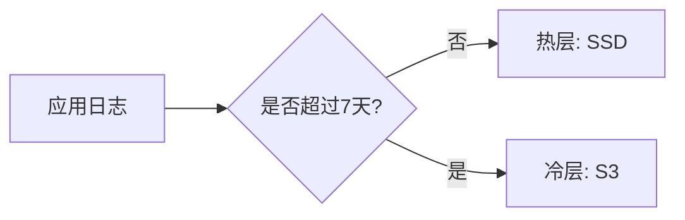

# 数据分层存储

## 介绍

数据分层存储（Tiered Storage）是 Grafana Loki 中一种优化存储成本和查询性能的关键机制。它通过将日志数据按访问频率分层存储（如热数据存于高性能存储，冷数据存于低成本存储），实现资源的高效利用。对于初学者，理解这一概念能帮助你在实际部署中平衡性能与成本。

:::note 核心概念
- **热层（Hot Tier）**：存储频繁访问的近期数据，通常使用快速但昂贵的存储（如 SSD）。
- **冷层（Cold Tier）**：存储较少访问的历史数据，通常使用廉价但较慢的存储（如对象存储 S3）。
:::

## 为什么需要数据分层存储？

日志数据的价值通常随时间递减：近期日志可能需要实时分析，而历史日志仅用于审计或偶尔查询。分层存储避免了为所有数据支付高性能存储的费用。

---

## Loki 中的数据分层配置

### 1. 存储配置示例

以下是一个 Loki 配置文件片段，定义热层（本地文件系统）和冷层（S3）：

```yaml
storage_config:
  boltdb_shipper:
    active_index_directory: /loki/index
    cache_location: /loki/cache
  aws:
    s3: s3://your-bucket/loki
    region: us-east-1
```

### 2. 分层策略

通过 `compactor` 配置数据从热层迁移到冷层的规则：

```yaml
compactor:
  working_directory: /loki/compactor
  shared_store: s3
  retention_enabled: true
  retention_delete_delay: 2h
```

:::tip 迁移触发条件
Loki 默认基于时间（如 24 小时）或数据大小自动迁移冷数据，可通过 `retention_period` 调整。
:::

---

## 实际案例：电商平台日志管理

### 场景描述
一个电商平台需要：
- 实时监控最近 7 天的用户行为日志（高频查询）。
- 保留 180 天的日志用于合规审计（低频查询）。

### 解决方案
1. **热层**：使用本地 SSD 存储 7 天内的日志，确保快速查询。
2. **冷层**：将 7 天前的日志迁移到 S3，降低存储成本。



---

## 总结

数据分层存储是 Loki 中优化资源的核心功能：
- **降低成本**：减少高性能存储的使用量。
- **保持灵活性**：仍可查询冷数据，只是速度较慢。
- **易于配置**：通过 YAML 文件定义策略。

---

## 延伸练习
1. 在本地 Loki 实例中尝试配置分层存储，观察数据迁移过程。
2. 使用 `logcli` 查询冷热层数据，比较响应时间差异。

## 附加资源
- [Loki 官方文档：存储配置](https://grafana.com/docs/loki/latest/configuration/#storage_config)
- [AWS S3 成本计算器](https://calculator.aws/)（用于估算冷层费用）