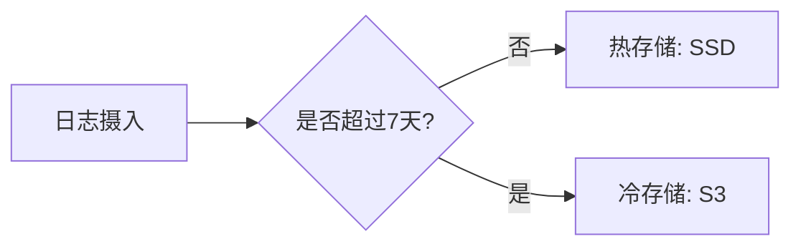

# 冷热数据策略

## 介绍

在日志管理系统中，"冷热数据策略"（Hot-Cold Data Strategy）是一种通过将数据划分为不同存储层来优化性能和成本的方法。热数据（Hot Data）是频繁访问的近期日志，需要高性能存储；冷数据（Cold Data）是较少访问的历史日志，可存储在成本更低的介质中。Grafana Loki通过这种策略显著降低长期存储成本，同时保持关键日志的快速检索能力。

## 为什么需要冷热数据分层？

- **性能优化**：热数据存储在SSD等高速介质上，响应更快。
- **成本控制**：冷数据可迁移到对象存储（如S3）或廉价磁盘。
- **生命周期管理**：自动将旧数据降级为冷存储，减少人工干预。

## Loki 中的实现机制

### 1. 存储配置示例

在Loki的配置文件（`loki-config.yaml`）中定义分层存储：

```yaml
storage_config:
  boltdb_shipper:
    active_index_directory: /loki/hot/index
    cache_location: /loki/hot/cache
  aws:
    bucketnames: my-loki-cold-bucket
    s3: s3://us-east-1
```

### 2. 数据保留策略

通过`compactor`配置自动转移数据：

```yaml
compactor:
  working_directory: /loki/compactor
  shared_store: s3
  retention_enabled: true
  retention_delete_delay: 2h
```

## 实际案例：电商平台日志管理

**场景**：某电商平台需要保留90天日志，但只有最近7天的日志会被频繁查询。

**解决方案**：
1. 热层：保留7天日志，使用本地SSD存储
2. 冷层：剩余83天日志存储在S3中



## 操作演示

### 查询冷热数据

使用LogQL查询时，Loki会自动处理存储分层：

```sql
-- 查询所有存储层的日志
{job="api-server"} |= "error"

-- 强制查询冷数据（性能较低）
{job="api-server"} |= "error" --store=slow
```

:::tip
查询冷数据时添加`--store=slow`参数，避免因意外操作影响热数据性能。
:::

## 性能与成本对比

| 指标          | 热数据          | 冷数据          |
|---------------|----------------|----------------|
| 查询延迟      | `<100ms`         | `1-5s`           |
| 存储成本      | `$0.10/GB/月`    | `$0.03/GB/月`    |
| 典型存储介质  | `SSD/NVMe`       | `HDD/S3`         |

## 总结

冷热数据策略是Loki日志管理的核心优化手段，通过：
1. 将高频访问数据放在高性能存储
2. 自动归档低频访问数据
3. 提供透明的查询接口

:::note 附加资源
1. [Loki官方存储文档](https://grafana.com/docs/loki/latest/storage/)
2. 练习：配置一个保留策略，将14天前的日志自动转移到冷存储
:::