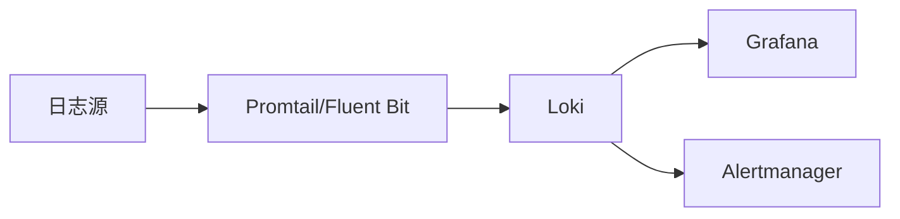

# Loki 集成概述

Grafana Loki是一个开源的日志聚合系统，专为云原生环境设计。它通过高效的索引和存储机制，帮助开发者快速查询和分析日志数据。Loki的强大之处在于它能与多种工具和平台无缝集成，从而扩展其功能并适应不同的使用场景。

## 什么是Loki集成？

Loki集成是指将Loki与其他工具、服务或平台连接起来，以实现更高效的日志管理、分析和可视化。通过集成，Loki可以接收来自不同来源的日志数据，并将其存储和索引，同时支持通过Grafana等工具进行查询和可视化。

:::tip
Loki的轻量级设计使其特别适合与Kubernetes、Prometheus和Grafana等云原生工具集成。
:::

## 常见的Loki集成场景

以下是Loki常见的集成场景：

1. **与Prometheus集成**：Loki和Prometheus可以共享相同的服务发现机制，简化配置。
2. **与Grafana集成**：Grafana可以直接查询Loki中的日志数据，实现日志和指标的联合分析。
3. **与Kubernetes集成**：通过Fluent Bit或Promtail等日志收集器，将Kubernetes集群中的日志发送到Loki。
4. **与Alertmanager集成**：通过Loki的日志告警功能，结合Alertmanager实现告警通知。

## Loki 集成的工作原理

Loki通过以下方式与其他工具集成：

1. **日志收集**：使用Promtail、Fluent Bit或Fluentd等日志收集器将日志发送到Loki。
2. **日志存储**：Loki将日志数据存储在对象存储（如S3、GCS）或本地文件系统中。
3. **日志查询**：通过Grafana或LogCLI查询Loki中的日志数据。
4. **告警管理**：通过Loki的Ruler组件生成告警，并发送到Alertmanager。



## 实际案例：将Kubernetes日志发送到Loki

以下是一个简单的示例，展示如何通过Promtail将Kubernetes中的日志发送到Loki。

### 步骤1：安装Promtail
在Kubernetes集群中部署Promtail，配置其从Pod中收集日志并发送到Loki。

```yaml
# promtail-config.yaml
server:
  http_listen_port: 9080
  grpc_listen_port: 0

positions:
  filename: /tmp/positions.yaml

clients:
  - url: http://loki:3100/loki/api/v1/push

scrape_configs:
  - job_name: kubernetes-pods
    kubernetes_sd_configs:
      - role: pod
    relabel_configs:
      - source_labels: [__meta_kubernetes_pod_annotation_name]
        action: keep
        regex: .+
      - source_labels: [__meta_kubernetes_pod_annotation_name]
        target_label: __service__
      - source_labels: [__meta_kubernetes_pod_node_name]
        target_label: __host__
    pipeline_stages:
      - docker: {}
```

### 步骤2：部署Loki
部署Loki服务，并确保Promtail可以访问其API端点。

```yaml
# loki-config.yaml
auth_enabled: false

server:
  http_listen_port: 3100

ingester:
  lifecycler:
    address: 127.0.0.1
    ring:
      kvstore:
        store: inmemory
      replication_factor: 1
    final_sleep: 0s
  chunk_idle_period: 5m
  chunk_retain_period: 30s

schema_config:
  configs:
    - from: 2020-10-24
      store: boltdb
      object_store: filesystem
      schema: v11
      index:
        prefix: index_
        period: 168h

storage_config:
  boltdb:
    directory: /tmp/loki/index
  filesystem:
    directory: /tmp/loki/chunks

limits_config:
  enforce_metric_name: false
  reject_old_samples: true
  reject_old_samples_max_age: 168h
```

### 步骤3：查询日志
在Grafana中配置Loki数据源，然后使用LogQL查询日志。

```
{namespace="default"} |= "error"
```

## 总结

Loki的集成能力使其成为云原生日志管理的强大工具。通过与Prometheus、Grafana和Kubernetes等工具的集成，Loki能够提供高效的日志收集、存储和查询功能。对于初学者来说，掌握这些集成场景是使用Loki的关键一步。

## 附加资源

1. [Loki官方文档](https://grafana.com/docs/loki/latest/)
2. [Promtail配置指南](https://grafana.com/docs/loki/latest/clients/promtail/)
3. [LogQL查询语言](https://grafana.com/docs/loki/latest/logql/)