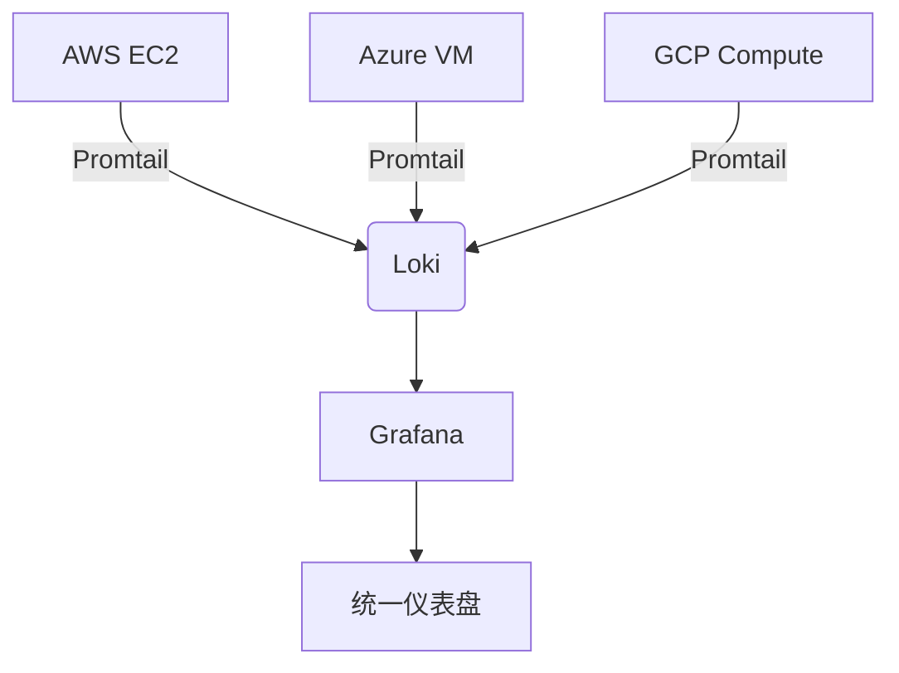

# 与云服务集成

## 介绍

Grafana Loki是一个轻量级的日志聚合系统，专为云原生环境设计。它与云服务的集成能力是其核心优势之一。本章将介绍如何将Loki与AWS、Azure和GCP等主流云服务集成，帮助您在不同云环境中高效地收集、存储和查询日志。

:::note
Loki的云服务集成主要通过存储后端适配器和日志收集器实现，无需复杂的配置即可与云原生服务协同工作。
:::

## 主要云服务集成方案

### 1. 与AWS集成

Loki可以与AWS的多个服务无缝集成：

#### 使用S3作为存储后端

Loki默认支持使用Amazon S3作为日志存储后端。以下是配置示例：

```yaml
storage_config:
  aws:
    s3: s3://<ACCESS_KEY>:<SECRET_KEY>@<REGION>/<BUCKET_NAME>
    s3forcepathstyle: true
```

#### 通过Lambda收集CloudWatch日志

您可以使用Lambda函数将CloudWatch日志转发到Loki：

```javascript
const { Loki } = require('lokijs');

exports.handler = async (event) => {
    const logs = event.awslogs.data;
    const loki = new Loki('http://your-loki-instance:3100');
    
    await loki.pushLogs({
        streams: [{
            stream: { source: 'cloudwatch' },
            values: logs.map(log => [Date.now().toString(), log.message])
        }]
    });
};
```

### 2. 与Azure集成

#### 使用Blob Storage作为存储后端

```yaml
storage_config:
  azure:
    account_name: <ACCOUNT_NAME>
    account_key: <ACCOUNT_KEY>
    container_name: <CONTAINER_NAME>
```

#### 通过Azure Functions收集日志

```csharp
using System.Net.Http;
using System.Text;

public static async Task Run(string logMessage, ILogger log)
{
    var httpClient = new HttpClient();
    var content = new StringContent(
        $"{{\"streams\":[{{\"stream\":{{\"source\":\"azure\"}},\"values\":[[\"{DateTimeOffset.Now.ToUnixTimeMilliseconds()}\",\"{logMessage}\"]]}}]}}",
        Encoding.UTF8,
        "application/json");
    
    await httpClient.PostAsync("http://your-loki-instance:3100/loki/api/v1/push", content);
}
```

### 3. 与GCP集成

#### 使用Google Cloud Storage作为存储后端

```yaml
storage_config:
  gcs:
    bucket_name: <BUCKET_NAME>
    auth_type: "default"  # 使用默认应用凭据
```

#### 通过Cloud Functions收集Stackdriver日志

```javascript
const { IncomingWebhook } = require('@slack/webhook');

exports.sendToLoki = (event, context) => {
    const logEntry = event.data;
    const webhook = new IncomingWebhook('http://your-loki-instance:3100/loki/api/v1/push');
    
    return webhook.send({
        streams: [{
            stream: { source: 'stackdriver' },
            values: [[Date.now().toString(), JSON.stringify(logEntry)]]
        }]
    });
};
```

## 实际应用案例

### 案例：多云环境下的统一日志管理

一家公司在AWS、Azure和GCP上运行不同的微服务，需要统一的日志解决方案：



配置要点：
1. 每个云环境部署Promtail收集日志
2. Loki使用多云存储策略（S3+Blob Storage+GCS）
3. Grafana作为统一查询界面

## 总结

与云服务集成是Loki的核心能力之一，通过简单的配置即可实现：

- 使用云存储服务作为后端
- 利用云函数收集各类日志
- 在多云环境中实现统一管理

:::tip 最佳实践
1. 为每个云环境配置独立的租户ID
2. 使用云原生身份认证机制
3. 根据日志量选择合适的存储类别
:::

## 延伸学习

1. 尝试将Loki与您使用的云服务集成
2. 比较不同云存储后端的性能差异
3. 探索如何优化云函数中的日志收集逻辑

如需更深入的配置细节，请参考各云服务的官方文档和Loki存储配置指南。