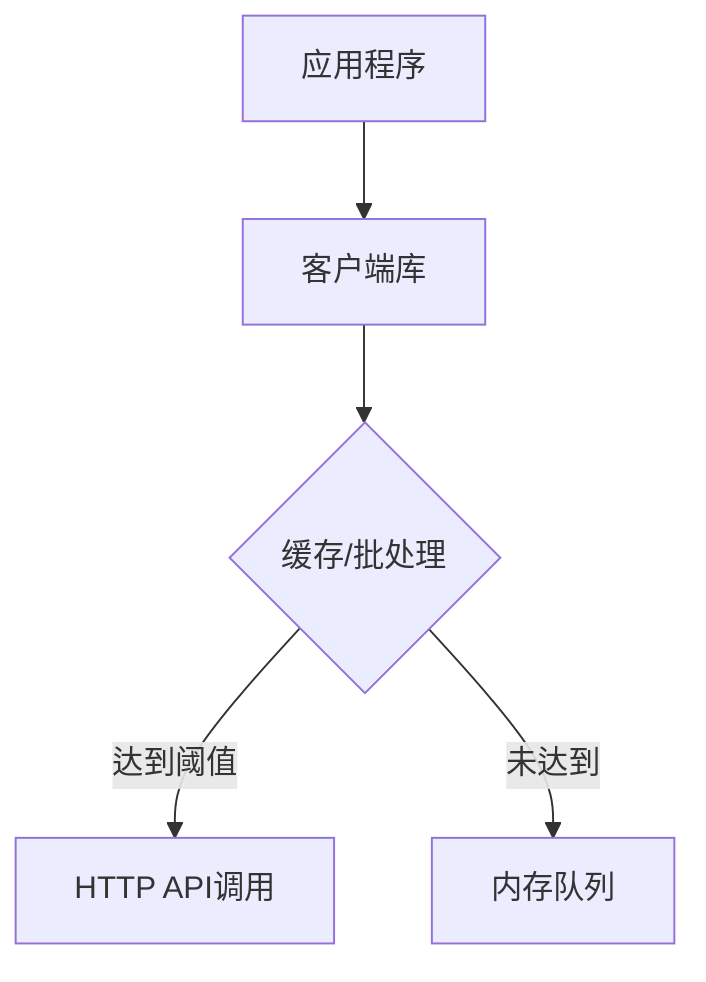

# 自定义集成开发

## 介绍

Grafana Loki的**自定义集成开发**允许开发者将Loki的日志管理能力扩展到非标准环境或特定技术栈。通过客户端库修改、插件开发或直接API调用，您可以实现以下场景：
- 将专有系统的日志导入Loki
- 为小众编程语言创建SDK
- 构建定制化日志处理管道

:::tip 适用场景
当现有Loki客户端无法满足您的协议/语言需求时，才需要自定义开发。优先检查[官方客户端列表](https://grafana.com/docs/loki/latest/clients/)。
:::

---

## 核心集成方式

### 1. 直接使用HTTP API

Loki的所有功能都通过REST API暴露。以下是推送日志的基础示例：

```python
import requests

# 基本日志推送
url = "http://localhost:3100/loki/api/v1/push"
headers = {"Content-Type": "application/json"}

payload = {
  "streams": [
    {
      "stream": { "app": "myapp", "env": "prod" },
      "values": [ [ "<timestamp纳秒>", "log line content" ] ]
    }
  ]
}

response = requests.post(url, json=payload, headers=headers)
print(response.status_code)  # 成功应返回204
```

关键参数说明：
- `stream`: 键值对形式的日志标签
- `values`: 二维数组，每个条目格式为 `[timestamp, logline]`

:::caution 时间戳格式
必须使用Unix纳秒时间戳，可通过Python获取：`str(int(time.time() * 1e9))`
:::

### 2. 开发客户端库

典型客户端库结构：



实现要点：
1. **批处理**：积累日志到一定数量/时间间隔再发送
2. **重试机制**：处理网络故障
3. **标签管理**：动态标签注入

Go语言示例片段：

```go
type LokiClient struct {
    url     string
    batch   []LogEntry
    timeout time.Duration
}

func (c *LokiClient) AddLog(labels map[string]string, message string) {
    entry := LogEntry{
        Timestamp: time.Now().UnixNano(),
        Line:      message,
        Labels:    labels,
    }
    c.batch = append(c.batch, entry)
    
    if len(c.batch) >= 1000 {
        c.flush()
    }
}
```

### 3. 插件开发（以Fluentd为例）

创建Fluentd输出插件的基本步骤：

1. 继承 `Fluent::Plugin::Output` 类
2. 实现 `#write` 方法处理日志
3. 使用Loki的protobuf格式提升性能

```ruby
require 'fluent/plugin/output'
require 'net/http'

class Fluent::Plugin::LokiOutput < Fluent::Plugin::Output
  # 注册插件类型
  Fluent::Plugin.register_output('loki', self)

  config_param :url, :string, default: 'http://localhost:3100/loki/api/v1/push'
  
  def write(chunk)
    streams = {}
    
    chunk.each do |time, record|
      # 转换日志为Loki流格式
      stream_key = record['labels'].hash
      streams[stream_key] ||= {
        labels: record['labels'],
        entries: []
      }
      streams[stream_key][:entries] << [time.to_i, record['message']]
    end

    # 发送到Loki
    http = Net::HTTP.new(uri.host, uri.port)
    request = Net::HTTP::Post.new(uri.request_uri)
    request.body = convert_to_proto(streams.values)
    http.request(request)
  end
end
```

---

## 实战案例：IoT设备日志收集

**场景需求**：
- 数千台低功耗设备通过MQTT发送日志
- 需要添加设备元数据作为标签
- 网络不稳定需本地缓存

**解决方案**：

```python
class LokiIoTAdapter:
    def __init__(self):
        self.cache = PersistentQueue('/tmp/loki_cache')
        
    def on_mqtt_message(self, client, msg):
        device_id = msg.topic.split('/')[-1]
        log_entry = {
            "ts": msg.timestamp,
            "line": msg.payload.decode(),
            "labels": {
                "device": device_id,
                "region": self.get_region(device_id)
            }
        }
        self.cache.add(log_entry)
        
        if self.cache.size() > 100:
            self.flush_to_loki()
            
    def flush_to_loki(self):
        batch = self.cache.pop_batch(100)
        streams = self._convert_to_streams(batch)
        try:
            requests.post(LOKI_URL, json={"streams": streams}, timeout=5)
        except Exception as e:
            self.cache.retry(batch)  # 重试机制
```

---

## 最佳实践

1. **标签设计原则**：
   - 避免高基数（避免`user_id`等作为标签）
   - 使用固定标签集（如`app, env, component`）

2. **性能优化**：
   ```mermaid
   graph LR
       A[原始日志] --> B[预处理过滤]
       B --> C[批量聚合]
       C --> D[压缩传输]
       D --> E[异步发送]
   ```

3. **错误处理**：
   - 实现指数退避重试
   - 监控失败队列长度
   - 提供死信队列机制

---

## 总结

自定义集成开发使Loki能适应各种特殊场景，关键步骤包括：
1. 选择适合的集成方式（API/客户端/插件）
2. 设计高效的日志批处理流程
3. 实现健壮的错误处理机制

**延伸学习**：
- [Loki HTTP API文档](https://grafana.com/docs/loki/latest/api/)
- [Promtail客户端源码分析](https://github.com/grafana/loki/tree/main/clients/pkg/promtail)
- [OpenTelemetry日志集成](https://opentelemetry.io/docs/concepts/signals/logs/)

**练习建议**：
1. 尝试用Python实现一个最小批处理客户端
2. 为Nginx访问日志设计优化的标签方案
3. 模拟网络故障测试客户端的恢复能力