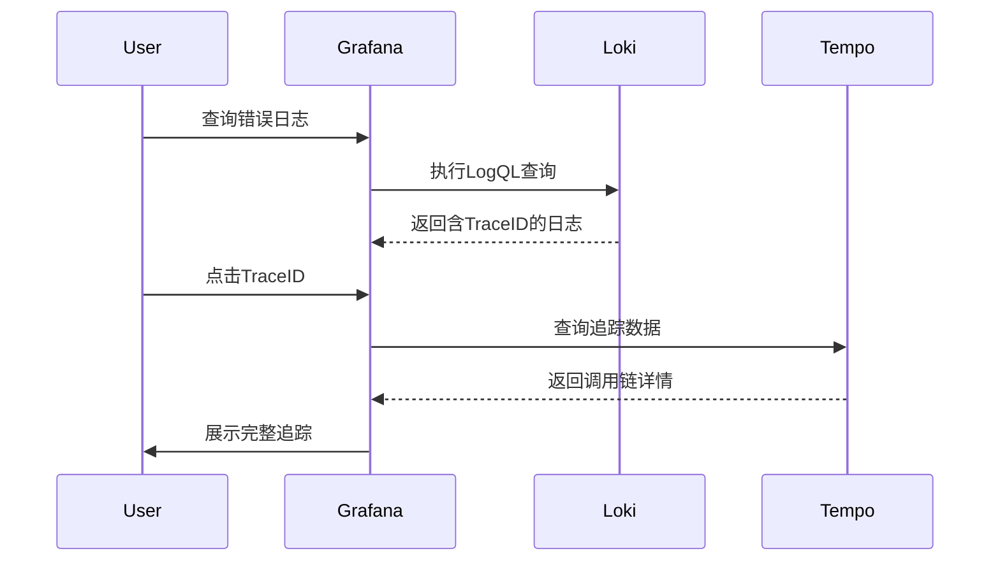

# 与Tempo集成

## 介绍

Grafana Loki和Tempo是云原生可观测性栈中的两个关键组件：Loki专注于日志聚合，而Tempo是分布式追踪系统。通过将它们集成，您可以实现**日志与追踪数据的关联**，帮助开发团队快速定位问题根源。例如，当发现某个服务出现错误时，可以直接从日志跳转到相关请求的完整调用链。

:::tip 为什么需要集成？
- **上下文关联**：通过TraceID将日志条目与调用链关联
- **效率提升**：减少在多个工具间切换的时间
- **完整视图**：获得请求的完整生命周期视图
:::

## 前置条件

在开始之前，请确保：
1. 已安装并运行Loki和Tempo
2. 两者使用相同的Grafana实例
3. 应用已配置同时生成日志和追踪数据

## 基础配置

### 1. Loki配置修改

在Loki的配置文件（通常为`loki-config.yaml`）中添加Tempo的详细信息：

```yaml
tracing:
  enabled: true
  host: tempo.monitoring.svc.cluster.local
  port: 4317
  sampling_fraction: 1.0
```

关键参数说明：
- `sampling_fraction`: 设置采样率（1.0表示100%采样）

### 2. 应用端配置

确保您的应用在日志中输出TraceID。以下是Go语言的示例：

```go
import (
    "go.opentelemetry.io/otel/trace"
    "log"
)

func handler() {
    span := trace.SpanFromContext(ctx)
    log.Printf("Processing request (traceID=%s)", span.SpanContext().TraceID())
}
```

对应的日志输出示例：
```
2023-01-01T12:00:00Z INFO Processing request (traceID=4bf92f3577b34da6a3ce929d0e0e4736)
```

## 数据关联实战

### 1. 在Grafana中配置数据源

1. 导航到 **Configuration > Data Sources**
2. 添加Loki和Tempo数据源
3. 确保在Loki数据源设置中启用"Derived fields"：

```yaml
datasources:
  - name: Loki
    jsonData:
      derivedFields:
        - datasourceUid: tempo
          matcherRegex: "traceID=(\\w+)"
          name: TraceID
          url: '$${__value.raw}'
```

### 2. 查询日志并跳转追踪

在Grafana Explore界面：
1. 使用LogQL查询日志：`{job="my-service"} |= "error"`
2. 找到包含TraceID的日志条目
3. 点击TraceID链接自动跳转到Tempo中的对应追踪



## 实际应用场景

**电商平台故障排查**：
1. 用户报告支付失败
2. 运维团队在Loki中查询支付服务的错误日志
3. 发现错误日志包含TraceID："支付网关超时 (traceID=7d3ef8a1...)"
4. 点击TraceID查看Tempo中的完整调用链：
   - 前端服务 → 订单服务 → 支付网关
5. 发现支付网关与银行API的通信存在500ms延迟

:::note 最佳实践
- 在所有服务的日志中统一包含TraceID
- 对关键业务路径实施100%采样
- 为开发团队提供集成查询的快捷方式
:::

## 高级配置

### 1. 使用OpenTelemetry Collector

对于复杂环境，建议使用OTel Collector统一处理遥测数据：

```yaml
receivers:
  otlp:
    protocols:
      grpc:
      http:

processors:
  batch:

exporters:
  logging:
    logLevel: debug
  loki:
    endpoint: "http://loki:3100/loki/api/v1/push"
  tempo:
    endpoint: "tempo:4317"

service:
  pipelines:
    logs:
      receivers: [otlp]
      processors: [batch]
      exporters: [loki]
    traces:
      receivers: [otlp]
      processors: [batch]
      exporters: [tempo]
```

### 2. 自动化关联规则

在Grafana中设置自动化仪表板，当发现错误日志时自动显示相关追踪：

```json
{
  "panels": [
    {
      "title": "Error Logs",
      "type": "logs",
      "targets": [{ "expr": "count_over_time({level=\"error\"}[1h])" }]
    },
    {
      "title": "Related Traces",
      "type": "traces",
      "linkedTraceQuery": {
        "field": "TraceID",
        "internalLink": true
      }
    }
  ]
}
```

## 总结

通过Loki与Tempo的集成，您可以将原本孤立的日志和追踪数据转化为有机联系的可观测性资产。关键要点包括：

- **统一标识**：确保TraceID在日志和追踪间传递
- **简化流程**：通过Grafana实现一键跳转
- **全栈视角**：获得从应用日志到基础设施调用的完整视图

## 延伸学习

1. **实践练习**：
   - 部署一个示例应用，故意制造错误
   - 练习从日志定位到追踪的全过程
2. **进阶主题**：
   - 结合Prometheus指标创建完整可观测性仪表板
   - 配置告警规则，当错误出现时自动捕获相关追踪
3. **官方资源**：
   - [Grafana文档：关联日志与追踪](https://grafana.com/docs/grafana/latest/datasources/loki/#correlate-logs-with-traces)
   - [Tempo最佳实践指南](https://grafana.com/docs/tempo/latest/best-practices/)