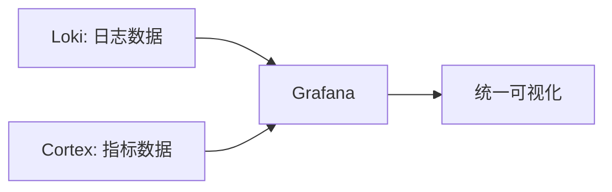

# 与Cortex集成

## 介绍

Grafana Loki是一个高效的日志聚合系统，而Cortex是一个多租户的Prometheus兼容的长期存储解决方案。将Loki与Cortex集成，可以让你在一个统一的平台上管理日志和指标数据，简化运维工作流程并提升可观测性。

在本章节中，你将学习：
- Cortex的基本概念及其与Loki的关系
- 如何配置Loki与Cortex的集成
- 实际应用场景和最佳实践

---

## 为什么需要集成Loki和Cortex？

Loki和Cortex都是CNCF（云原生计算基金会）下的项目，设计理念相似，都强调水平扩展和多租户支持。它们的集成可以带来以下优势：
1. **统一的数据存储**：使用相同的对象存储后端（如S3、GCS）。
2. **简化的运维**：共享索引和缓存层，减少资源消耗。
3. **一致的查询体验**：通过Grafana同时查询日志和指标。

:::note
Cortex最初专注于指标存储，而Loki专注于日志存储。集成后，两者可以互补，形成完整的可观测性解决方案。
:::

---

## 集成步骤

### 前提条件
- 已部署Loki和Cortex集群
- 两者使用相同的对象存储后端（如Amazon S3）
- 确保网络互通（尤其是gRPC端口）

### 1. 配置Loki使用Cortex的存储
在Loki的配置文件（`loki-config.yaml`）中，指定Cortex的存储后端：

```yaml
storage_config:
  cortex:
    chunks:
      prefix: loki_chunks_
    schema_config:
      configs:
        - from: 2023-01-01
          store: cortex
          object_store: s3
          schema: v11
```

### 2. 配置Cortex的多租户支持
确保Cortex启用多租户模式（`-auth.enabled=true`），并在Loki的配置中添加认证信息：

```yaml
auth_enabled: true
frontend:
  auth:
    type: bearer-token
    bearer_token: YOUR_CORTEX_API_KEY
```

### 3. 验证集成
启动Loki后，检查日志是否成功写入Cortex的存储桶：

```bash
curl -H "Authorization: Bearer YOUR_CORTEX_API_KEY" \
  http://cortex-address/api/v1/query?query={job="loki"}
```

---

## 实际案例：电商平台监控

### 场景描述
一个电商平台需要同时监控：
- 用户行为日志（如搜索关键词）
- 系统指标（如订单服务的延迟）

### 解决方案
1. 使用Loki收集Nginx访问日志和应用程序日志
2. 使用Cortex存储Prometheus采集的指标
3. 在Grafana中创建联合仪表盘：



### 查询示例
在Grafana中使用LogQL和PromQL联合查询：

```sql
-- 查询错误日志的同时显示错误率指标
{container="app"} |= "ERROR" | logfmt
-- 配合指标查询
rate(container_errors_total[5m])
```

---

## 常见问题

### 1. 性能调优建议
- 为Loki和Cortex分配独立的缓存层
- 调整`chunk_target_size`（建议4MB）
- 监控`cortex_ingester_flush_queue_length`指标

### 2. 安全配置
- 使用TLS加密gRPC通信
- 定期轮换API密钥
- 通过Cortex的`-limits.per-user-override-config`限制租户资源

:::warning
生产环境中务必启用Cortex的持久化存储。默认的`filesystem`存储仅适用于测试。
:::

---

## 总结

通过将Loki与Cortex集成，你可以：
- 降低存储管理复杂度
- 实现日志和指标的关联分析
- 利用Cortex的长期存储能力

## 延伸学习
1. [Cortex官方文档](https://cortexmetrics.io/docs/)
2. [Loki存储架构白皮书](https://grafana.com/docs/loki/latest/storage/)
3. 实践练习：尝试在MinIO上搭建Loki+Cortex测试环境