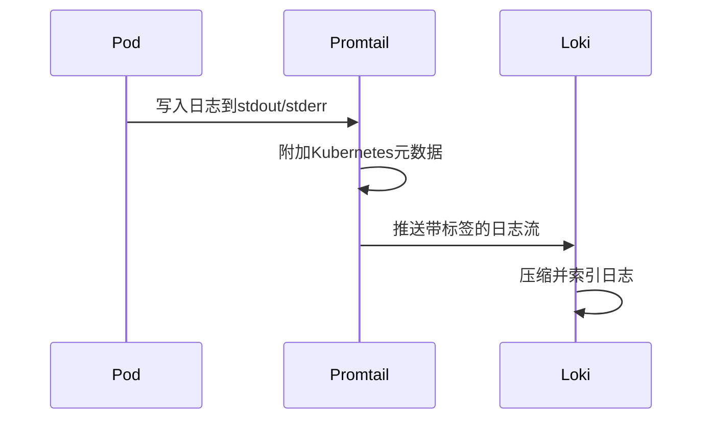

# 与Kubernetes集成

## 介绍

Grafana Loki是一个轻量级的日志聚合系统，专为云原生环境设计。与Kubernetes集成后，Loki可以自动收集、索引和存储容器日志，同时提供高效的查询能力。本指南将逐步介绍如何将Loki部署到Kubernetes集群，并配置日志收集功能。

:::note
Loki与Kubernetes的集成主要通过以下组件实现：
- **Loki**：日志存储和查询服务
- **Promtail**：日志收集代理（通常以DaemonSet形式运行）
- **Kubernetes服务发现**：自动识别Pod和日志流
:::

---

## 前置条件

在开始之前，请确保：
1. 已有一个运行的Kubernetes集群（可以是Minikube或生产环境）
2. 已安装`kubectl`并配置了集群访问权限
3. 已安装Helm（推荐方式部署Loki）

---

## 步骤1：使用Helm安装Loki

推荐使用Helm chart快速部署Loki Stack（包含Loki和Promtail）：

```bash
helm repo add grafana https://grafana.github.io/helm-charts
helm repo update
helm upgrade --install loki grafana/loki-stack \
  --namespace=loki \
  --create-namespace \
  --set promtail.enabled=true
```

验证安装：

```bash
kubectl -n loki get pods
```

预期输出应显示类似以下状态的Pod：
```
NAME           READY   STATUS    RESTARTS   AGE
loki-0         1/1     Running   0          2m
promtail-abc   1/1     Running   0          2m
```

---

## 步骤2：理解Promtail配置

Promtail是Loki的日志收集代理，它会自动发现Kubernetes中的Pod并收集日志。以下是关键配置项（通常通过ConfigMap管理）：

```yaml
# promtail-config.yaml 示例片段
scrape_configs:
- job_name: kubernetes-pods
  kubernetes_sources:
    - role: pod
  relabel_configs:
    # 添加Pod标签作为Loki标签
    - source_labels: [__meta_kubernetes_pod_label_app]
      target_label: app
    - source_labels: [__meta_kubernetes_namespace]
      target_label: namespace
```

:::tip
标签（Labels）是Loki的核心设计，合理的标签策略能显著提高查询效率。建议使用：
- `namespace`
- `app`
- `pod_name`
等Kubernetes原生元数据作为标签。
:::

---

## 步骤3：日志收集流程



1. Pod将日志写入标准输出/错误
2. Promtail通过节点上的日志文件发现新日志
3. Promtail添加Kubernetes元数据（如Pod名称、标签等）
4. 日志被推送到Loki并建立索引

---

## 步骤4：查询日志

部署Grafana并添加Loki数据源后，可以使用LogQL查询：

```bash
# 查询特定命名空间的所有日志
{namespace="default"}

# 查询特定应用的错误日志
{app="frontend"} |= "error"
```

在Kubernetes环境中，还可以直接通过`kubectl`访问Loki：

```bash
kubectl -n loki port-forward service/loki 3100:3100
```

然后访问`http://localhost:3100`进入Loki自带查询界面。

---

## 实际案例：调试微服务应用

假设有一个包含`frontend`和`backend`服务的应用，当出现API错误时：

1. 通过标签快速定位相关日志：
   ```logql
   {app=~"frontend|backend"} |= "API_FAILED"
   ```
2. 分析请求链路：
   ```logql
   {app="frontend"} | json | requestID="12345"
   ```
3. 关联查看后端日志：
   ```logql
   {app="backend"} | json | requestID="12345"
   ```

---

## 高级配置

### 动态标签管理

避免标签爆炸问题（高基数标签会影响性能）：

```yaml
# loki-config.yaml 片段
limits_config:
  max_label_names_per_series: 10
  reject_old_samples: true
```

### 资源限制

为Loki和Promtail设置合理的资源请求/限制：

```yaml
# values.yaml 示例
resources:
  limits:
    cpu: 1
    memory: 2Gi
  requests:
    cpu: 500m
    memory: 1Gi
```

---

## 总结

通过本指南，你已经学会：
- 使用Helm在Kubernetes部署Loki Stack
- Promtail如何自动收集容器日志
- 利用Kubernetes元数据增强日志查询能力
- 基本的LogQL查询语法

## 后续学习

1. 尝试为你的应用添加自定义日志标签
2. 配置Grafana仪表板展示关键日志指标
3. 学习Loki的保留策略和存储配置

:::warning 生产环境注意
- 始终监控Loki的资源使用情况
- 避免使用高基数字段（如用户ID）作为标签
- 规划好日志保留周期和存储大小
:::