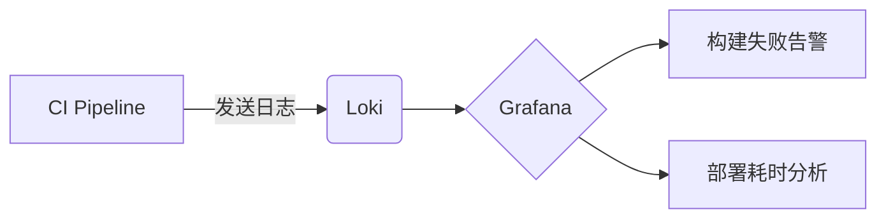

# 与CI/CD工具集成

## 介绍

在现代DevOps实践中，持续集成和持续交付（CI/CD）是快速交付高质量软件的核心。将Grafana Loki与CI/CD工具集成，可以帮助团队实时监控构建和部署日志，快速定位问题。本章将介绍如何通过日志收集增强CI/CD管道的可观测性。

:::note 为什么需要集成？
- **实时反馈**：在部署失败时立即查看相关日志
- **集中存储**：避免日志分散在不同构建节点
- **历史追溯**：对比不同版本间的日志差异
:::

## 基础集成方法

### 1. 通过Loki API推送日志

大多数CI/CD工具支持通过HTTP API发送数据。Loki提供了`/loki/api/v1/push`端点接收日志：

```bash
# 使用curl发送日志到Loki
curl -v -H "Content-Type: application/json" -X POST \
  -s "http://loki:3100/loki/api/v1/push" \
  --data-raw \
  '{
    "streams": [
      {
        "stream": {
          "job": "jenkins",
          "build_id": "42"
        },
        "values": [
          [ "<timestamp>", "Build started for commit abc123" ]
        ]
      }
    ]
  }'
```

### 2. 使用Promtail采集日志

如果CI/CD工具运行在Kubernetes中，可以通过Promtail收集日志：

```yaml
# promtail-config.yaml 片段
scrape_configs:
  - job_name: jenkins
    kubernetes_sd_configs:
      - role: pod
        namespaces:
          names: ["jenkins"]
    relabel_configs:
      - source_labels: [__meta_kubernetes_pod_label_app]
        target_label: job
```

## 主流工具集成示例

### Jenkins集成

1. **安装Loki插件**：
   - 在Jenkins插件管理中搜索"Grafana Loki"
   - 安装后进入`系统配置`设置Loki服务器地址

2. **在Pipeline中使用**：
```groovy
pipeline {
  agent any
  stages {
    stage('Build') {
      steps {
        script {
          // 发送自定义日志
          lokiSend message: "开始构建 ${env.JOB_NAME}", 
                  labels: [job: "${env.JOB_NAME}", build: "${env.BUILD_ID}"]
          
          // 自动捕获控制台输出
          lokiLog()
        }
      }
    }
  }
}
```

### GitHub Actions集成

创建Action工作流文件`.github/workflows/deploy.yml`：

```yaml
name: Deploy with Loki Logging
on: [push]

jobs:
  deploy:
    runs-on: ubuntu-latest
    steps:
      - uses: actions/checkout@v3
      
      - name: Log to Loki
        run: |
          echo "Starting deployment for ${{ github.sha }}"
          curl -X POST "http://loki:3100/loki/api/v1/push" \
            -H "Content-Type: application/json" \
            -d '{
              "streams": [{
                "stream": {
                  "repo": "${{ github.repository }}",
                  "workflow": "${{ github.workflow }}"
                },
                "values": [
                  ["'"$(date +%s%N)"'", "Deployment started"]
                ]
              }]
            }'
```

## 高级场景

### 部署验证看板

在Grafana中创建CI/CD监控看板，使用LogQL查询：

```sql
# 显示最近10次构建的日志
{job="jenkins"} |= "error" | logfmt | line_format "{{.build_id}} {{.message}}"

# 统计各阶段的耗时
rate({job="github-actions"} | logfmt | duration > 5s [1m])
```



## 最佳实践

1. **标签设计**：
   - 包含环境（env=prod）
   - 包含版本号（version=v1.2.3）
   - 包含构建/部署ID

2. **日志内容**：
   - 记录关键决策点
   - 包含机器可读的元数据（JSON格式）
   - 避免敏感信息

:::warning 注意
生产环境中应通过服务账户认证访问Loki API，不要硬编码凭据
:::

## 总结

通过将Loki集成到CI/CD流程中，团队可以获得：
- 部署过程的完整可观测性
- 快速故障排查能力
- 历史日志的版本对比

## 延伸学习

1. 尝试在ArgoCD或Tekton中集成Loki
2. 创建告警规则，当部署日志中出现"error"时通知团队
3. 比较不同构建版本的日志差异