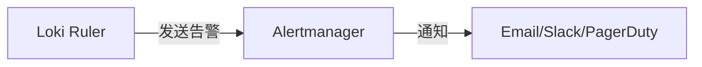

# 与告警系统集成

## 介绍

Grafana Loki是一个轻量级的日志聚合系统，专为云原生环境设计。通过与告警系统（如Prometheus Alertmanager）集成，Loki可以帮助您监控日志数据并在满足特定条件时触发告警。这对于快速响应应用程序中的错误或异常行为至关重要。

在本章节中，我们将学习如何配置Loki与告警系统的集成，并通过实际案例展示其应用场景。

---

## 1. Loki告警基础

Loki的告警功能基于日志查询结果。当查询返回的日志满足预设条件时，Loki可以触发告警。告警规则通常通过Loki的Ruler组件定义，并发送到Alertmanager进行处理。

:::note
Loki的告警功能依赖于Prometheus Alertmanager。确保您已安装并配置了Alertmanager。
:::

---

## 2. 配置Loki与Alertmanager集成

### 步骤1：配置Loki Ruler
Loki的Ruler组件负责评估告警规则并将告警发送到Alertmanager。在Loki的配置文件中添加以下内容：

```yaml
ruler:
  alertmanager_url: http://alertmanager:9093
  enable_alertmanager_v2: true
  enable_api: true
```

### 步骤2：定义告警规则
告警规则以YAML格式定义，通常存储在Loki的规则目录中。以下是一个示例规则文件 `rules/alerts.yaml`：

```yaml
groups:
  - name: example
    rules:
      - alert: HighErrorRate
        expr: 'rate({job="myapp"} |~ "error" [5m]) > 0.1'
        for: 10m
        labels:
          severity: critical
        annotations:
          summary: "High error rate in {{ $labels.job }}"
          description: "Error rate is {{ $value }} for job {{ $labels.job }}."
```

### 步骤3：启动Loki和Alertmanager
确保Loki和Alertmanager正在运行，并且Loki的Ruler组件已加载告警规则。

---

## 3. 告警规则详解

### 告警规则字段
- `alert`: 告警名称。
- `expr`: 日志查询表达式，用于触发告警。
- `for`: 告警触发前必须满足条件的持续时间。
- `labels`: 附加到告警的标签。
- `annotations`: 告警的详细描述。

### 示例查询
以下查询检测过去5分钟内错误日志率超过10%的情况：
```logql
rate({job="myapp"} |~ "error" [5m]) > 0.1
```

---

## 4. 实际案例：监控Web应用错误

假设您有一个Web应用，需要监控其错误日志。以下是配置步骤：

### 步骤1：定义告警规则
```yaml
groups:
  - name: webapp-errors
    rules:
      - alert: WebAppErrorRate
        expr: 'rate({job="webapp"} |~ "500 Internal Server Error" [5m]) > 0.05'
        for: 5m
        labels:
          severity: warning
        annotations:
          summary: "High error rate in WebApp"
          description: "Error rate is {{ $value }} for job {{ $labels.job }}."
```

### 步骤2：验证告警
当错误率超过5%时，Alertmanager将收到告警并发送通知。

---

## 5. 告警通知流程

以下是Loki与Alertmanager集成的告警流程：



---

## 6. 总结

通过将Loki与Alertmanager集成，您可以实现基于日志的告警监控。关键步骤包括：
1. 配置Loki Ruler以连接Alertmanager。
2. 定义告警规则。
3. 验证告警是否正常工作。

---

## 7. 附加资源
- [Loki告警官方文档](https://grafana.com/docs/loki/latest/alerting/)
- [Prometheus Alertmanager配置指南](https://prometheus.io/docs/alerting/latest/configuration/)

## 8. 练习
1. 尝试为您的应用定义一个告警规则，监控特定错误日志。
2. 配置Alertmanager将告警发送到Slack或Email。