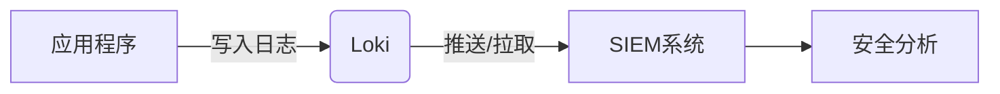

## 介绍

SIEM（Security Information and Event Management）系统用于集中收集、分析和报告安全事件数据。将Grafana Loki与SIEM系统集成，可以将日志数据无缝传输到SIEM平台，增强安全监控能力。本指南将介绍Loki与常见SIEM系统（如Splunk、IBM QRadar等）的集成方法。

:::note
**SIEM的核心功能**：  
- 日志聚合  
- 实时分析  
- 威胁检测  
- 合规报告  
:::

---

## 集成原理

Loki通过以下方式与SIEM系统交互：  
1. **日志推送**：使用Loki的API或插件将日志转发到SIEM。  
2. **日志拉取**：SIEM系统通过Loki的HTTP API主动查询日志。  



---

## 集成步骤

### 方法1：通过Grafana Agent转发日志
Grafana Agent可以同时将日志发送到Loki和SIEM系统。  
配置示例（`agent.yaml`）：  

```yaml
logs:
  scrape_configs:
    - job_name: syslog
      syslog:
        listen_address: "0.0.0.0:1514"
  clients:
    - url: http://loki:3100/loki/api/v1/push
    - url: http://splunk:8088/services/collector
      basic_auth:
        username: admin
        password: "{{ .SIEM_PASSWORD }}"
```

:::caution
确保SIEM系统的接收端口（如Splunk的HTTP Event Collector）已正确配置。  
:::

---

### 方法2：使用Loki的HTTP API
SIEM系统可以直接查询Loki的日志数据：  

```bash
# 查询最近5分钟的日志
curl -G http://loki:3100/loki/api/v1/query_range \
  --data-urlencode 'query={job="nginx"}' \
  --data-urlencode 'start=$(date -d "5 minutes ago" +%s)'
```

**输出示例**：  
```json
{
  "data": {
    "result": [
      {
        "stream": { "level": "error" },
        "values": [ ["timestamp", "error message"] ]
      }
    ]
  }
}
```

---

## 实际案例：检测SSH暴力破解

### 场景描述
通过Loki收集SSH登录日志，并转发到SIEM系统进行实时分析。

1. **日志收集配置**（Promtail）：  
```yaml
scrape_configs:
  - job_name: ssh
    static_configs:
      - targets: [localhost]
        labels:
          job: ssh
          __path__: /var/log/auth.log
```

2. **SIEM规则示例**（Splunk SPL）：  
```sql
index="loki_ssh" "Failed password" 
| stats count by src_ip 
| where count > 5
| alert "SSH暴力破解尝试"
```

---

## 总结

### 关键点
- Loki与SIEM集成可通过**推送**或**拉取**模式实现。  
- Grafana Agent是推荐的中转工具。  
- 结合SIEM的告警规则增强安全监控。  

### 延伸练习
1. 尝试将Nginx访问日志集成到Splunk。  
2. 在SIEM中创建一条检测SQL注入的规则。  

### 附加资源
- [Loki HTTP API文档](https://grafana.com/docs/loki/latest/api/)  
- [Splunk HTTP Event Collector配置](https://docs.splunk.com/)