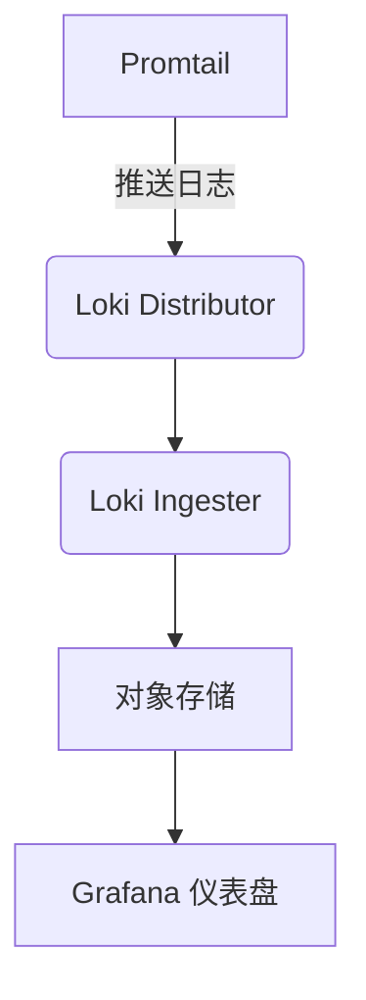

# 日常运维任务

## 介绍

Grafana Loki是一个高效的日志聚合系统，专为云原生环境设计。作为运维人员，日常任务包括确保Loki集群的稳定性、监控日志流、优化查询性能以及处理故障。本章将详细介绍这些任务的操作方法和最佳实践。

---

## 日志管理

### 日志收集与存储

Loki通过`Promtail`或其他日志代理收集日志，并将其存储在对象存储（如S3、GCS）或本地文件系统中。日常运维中需关注存储使用情况：

```bash
# 检查Loki的存储用量
curl -s http://localhost:3100/loki/api/v1/stats | jq '.storage'
```

输出示例：
```json
{
  "chunks": {
    "total_bytes": 1024000,
    "compressed_bytes": 512000
  }
}
```

:::tip
定期清理旧日志数据以避免存储溢出。可通过`retention_period`配置自动过期策略。
:::

---

## 监控与告警

### 关键指标监控

使用Grafana监控Loki的核心指标，包括：
- **日志摄入速率**：`rate(loki_distributor_bytes_received_total[1m])`
- **查询延迟**：`histogram_quantile(0.9, sum(rate(loki_query_frontend_duration_seconds_bucket[1m])) by (le))`



:::warning
若`loki_request_duration_seconds`持续升高，可能表示查询负载过大，需优化索引或扩容。
:::

---

## 故障排查

### 常见问题处理

1. **日志丢失**：检查Promtail配置和目标标签匹配：
   ```yaml
   # promtail-config.yaml
   scrape_configs:
     - job_name: app-logs
       static_configs:
         - targets: [localhost]
           labels:
             job: myapp
             __path__: /var/log/app/*.log
   ```

2. **查询超时**：调整查询限制：
   ```bash
   # 在Loki配置中增加超时时间
   query_timeout: 5m
   ```

---

## 性能优化

### 索引优化

Loki的查询性能依赖索引。对于高频查询的标签，使用`boltdb-shipper`优化索引存储：

```yaml
# loki-config.yaml
schema_config:
  configs:
    - from: 2023-01-01
      store: boltdb-shipper
      object_store: s3
      schema: v11
```

---

## 实际案例

### 场景：日志突增导致存储压力

**问题**：某应用突发错误，日志量增长10倍，Loki存储接近上限。<br />
**解决步骤**：
1. 临时增加存储配额。
2. 使用`logcli`快速查询错误日志：
   ```bash
   logcli query '{job="myapp"} |= "ERROR"' --limit=1000
   ```
3. 修复应用后，调整日志保留策略为7天。

---

## 总结

日常运维Loki的关键任务包括：
1. 监控日志摄入和存储。
2. 设置合理的告警规则。
3. 定期优化索引和查询性能。
4. 快速响应故障。

---

## 附加资源

1. [Loki官方文档](https://grafana.com/docs/loki/latest/)
2. 练习：使用`logcli`导出最近1小时的错误日志，并分析高频错误模式。