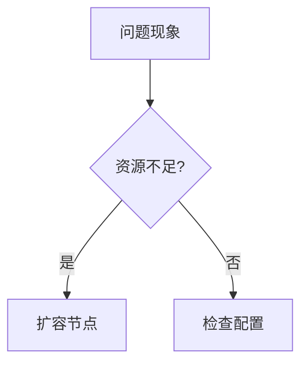

# Loki 问题排查方法

## 简介

在运维Grafana Loki时，遇到日志收集延迟、查询失败或性能下降等问题是常见情况。本文将介绍系统化的排查方法，帮助初学者快速定位和解决Loki集群中的各类问题。

## 基础排查流程

### 1. 健康检查

首先使用Loki的`/ready`和`/healthy`端点确认服务状态：

```bash
curl http://localhost:3100/ready
curl http://localhost:3100/healthy
```

预期输出应为 `ready` 和 `OK`。

:::tip
如果返回异常，检查Loki进程日志：
```bash
journalctl -u loki -n 50 --no-pager
```
:::

### 2. 日志级别调整

临时提高日志级别获取更详细的信息：

```yaml
# config.yaml 片段
auth_enabled: false
server:
  log_level: debug
```

### 3. 资源监控

使用Grafana仪表板监控关键指标：
- 内存使用量
- 存储吞吐量
- 查询延迟



## 常见问题场景

### 场景1：日志接收失败

**现象**：Promtail发送日志但Loki未存储

**排查步骤**：
1. 确认Promtail连接配置：
```yaml
clients:
  - url: http://loki:3100/loki/api/v1/push
```
2. 检查Loki存储后端状态：
```bash
loki -config.file=/etc/loki/config.yaml -log-config-reverse-order -target=all
```
3. 验证存储卷权限：
```bash
ls -la /loki/chunks
```

### 场景2：查询超时

**现象**：LogQL查询返回`504 Gateway Timeout`

**解决方案**：
1. 调整查询限制：
```yaml
limits_config:
  max_query_parallelism: 128
  query_timeout: 10m
```
2. 优化查询语句：
```sql
# 低效查询
{job="nginx"} |= "error"
# 优化后
{job="nginx"} |= "error" |~ "5[0-9]{2}"
```

## 高级诊断工具

### 1. 性能分析

生成CPU profile：
```bash
curl http://localhost:3100/debug/pprof/profile > cpu.pprof
```

### 2. 跟踪分布式查询

启用查询跟踪头：
```bash
curl -H "X-Loki-Query-Trace: true" \
  "http://localhost:3100/loki/api/v1/query_range?query=..."
```

## 实际案例

**案例背景**：
某电商网站在大促期间出现日志查询延迟，原始查询：
```sql
{namespace="checkout"} |= "payment_failed"
```

**优化过程**：
1. 通过`/metrics`发现`loki_ingester_memory_chunks`过高
2. 增加ingester节点并启用分片：
```yaml
ingester:
  lifecycler:
    num_tokens: 512
```
3. 最终优化查询：
```sql
{namespace="checkout", pod=~"payment-service-.*"} | json | status="failed"
```

## 总结与练习

### 关键要点
- 遵循从外到内的排查顺序：网络 → 配置 → 资源
- 善用Loki内置的调试接口
- 复杂查询需要结合标签过滤和管道操作

### 练习建议
1. 故意配置错误的存储路径，观察错误日志
2. 对测试集群发起高负载查询，练习性能调优
3. 模拟Promtail断连场景，实践恢复流程

### 扩展阅读
- [Loki官方故障排除指南](https://grafana.com/docs/loki/latest/operations/troubleshooting/)
- 《云原生日志系统实战》第7章
