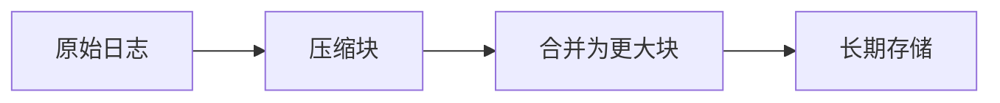

# 资源回收

## 介绍

在Grafana Loki中，**资源回收**是指管理存储资源的过程，确保系统不会因日志数据无限增长而耗尽存储空间。Loki通过**保留策略**和**压缩机制**来实现资源回收，帮助用户控制存储成本并保持查询性能。

:::note 为什么需要资源回收？
- 避免存储成本无限增加
- 提升查询效率（减少扫描的数据量）
- 满足合规性要求（数据保留期限）
:::

## 核心概念

### 1. 保留策略

Loki通过`retention_period`配置项定义数据的保留时间。超过此期限的数据会被自动清理。

```yaml
# loki-config.yaml 示例
limits_config:
  retention_period: 168h  # 保留7天（168小时）
```

### 2. 删除机制

Loki提供两种删除方式：
- **后台自动清理**：基于保留策略
- **手动删除**：通过LogQL或API

#### 手动删除示例

```bash
# 删除特定标签的数据
curl -X POST \
  -H "Content-Type: application/json" \
  -d '{"query": "{app=\"nginx\"}", "start": "2023-01-01T00:00:00Z", "end": "2023-01-02T00:00:00Z"}' \
  http://localhost:3100/loki/api/v1/delete
```

### 3. 压缩与存储优化

Loki会定期压缩旧数据以提高存储效率：



## 实际案例

### 案例1：电商平台日志管理

**需求**：
- 生产环境日志保留30天
- 开发环境日志保留7天
- 支付服务日志保留1年（合规要求）

**解决方案**：
```yaml
# 多租户配置示例
limits_config:
  retention_period: 720h # 默认30天

overrides:
  "dev":
    retention_period: 168h
  "payment":
    retention_period: 8760h
```

### 案例2：紧急存储清理

当存储即将耗尽时，可以临时调整保留策略：

```bash
# 动态修改配置（无需重启）
curl -X POST \
  -H "Content-Type: application/json" \
  -d '{"limits_config":{"retention_period":"24h"}}' \
  http://localhost:3100/loki/api/v1/overrides
```

## 最佳实践

:::tip 资源回收建议
1. **分层保留**：关键业务数据保留更久
2. **监控存储使用**：设置Prometheus告警
3. **定期审查**：根据业务需求调整策略
4. **测试删除**：先在非生产环境验证
:::

## 总结

Grafana Loki的资源回收功能帮助您：
- 自动化管理日志生命周期
- 平衡存储成本与数据价值
- 满足合规性要求

## 延伸学习

1. **官方文档**：[Loki Retention](https://grafana.com/docs/loki/latest/operations/storage/retention/)
2. **实践练习**：
   - 配置不同命名空间的保留策略
   - 使用LogQL查询即将过期的数据
   - 模拟存储告警并执行紧急清理

3. **进阶话题**：
   - 与S3生命周期策略集成
   - 基于标签的细粒度保留控制