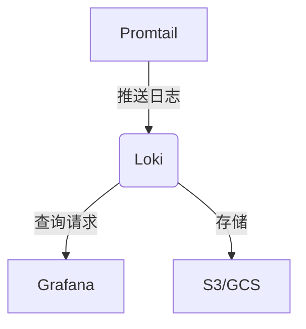

## 介绍

在Grafana Loki的运维过程中，**文档与知识管理**是确保系统稳定性和团队协作效率的核心环节。良好的文档实践能帮助团队快速定位问题、统一操作流程，并为新成员提供学习路径。本节将涵盖：
- 文档类型（如架构图、操作手册、故障处理指南）
- 知识管理工具（如Wiki、Markdown、版本控制）
- 自动化文档生成技巧

:::tip
文档应遵循“最小化可行记录”原则：确保内容简洁、可操作，并定期更新。
:::

---

## 文档类型与结构

### 1. 系统架构文档
使用文字和图表描述Loki的部署拓扑、组件交互及数据流向。例如：



### 2. 操作手册
分步骤记录常见运维操作，例如**日志卷清理**：
```bash
# 清理7天前的日志索引
loki-logcli --addr=http://loki:3100 \
    delete --older-than=168h \
    --query='{job="my-service"}'
```
**输出**：`Deleted 15 streams older than 7 days`

### 3. 故障处理指南
按“现象-诊断-解决”模板编写：
```
## 现象：Grafana显示"Too many outstanding requests"
1. 诊断：检查Loki的`/metrics`端点
2. 解决：调整`-querier.max-concurrent`参数
```

---

## 知识管理工具

### 1. 版本控制（Git）
将文档与配置代码一同管理：
```bash
/docs
  ├── architecture.md
  ├── operations/
  │   └── log_retention.md
  └── troubleshooting/
      └── high_load.md
```

### 2. Wiki系统
- 使用[GitHub Wiki](https://docs.github.com/en/communities/documenting-your-project-with-wikis)或[BookStack](https://www.bookstackapp.com/)
- 集成到Slack/MS Teams实现即时搜索

:::caution
避免知识孤岛！确保文档存放位置对所有相关人员可见。
:::

---

## 自动化实践

### 1. 从代码生成文档
利用`go doc`为Loki插件生成API文档：
```go
// Package filter implements log line filtering
// Example:
//   filter.New("error") // 创建错误日志过滤器
package filter
```
运行`godoc -http=:6060`查看生成的文档。

### 2. 监控指标注释
为Prometheus指标添加说明：
```yaml
# HELP loki_ingester_memory_chunks 当前内存中的日志块数量
# TYPE loki_ingester_memory_chunks gauge
```

---

## 实际案例

**场景**：某团队发现Loki查询变慢，但无人记得历史优化措施。<br />
**解决方案**：
1. 在Wiki创建《性能优化记录》页面
2. 记录每次调优的参数和效果：
   ```markdown
   | 日期     | 参数                     | 效果          |
   |----------|--------------------------|---------------|
   | 2023-08-01 | `-store.chunk-cache-size=2GB` | QPS提升40% |
   ```
3. 设置文档Review机制，每月更新

---

## 总结与练习

### 关键点总结
- 文档应分类存储并易于检索
- 结合图表和代码片段提升可读性
- 自动化工具减少维护成本

### 练习建议
1. 为你的Loki集群创建架构文档
2. 编写一个故障处理剧本（如“日志丢失”场景）
3. 尝试用`loki-docs-generator`自动生成配置说明

### 扩展阅读
- [Diátaxis文档框架](https://diataxis.fr/)
- [Google工程实践文档指南](https://google.github.io/eng-practices/)
``` 

注：实际使用时请移除最外层的