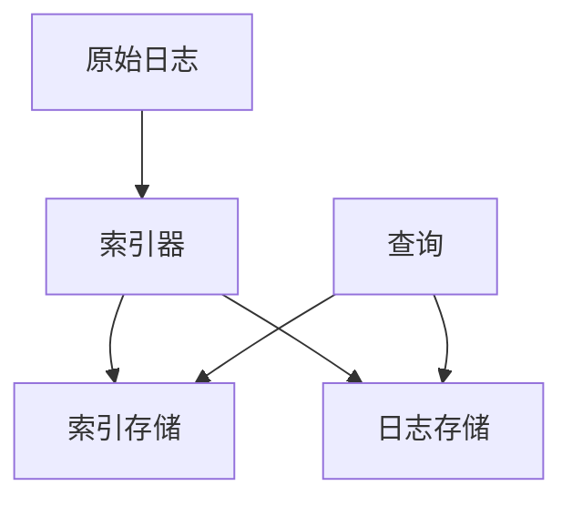

# 性能瓶颈分析

## 介绍

在运维Grafana Loki时，性能瓶颈是常见的问题之一。无论是查询速度变慢还是日志写入延迟，都可能影响系统的整体表现。本文将帮助你理解如何识别和分析Loki中的性能瓶颈，并提供优化建议。

## 常见的性能瓶颈来源

Loki的性能瓶颈通常来自以下几个方面：

1. **查询性能**：复杂的LogQL查询或大量数据扫描
2. **写入性能**：日志摄取速率超过处理能力
3. **存储性能**：底层存储系统(如S3、GCS)响应慢
4. **资源限制**：CPU、内存或网络带宽不足

## 识别性能瓶颈

### 1. 使用Loki指标

Loki提供了丰富的指标来帮助识别性能问题。可以通过Prometheus查询这些指标：

```promql
# 查询延迟高的请求
rate(loki_request_duration_seconds_bucket{le="10"}[5m])
```

### 2. 分析查询性能

慢查询通常是性能问题的首要嫌疑。使用`logcli`工具分析查询性能：

```bash
logcli query '{job="my-service"}' --limit=1000 --stats
```

输出示例：
```
Summary:
Total bytes processed: 1.2GB
Total lines processed: 120000
Execution time: 12.34s
```

### 3. 检查资源使用情况

使用`kubectl top`(如果部署在Kubernetes中)或系统监控工具检查资源使用：

```bash
kubectl top pods -n loki
```

## 性能优化策略

### 1. 查询优化

- 使用更精确的标签选择器
- 添加时间范围限制
- 避免全表扫描

优化前：
```logql
{job=~".*"}
```

优化后：
```logql
{job="api-server"} |= "error" |~ "timeout"
```

### 2. 索引优化



确保索引配置合理：
```yaml
schema_config:
  configs:
    - from: 2020-10-24
      store: boltdb-shipper
      object_store: s3
      schema: v11
      index:
        prefix: index_
        period: 24h
```

### 3. 水平扩展

对于高负载环境，考虑：
- 增加`ingester`节点处理写入
- 增加`querier`节点处理查询
- 增加`store-gateway`节点加速存储访问

## 实际案例

**案例：电商平台黑色星期五日志查询变慢**

**问题**：在促销活动期间，Loki查询响应时间从平均200ms增加到5s。

**分析步骤**：
1. 检查Prometheus指标，发现`loki_ingester_memory_chunks`接近配置上限
2. 查询日志显示大量全表扫描操作
3. 网络监控显示存储后端延迟增加

**解决方案**：
1. 增加`ingester`节点的内存限制
2. 优化查询添加时间范围和更精确的标签
3. 为S3存储添加缓存层

## 总结

性能瓶颈分析是Loki运维中的关键技能。通过监控指标、分析查询模式和合理配置，可以显著提升系统性能。

## 附加资源

- [官方性能调优文档](https://grafana.com/docs/loki/latest/operations/tuning/)
- [LogQL最佳实践](https://grafana.com/docs/loki/latest/logql/)
- [Loki架构设计](https://grafana.com/docs/loki/latest/architecture/)

:::tip 练习
1. 使用`logcli`对你环境中的Loki执行查询并分析统计信息
2. 尝试优化一个慢查询，比较优化前后的性能差异
3. 模拟高负载场景，观察Loki的指标变化
:::