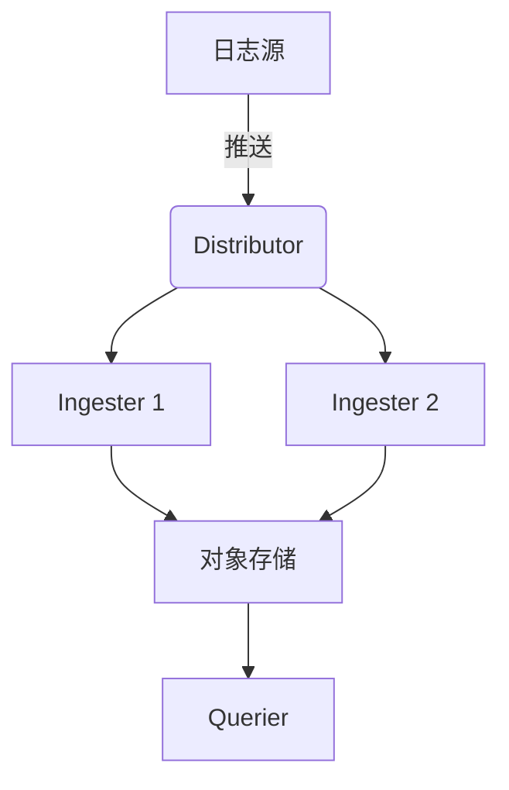

## 介绍

容量规划是Grafana Loki运维中的关键环节，它帮助您预估所需的存储、计算和网络资源，以避免性能瓶颈或资源浪费。合理的容量规划能确保Loki集群在高负载下稳定运行，同时控制成本。

## 核心概念

### 1. 数据量估算
Loki的存储需求主要由以下因素决定：
- **日志摄入量**：每秒接收的日志行数（log lines/sec）
- **日志平均大小**：单行日志的字节数
- **保留周期**：日志需要保留的时间（如7天、30天）

计算公式：
```
总存储量 = 日志摄入量 × 日志平均大小 × 保留时间 × 压缩因子
```

:::tip
Loki默认使用Snappy压缩，压缩因子通常为0.3-0.5（即压缩后为原始大小的30%-50%）
:::

### 2. 组件资源需求

#### Ingesters
- **内存**：每个ingester需要约1GB内存 + (日志行数 × 0.5KB)
- **CPU**：每10,000行日志/秒需要约1个vCPU

#### Queriers
- **内存**：每个查询约需要100MB内存
- **CPU**：并发查询数 × 查询复杂度

#### Store
- 对象存储（如S3、GCS）需要足够的IOPS（每秒输入输出操作次数）

## 实战示例

### 案例：电商平台日志系统
**需求**：
- 日均日志量：1亿行（约1,200行/秒）
- 平均日志大小：1KB
- 保留周期：14天

**计算**：
1. 原始日志量：
   ```
   1,200 lines/sec × 1KB × 86400 sec/day = ~103GB/day
   ```
2. 压缩后存储：
   ```
   103GB × 14 days × 0.4 = ~577GB
   ```
3. Ingester配置：
   ```
   1,200 lines/sec → 2个ingester（每个处理600 lines/sec）
   内存：1GB + (600 × 0.5KB) = ~1.3GB/实例
   ```

## 配置建议

### Loki 配置片段
```yaml
limits_config:
  ingestion_rate_mb: 10      # 每个ingester的摄入限制
  ingestion_burst_size_mb: 20
  max_entries_limit_per_query: 5000

ingester:
  lifecycler:
    num_tokens: 256         # 虚拟节点数
  chunk_idle_period: 1h     # 块空闲时间
```

## 监控与调整

使用Grafana监控关键指标：
- `loki_ingester_memory_chunks`：内存中的日志块数
- `loki_ingester_chunk_utilization`：块利用率
- `loki_distributor_bytes_received_total`：摄入数据量



## 总结

有效的容量规划需要：
1. 准确测量当前日志量
2. 预估增长趋势
3. 定期审查资源使用情况
4. 根据监控数据动态调整

## 延伸学习

- 使用`logcli`工具测试查询性能：
  ```bash
  logcli query '{job="nginx"}' --limit=1000 --stats
  ```
- 压力测试工具：`loki-canary`

:::warning
始终预留20-30%的缓冲容量以应对流量突增！
:::