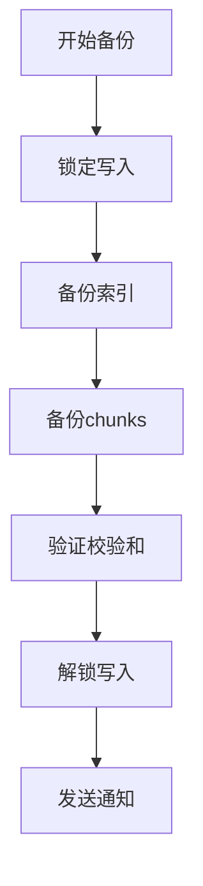

# Loki 备份恢复策略

## 介绍

在运维 Grafana Loki 时，备份与恢复策略是确保日志数据安全的关键环节。Loki 作为日志聚合系统，其数据通常包含关键业务信息，一旦丢失可能造成严重后果。本指南将介绍 Loki 的核心备份恢复机制，涵盖配置方法、工具选择和实际场景的解决方案。

## 备份策略设计

### 1. 备份目标
Loki 的数据主要由两部分组成：
- **索引数据**：存储在 `index` 目录或配置的数据库（如 BoltDB、Bigtable）
- **日志块数据**：存储在 `chunks` 目录或对象存储（如 S3、GCS）

:::tip
建议优先备份索引数据，因为重建索引的成本远高于重新摄入日志数据。
:::

### 2. 备份方法

#### 对象存储方案（推荐）
如果使用云对象存储（如 S3），可启用版本控制功能：

```bash
aws s3api put-bucket-versioning \
  --bucket my-loki-storage \
  --versioning-configuration Status=Enabled
```

#### 文件系统备份
对于本地存储，使用定时任务同步数据：

```bash
# 每日全量备份示例
0 2 * * * rsync -avz /loki/storage/ /backup/loki/$(date +\%Y\%m\%d)
```

## 恢复操作指南

### 1. 索引恢复
从 BoltDB 备份恢复：

```bash
# 停止 Loki 服务
systemctl stop loki

# 替换损坏的索引文件
cp /backup/loki/index_20231101.bak /loki/storage/index/index.db

# 重启服务
systemctl start loki
```

### 2. 日志数据恢复
当使用对象存储时，可通过版本回滚恢复：

```bash
aws s3api list-object-versions \
  --bucket my-loki-storage \
  --prefix chunks/

aws s3api restore-object \
  --bucket my-loki-storage \
  --key chunks/01FP3AQKBM2YJX2P6ZJ6X6EZFB \
  --version-id "null"
```

## 实际案例

### 场景：误删除日志流
1. **问题**：开发人员误删除了 `namespace=prod` 的所有日志
2. **解决步骤**：
   - 从 S3 版本历史恢复相关 chunk 文件
   - 重建受影响时间段的索引
   - 使用 `logcli` 验证数据完整性：

```bash
logcli query '{namespace="prod"}' --limit=5 --from="2023-11-01T00:00:00Z"
```

## 自动化方案

使用 Kubernetes CronJob 实现定时备份：

```yaml
apiVersion: batch/v1
kind: CronJob
metadata:
  name: loki-backup
spec:
  schedule: "0 2 * * *"
  jobTemplate:
    spec:
      containers:
      - name: backup
        image: amazon/aws-cli
        command: ["s3", "sync", "s3://my-loki-storage", "s3://loki-backup/$(date +%Y%m%d)"]
      restartPolicy: OnFailure
```

## 监控与验证

建议监控备份任务的以下指标：
- 备份持续时间
- 备份数据量
- 最后一次成功备份时间



## 总结

关键要点：
- 定期测试恢复流程（至少每季度一次）
- 遵循 3-2-1 原则：3份备份，2种介质，1份异地
- 文档化恢复流程并团队共享

## 延伸学习

- [Loki 官方运维文档](https://grafana.com/docs/loki/latest/operations)
- 《SRE：Google运维解密》中数据完整性章节
- 练习：在测试环境模拟删除日志流并尝试恢复