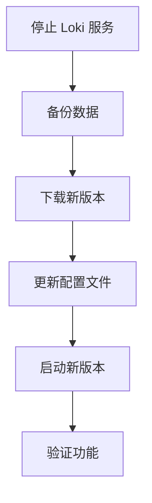

# Loki 版本升级流程

## 介绍

版本升级是运维 Grafana Loki 的重要环节，它能带来新功能、性能优化和安全补丁。本指南将详细介绍从升级前准备到验证的完整流程，帮助初学者避免常见问题。

:::note 为什么需要升级？
- 获取新功能（如查询优化、存储改进）
- 修复已知漏洞
- 保持与依赖组件的兼容性
:::

## 升级前准备

### 1. 检查升级路径
```bash
# 查看当前版本
loki --version

# 检查官方升级说明
curl -s https://grafana.com/docs/loki/latest/upgrading/ | grep "Version"
```

### 2. 备份关键数据
```bash
# 备份配置文件
cp -r /etc/loki /backup/loki_config_$(date +%F)

# 如有必要，备份存储数据（取决于使用的存储后端）
aws s3 sync s3://loki-storage s3://loki-backup/$(date +%F)
```

### 3. 检查依赖兼容性

| 组件        | 最低要求版本 |
|------------|-------------|
| Promtail   | 2.4+        |
| Grafana    | 8.0+        |
| Kubernetes | 1.19+       |

## 升级步骤

### 单节点升级流程


### 详细操作

1. 停止服务
```bash
sudo systemctl stop loki
```

2. 获取新版本（以 v2.7.0 为例）
```bash
wget https://github.com/grafana/loki/releases/download/v2.7.0/loki-linux-amd64.zip
unzip loki-linux-amd64.zip
```

3. 配置文件迁移
```yaml
# 比较新旧配置差异
diff -u /etc/loki/old-config.yaml /etc/loki/new-config.yaml

# 常见需要更新的配置项
auth_enabled: false  # 2.0+版本默认值变化
```

:::caution 重要提示
始终保留旧版本二进制文件，以便快速回滚：
```bash
mv /usr/bin/loki /usr/bin/loki_old
cp loki-linux-amd64 /usr/bin/loki
```
:::

## 验证升级

### 基础检查
```bash
# 验证版本
loki --version
# 预期输出: 2.7.0

# 检查服务状态
journalctl -u loki -f --since "5 minutes ago"
```

### 功能测试
1. 查询日志验证
```bash
curl -G http://localhost:3100/loki/api/v1/query_range \
  --data-urlencode 'query={job="varlogs"}' \
  --data-urlencode 'limit=5'
```

2. 告警规则检查
```yaml
# 示例告警规则验证
- alert: LokiRequestErrors
  expr: rate(loki_request_duration_seconds_count{status_code=~"5.."}[1m]) > 0
```

## 实际案例

**场景**：从 v2.4.2 升级到 v2.6.1 时遇到的配置变更

1. **问题**：`chunk_target_size` 参数废弃
2. **解决方案**：
```yaml
# 旧配置
chunk_target_size: 1048576

# 新配置
limits_config:
  ingestion_rate_strategy: local
  ingestion_rate_mb: 10
```

3. **验证方法**：
```bash
# 检查压缩是否正常
loki --config.file=/etc/loki/config.yaml --target=compactor
```

## 总结与资源

### 关键要点
- 始终先升级测试环境
- 仔细阅读版本变更说明
- 监控升级后系统表现

### 延伸学习
- [官方升级指南](https://grafana.com/docs/loki/latest/upgrading/)
- [版本变更日志](https://github.com/grafana/loki/blob/main/CHANGELOG.md)

### 练习建议
1. 在本地Docker环境模拟从2.4.0升级到2.5.0
2. 编写自动检查版本兼容性的Shell脚本
3. 设计升级回滚检查清单