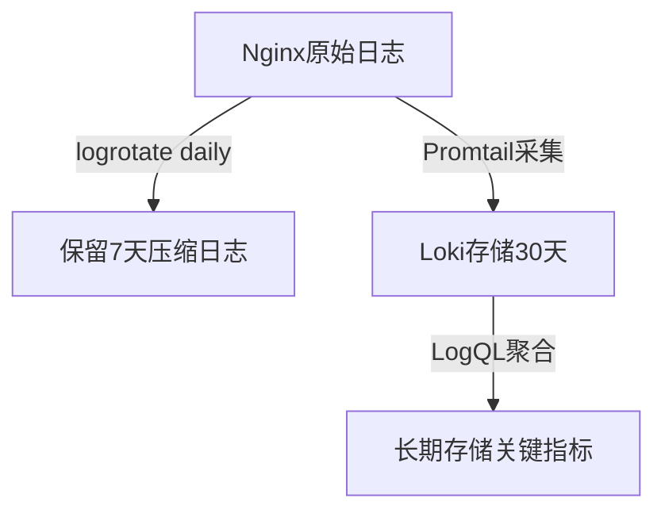

# 日志轮转

## 介绍

日志轮转（Log Rotation）是运维中的关键实践，用于管理日志文件的生成、存储和清理。在Grafana Loki等日志聚合系统中，合理的日志轮转策略能有效控制存储成本，避免磁盘空间耗尽，同时保留必要的日志数据用于分析。

日志轮转通常通过以下方式实现：
- **按时间轮转**（如每天、每周）
- **按文件大小轮转**（如达到100MB时）
- **按日志数量轮转**（如保留最近7个文件）

## 为什么需要日志轮转？

:::note
日志文件会持续增长，如果不加限制：
1. 占用过多磁盘空间，导致系统崩溃
2. 增加Loki索引和查询负担
3. 降低日志分析效率
:::

## 基础配置示例

### 使用logrotate工具（Linux系统）

大多数Linux系统内置`logrotate`工具。以下是一个典型的配置示例（`/etc/logrotate.d/myapp`）：

```bash
/var/log/myapp/*.log {
    daily
    rotate 7
    compress
    delaycompress
    missingok
    notifempty
    sharedscripts
    postrotate
        systemctl restart loki
    endscript
}
```

**参数说明**：
- `daily`：每天轮转一次
- `rotate 7`：保留7个历史文件
- `compress`：启用gzip压缩旧日志
- `postrotate`：轮转后重启Loki服务（确保新日志被正确捕获）

## Loki 中的日志轮转策略

### 1. 客户端配置（Promtail）

在Promtail的配置文件（`promtail-config.yml`）中，可以控制日志文件的读取行为：

```yaml
scrape_configs:
- job_name: system
  static_configs:
  - targets:
      - localhost
    labels:
      job: varlogs
      __path__: /var/log/myapp/*.log
  pipeline_stages:
  - multiline:
      firstline: '^\d{4}-\d{2}-\d{2}'
      max_wait_time: 3s
```

:::tip
通过`__path__`使用通配符（如`*.log`）可以自动捕获轮转后的新日志文件，无需额外配置。
:::

### 2. Loki服务端保留策略

在Loki的配置文件（`loki-config.yml`）中设置数据保留时间：

```yaml
compactor:
  working_directory: /tmp/loki/compactor
  shared_store: filesystem
  retention_enabled: true
  retention_delete_delay: 2h
  retention_delete_worker_count: 10

storage_config:
  boltdb_shipper:
    active_index_directory: /tmp/loki/index
    shared_store: filesystem
  filesystem:
    directory: /tmp/loki/chunks

limits_config:
  retention_period: 720h  # 保留30天
```

## 实际案例：电商应用日志管理

**场景**：一个电商平台每天产生50GB的Nginx访问日志，需要：
1. 保留原始日志7天（用于调试）
2. 将关键指标（如错误率）长期存储在Loki中
3. 避免存储成本过高

**解决方案**：


1. Nginx服务器配置：
```bash
# /etc/logrotate.d/nginx
/var/log/nginx/*.log {
    daily
    rotate 7
    compress
    dateext
    missingok
    sharedscripts
    postrotate
        /usr/bin/killall -USR1 promtail
    endscript
}
```

2. Promtail添加过滤规则（只采集错误日志）：
```yaml
pipeline_stages:
- match:
    selector: '{job="nginx"} |~ "5[0-9]{2}"'
    stages:
    - pack:
        labels:
          - level
    - labels:
        level:
```

## 常见问题解决

:::caution
**问题**：轮转后Promtail不读取新文件<br />
**解决**：检查`readline`配置，确保使用`/path/to/*.log`而非具体文件名
:::

:::warning
**问题**：轮转导致Loki重复记录<br />
**解决**：在Promtail中配置`ignore_checkpoints: true`并设置合理的`max_backoff_period`
:::

## 总结与练习

**关键要点**：
1. 日志轮转是存储管理和系统稳定的基础
2. Loki本身不处理轮转，需结合操作系统工具
3. 通过保留策略平衡存储成本与需求

**练习建议**：
1. 在测试服务器上配置logrotate，观察轮转过程
2. 使用`loki-canary`工具模拟日志生成，测试保留策略
3. 编写LogQL查询，比较轮转前后的日志连续性

**扩展阅读**：
- [logrotate官方文档](https://linux.die.net/man/8/logrotate)
- [Loki保留策略配置指南](https://grafana.com/docs/loki/latest/operations/storage/retention/)