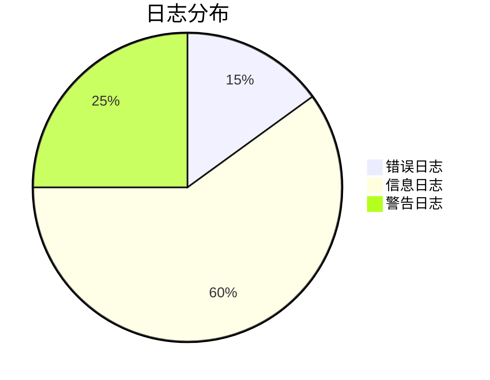

# 系统监控

## 介绍

系统监控是运维工作中至关重要的一环，它帮助管理员实时了解系统的运行状态、性能指标以及潜在问题。Grafana Loki 是一个开源的日志聚合系统，专门为日志监控和告警设计。与传统的监控工具不同，Loki 专注于日志数据的高效存储和查询，特别适合云原生环境。

在本章节中，你将学习如何利用 Loki 进行系统监控，包括配置、查询和告警设置。

---

## 为什么需要系统监控？

系统监控的主要目标包括：
1. **实时发现问题**：通过监控日志和指标，快速发现系统异常。
2. **性能优化**：分析历史数据，识别性能瓶颈。
3. **容量规划**：预测资源需求，避免资源不足或浪费。
4. **安全审计**：跟踪用户行为和系统事件，确保安全性。

:::tip
Loki 的优势在于其轻量级的索引设计和与 Prometheus 的深度集成，非常适合大规模分布式系统的日志监控。
:::

---

## Loki 系统监控基础

### 1. 数据采集
Loki 通过 **Promtail** 或 **Fluent Bit** 等代理工具采集日志数据。以下是一个简单的 Promtail 配置示例：

```yaml
server:
  http_listen_port: 9080
  grpc_listen_port: 0

positions:
  filename: /tmp/positions.yaml

clients:
  - url: http://loki:3100/loki/api/v1/push

scrape_configs:
  - job_name: system
    static_configs:
      - targets:
          - localhost
        labels:
          job: varlogs
          __path__: /var/log/*.log
```

### 2. 日志查询
使用 Loki 的 **LogQL** 查询语言过滤和分析日志。例如，查询错误日志：

```logql
{job="varlogs"} |= "error"
```

输出示例：
```
2023-10-01T12:00:00Z ERROR service failed to start
2023-10-01T12:05:00Z ERROR connection timeout
```

### 3. 告警规则
在 Grafana 中配置告警规则，例如检测高频错误：

```yaml
groups:
  - name: example
    rules:
      - alert: HighErrorRate
        expr: |
          sum(rate({job="varlogs"} |= "error" [5m])) by (job) > 10
        for: 10m
        labels:
          severity: critical
        annotations:
          summary: "High error rate detected in {{ $labels.job }}"
```

---

## 实际案例：监控 Web 服务

### 场景描述
假设你运行一个 Web 服务，需要监控以下内容：
1. HTTP 请求错误（如 5xx 状态码）。
2. 慢响应（延迟 > 1 秒）。

### 实现步骤
1. **配置 Promtail** 收集 Nginx 日志：
   ```yaml
   scrape_configs:
     - job_name: nginx
       static_configs:
         - targets: [localhost]
           labels:
             job: nginx
             __path__: /var/log/nginx/access.log
   ```

2. **创建 LogQL 查询**：
   - 查询 5xx 错误：
     ```logql
     {job="nginx"} | json | status >= 500
     ```
   - 查询慢响应：
     ```logql
     {job="nginx"} | json | duration > 1s
     ```

3. **设置告警**：
   ```yaml
   rules:
     - alert: Nginx5xxErrors
       expr: |
         sum(rate({job="nginx"} | json | status >= 500 [5m])) by (service) > 5
       annotations:
         description: "5xx errors detected in {{ $labels.service }}"
   ```

---

## 可视化监控数据

在 Grafana 中创建仪表盘，展示关键指标：
1. 错误率趋势图。
2. 请求延迟分布。
3. 服务健康状态。



---

## 总结

通过本章学习，你掌握了：
1. Loki 在系统监控中的核心作用。
2. 如何配置数据采集和告警规则。
3. 使用 LogQL 查询和分析日志。
4. 实际案例中监控 Web 服务的方法。

---

## 扩展练习
1. 尝试为你的本地开发环境配置 Promtail 和 Loki。
2. 编写一个 LogQL 查询，过滤出包含特定关键字的日志。
3. 在 Grafana 中创建一个简单的监控仪表盘。

## 附加资源
- [Loki 官方文档](https://grafana.com/docs/loki/latest/)
- [LogQL 语法指南](https://grafana.com/docs/loki/latest/logql/)
- [Promtail 配置参考](https://grafana.com/docs/loki/latest/clients/promtail/)