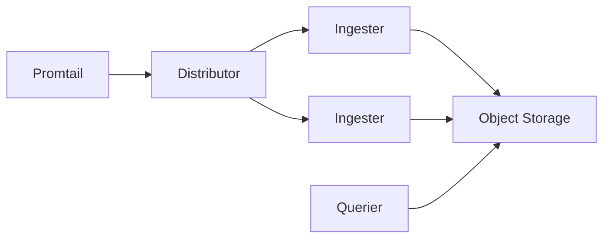

# 成本优化

## 介绍

在运维 Grafana Loki 时，成本优化是一个关键考量。Loki 的设计初衷是通过高效的日志存储和查询降低开销，但不当的配置仍可能导致资源浪费。本文将介绍如何从 **存储**、**查询** 和 **配置** 三方面优化 Loki 的成本。

:::note
成本优化的核心原则：  
1. **减少不必要的数据存储**  
2. **优化查询性能**  
3. **合理分配资源**
:::

---

## 一、存储优化

### 1. 保留策略（Retention）
通过 `retention_period` 控制日志保存时间，避免无限期存储。  
示例配置（`loki.yaml`）：
```yaml
table_manager:
  retention_deletes_enabled: true
  retention_period: 720h # 保留30天
```

### 2. 压缩与分块
Loki 的日志数据以块（chunk）形式存储。调整分块大小和压缩策略可节省空间：
```yaml
chunk_store_config:
  max_look_back_period: 720h # 与保留策略一致
schema_config:
  configs:
    - from: 2023-01-01
      store: boltdb-shipper
      object_store: s3
      schema: v11
      index:
        prefix: loki_index_
        period: 24h # 每日一个索引文件
```

:::tip
对于高频日志，增大 `chunk_block_size`（默认 256KB）可减少小文件数量，但会略微增加查询延迟。
:::

---

## 二、查询优化

### 1. 使用过滤条件
在 LogQL 中通过标签和管道操作减少扫描的数据量：
```logql
{cluster="prod", namespace="app"} |= "error" | json | latency > 500ms
```
优于全量查询：
```logql
{cluster="prod"} |= "error"
```

### 2. 限制查询范围
避免大时间范围查询：
```logql
{service="api"} |= "timeout" [15m]  # 仅查最近15分钟
```

---

## 三、资源配置

### 1. 按需分配组件
根据负载拆分组件（如独立部署 `ingester` 和 `querier`）：


### 2. 自动扩展
在 Kubernetes 中配置 HPA（Horizontal Pod Autoscaler）：
```yaml
apiVersion: autoscaling/v2
kind: HorizontalPodAutoscaler
metadata:
  name: loki-ingester
spec:
  scaleTargetRef:
    apiVersion: apps/v1
    kind: Deployment
    name: loki-ingester
  minReplicas: 2
  maxReplicas: 10
  metrics:
    - type: Resource
      resource:
        name: cpu
        target:
          type: Utilization
          averageUtilization: 60
```

---

## 实际案例

### 场景：电商大促期间的日志管理
1. **问题**：大促期间日志量增长10倍，存储成本激增。
2. **解决方案**：
   - 临时调整 `retention_period` 从30天缩短为7天。
   - 对非核心服务（如数据分析）日志关闭索引。
   - 使用 `logcli` 提前清理测试环境日志：
     ```bash
     logcli delete --query '{env="test"}' --from 48h
     ```

---

## 总结

| 优化方向       | 关键措施                          |
|----------------|-----------------------------------|
| **存储**       | 保留策略、压缩分块、冷热分层      |
| **查询**       | LogQL 过滤、小范围查询            |
| **资源**       | 组件分离、自动扩展                |

:::caution
优化前务必在测试环境验证配置变更！
:::

## 延伸阅读
1. [Loki 官方文档 - 存储配置](https://grafana.com/docs/loki/latest/configuration/#storage_config)
2. [LogQL 最佳实践](https://grafana.com/docs/loki/latest/logql/)