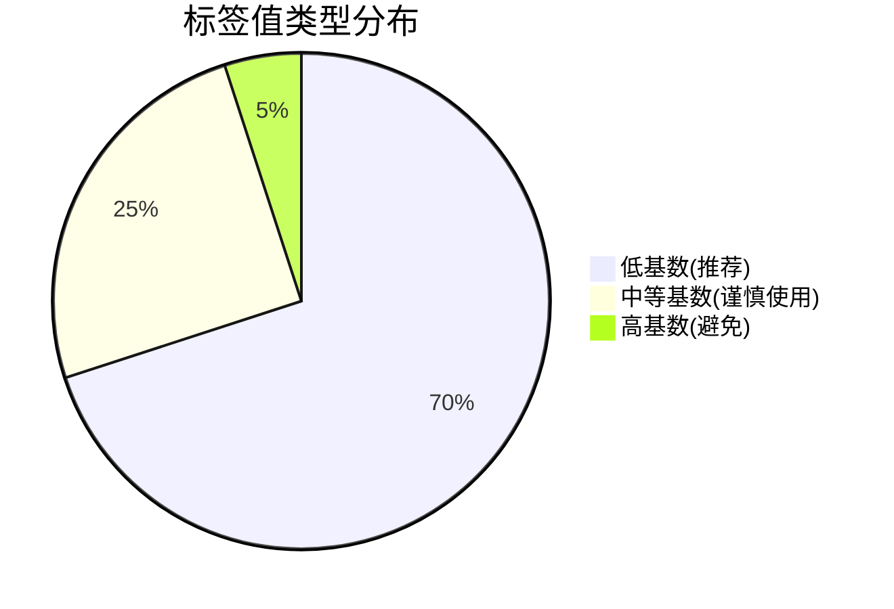

# Loki 标签设计最佳实践

## 介绍

在Grafana Loki中，**标签（Labels）**是索引和查询日志的核心机制。与Prometheus类似，标签用于标识日志流的元数据，但Loki的标签设计需要特别注意**基数（Cardinality）**控制，以避免性能问题。本章将深入探讨如何设计高效的标签体系。

:::note 关键概念
- **标签基数**：指标签值的唯一性数量（如`user_id=1001`和`user_id=1002`是两个不同的基数）
- **高基数问题**：当标签值组合过多时（如使用UUID作为标签），会导致索引膨胀
:::

## 基本原则

### 1. 控制标签基数
Loki的索引设计适合**低基数标签**，最佳实践包括：
- 优先使用有限的可枚举值（如`environment=prod|dev|staging`）
- 避免使用唯一值（如`request_id`、`user_id`）作为标签



### 2. 常用标签模式
推荐的基础标签组合：
```yaml
# promtail配置示例
scrape_configs:
  - job_name: myapp
    static_configs:
      - targets: [localhost]
        labels:
          job: 'myapp'
          environment: 'prod'
          component: 'api'
          severity: 'error' # 可选级别
```

## 实际案例

### 案例1：Web应用日志
**错误设计**：
```text
{app="shop", path="/user/87654321/profile", ip="192.168.1.100"}
# 路径和IP会导致无限基数
```

**优化设计**：
```text
{app="shop", route="/user/:id/profile", status="200", env="prod"}
# 使用路由模板和有限状态码
```

### 案例2：多租户系统
```go
// 在日志生成时添加租户标签
logger := log.With("tenant", getTenantFromContext(ctx))
```

:::warning 生产环境注意
以下标签会导致严重性能问题：
- `trace_id=abcd1234...`
- `session_id=xyz789...`
- 原始时间戳（应使用Loki内置时间索引）
:::

## 高级技巧

### 动态标签控制
通过Promtail的pipeline阶段动态添加标签：
```yaml
pipeline_stages:
  - docker: {}
  - match:
      selector: '{job="myapp"}'
      stages:
        - regex:
            expression: 'level=(?P<level>\w+)'
        - labels:
            level:
```

### 日志行筛选策略
对于高基数数据：
1. 保留在日志内容中
2. 通过[过滤器表达式](https://grafana.com/docs/loki/latest/logql/)查询：
```logql
{app="frontend"} |= "user_id=12345"
```

## 总结

| 推荐做法 | 避免做法 |
|---------|----------|
| 有限枚举值标签 | 唯一标识符标签 |
| 静态/预定义标签 | 动态生成的高基数标签 |
| 5-10个标签/日志流 | 数十个标签组合 |

:::tip 练习建议
1. 检查现有日志流的标签基数：
```logql
count by (label_name) (
  sum by (label_name, value) (
    rate({job="myapp"}[5m])
  )
)
```
2. 尝试重构一个高基数标签，将其移至日志内容
:::

## 延伸阅读
- [Loki官方标签文档](https://grafana.com/docs/loki/latest/fundamentals/labels/)
- [LogQL标签操作指南](https://grafana.com/docs/loki/latest/logql/#label-filter-expression)
- [基数控制白皮书](https://grafana.com/docs/loki/latest/operations/storage/)