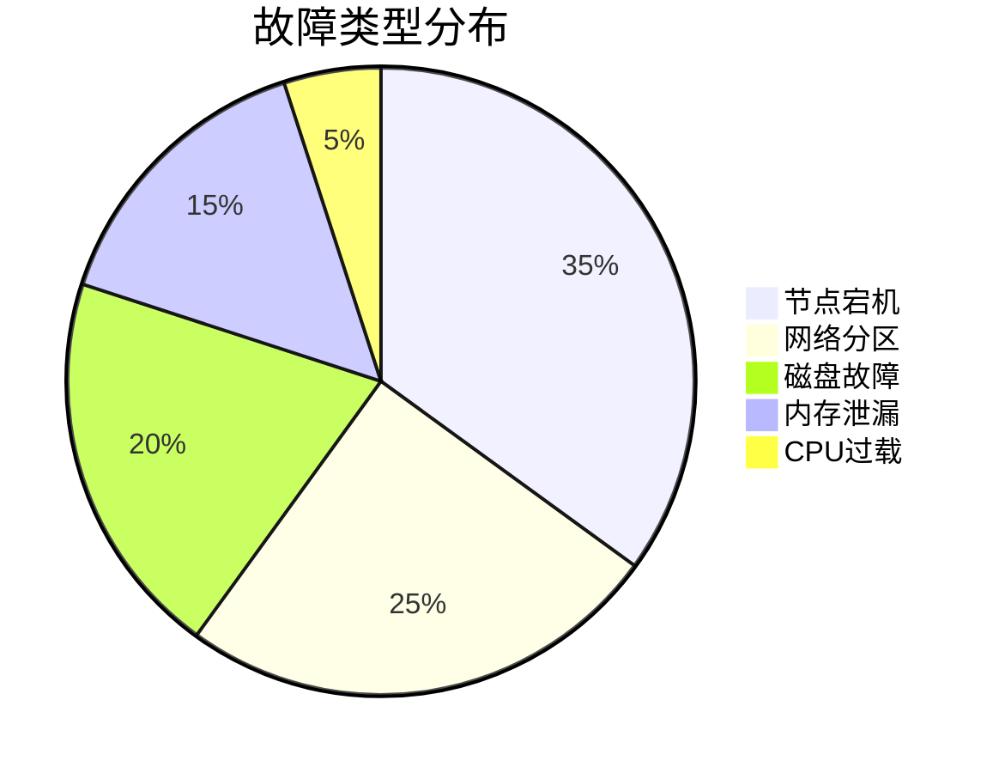

# 故障演练

## 介绍

故障演练（Chaos Engineering）是一种通过主动注入故障来验证系统健壮性的实践。在Grafana Loki中，故障演练帮助您识别日志管道的潜在弱点，确保在真实故障发生时能够快速恢复。本指南将介绍如何为Loki设计、执行和验证故障演练。

:::tip 为什么需要故障演练？
- 发现单点故障
- 验证监控告警的有效性
- 训练团队应对突发故障的能力
- 提升系统整体可靠性
:::

## 演练设计原则

### 1. 确定关键组件
Loki的核心组件包括：
- **Distributor**：接收日志数据
- **Ingester**：处理日志流
- **Querier**：执行查询
- **存储后端**（如S3/GCS）

### 2. 选择故障类型
常见演练场景：


## 实战演练示例

### 案例1：Ingester节点故障
**目标**：验证当一个Ingester节点宕机时，日志是否会被重新路由到其他节点。

**步骤**：
1. 部署3节点Loki集群
2. 使用`logcli`发送测试日志：
```bash
echo "Test message $(date)" | logcli push \
  --addr=http://loki:3100 \
  --user=myuser \
  --password=mypassword \
  --org-id=myorg \
  --labels="{job=\"test\",instance=\"app1\"}"
```
3. 随机终止一个Ingester节点：
```bash
kubectl delete pod loki-ingester-1 -n loki
```
4. 观察：
   - 日志是否继续接收（检查Distributor指标）
   - 查询是否仍能返回完整数据

**预期结果**：
- 短暂延迟（`<1分钟`）后日志恢复接收
- 查询结果包含故障期间的所有日志

:::caution 注意事项
- 避免在生产环境直接操作，建议先在测试集群验证
- 记录所有操作时间点，便于事后分析
:::

### 案例2：存储后端降级
**目标**：测试S3存储不可用时Loki的降级处理能力。

**模拟步骤**：
1. 限制S3访问权限：
```bash
aws iam put-user-policy \
  --user-name loki-service-account \
  --policy-name deny-s3-access \
  --policy-document '{"Version":"2012-10-17","Statement":[{"Effect":"Deny","Action":"s3:*","Resource":"*"}]}'
```
2. 观察：
   - Ingester是否进入只读模式
   - 查询是否返回降级提示
3. 恢复权限后检查数据一致性

## 验证与指标监控

关键Prometheus指标：
- `loki_ingester_flush_failures_total`
- `loki_distributor_samples_dropped_total`
- `loki_querier_storegateway_instances_hit_per_query`

Grafana仪表板示例查询：
```promql
sum(rate(loki_distributor_samples_dropped_total[1m])) by (reason)
```

## 总结与练习

### 核心收获
- 故障演练应成为定期实践
- 每次演练后更新应急预案
- 监控系统是演练成功的关键

### 进阶练习
1. 设计一个网络分区的演练方案
2. 比较单AZ故障与多AZ故障的影响差异
3. 为您的Loki集群创建自定义的"健康评分"指标

### 附加资源
- [Loki官方可靠性指南](https://grafana.com/docs/loki/latest/operations/reliability/)
- [Chaos Mesh文档](https://chaos-mesh.org/docs/)
- 《Site Reliability Engineering》第20章