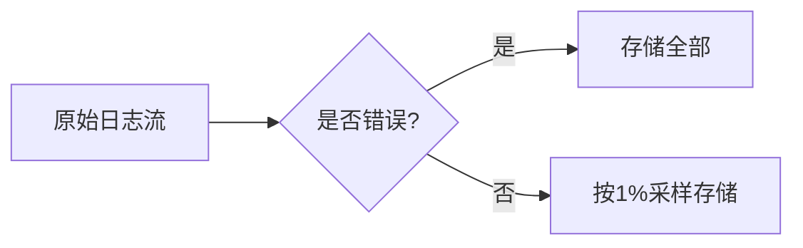

# 可观测性最佳实践

## 介绍

可观测性（Observability）是现代分布式系统运维的核心能力，它通过日志（Logs）、指标（Metrics）和追踪（Traces）三大支柱，帮助开发者快速定位问题、理解系统行为。Grafana Loki作为轻量级的日志聚合系统，专注于**低成本**和**高效查询**，是构建可观测性体系的关键组件之一。本章将介绍如何结合Loki实现可观测性最佳实践。

:::note 关键概念
- **日志（Logs）**：系统或应用生成的原始事件记录。
- **指标（Metrics）**：随时间变化的数值化数据（如CPU使用率）。
- **追踪（Traces）**：请求在分布式系统中的调用链路。
:::

---

## 1. 结构化日志

### 为什么需要结构化？
原始文本日志难以自动化分析。Loki通过标签（Labels）索引日志，但**内容本身仍需结构化**（如JSON），以便高效过滤和聚合。

### 示例：应用日志输出
```python
# 非结构化（不推荐）
print("Error: Failed to connect to database at 192.168.1.1")

# 结构化（推荐）
import json
log_entry = {
    "level": "ERROR",
    "message": "Failed to connect to database",
    "target": "database",
    "ip": "192.168.1.1"
}
print(json.dumps(log_entry))
```

**Loki查询优势**：  
通过标签过滤后，可使用LogQL解析JSON字段：  
```logql
{app="myapp"} | json | level="ERROR"
```

---

## 2. 合理的标签设计

### 标签原则
- **高基数问题**：避免使用唯一值（如用户ID）作为标签，会导致索引膨胀。
- **推荐标签**：固定维度如`environment=prod`、`app=frontend`。

### 错误 vs 正确配置
```yaml
# 错误：使用高基数标签
loki:
  config:
    schema_config:
      labels:
        - "user_id"  # 每个用户一个索引条目！

# 正确：低基数标签
loki:
  config:
    schema_config:
      labels:
        - "service"
        - "level"
```

---

## 3. 日志采样与保留策略

### 场景：处理海量日志
通过采样减少存储成本，同时保留关键错误日志。



### 配置示例
```yaml
# promtail配置（采样非错误日志）
pipeline_stages:
  - match:
      selector: '{level!="ERROR"}'
      action: drop
      drop_rate: 100  # 每100条保留1条
```

---

## 4. 与Metrics/Tracing联动

### 实际案例：全链路排查
1. **从指标发现问题**：Prometheus告警显示API延迟升高。
2. **查询Loki日志**：过滤相关服务的错误日志。
3. **追踪链路**：通过Tempo找到具体请求路径。

```logql
# 结合指标和日志
rate({service="api"} |= "timeout" [5m]) > 10
```

---

## 5. 告警与可视化

### 使用LogQL告警规则
```yaml
# loki-ruler-config.yaml
groups:
  - name: errors-alerts
    rules:
      - alert: HighErrorRate
        expr: |
          sum(rate({level="ERROR"}[5m])) by (service) > 5
        for: 10m
        labels:
          severity: critical
```

### Grafana看板集成
- 将Loki日志与Prometheus指标在同一面板展示。
- 使用`$__interval`变量动态调整查询范围。

---

## 总结

| 实践要点                | 具体措施                          |
|-------------------------|-----------------------------------|
| 结构化日志              | 输出JSON格式，便于LogQL解析       |
| 标签设计                | 选择低基数维度，避免高基数问题    |
| 采样与保留              | 对非关键日志降采样，设置TTL       |
| 多信号关联              | 日志、指标、追踪协同分析          |
| 自动化告警              | 基于LogQL定义阈值                 |

---

## 延伸练习
1. 在本地部署Loki和Promtail，尝试为示例应用配置结构化日志收集。
2. 设计一个LogQL查询，统计每小时错误日志的增长趋势。
3. 创建一个Grafana看板，混合展示Loki日志和Prometheus的HTTP请求率。

:::tip 附加资源
- [Loki官方文档](https://grafana.com/docs/loki/latest/)
- 《可观测性工程》书籍（O'Reilly）
:::