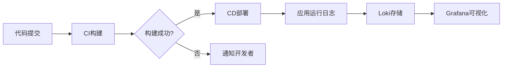

## 介绍

在现代DevOps实践中，日志管理是监控系统健康、排查问题的重要环节。Grafana Loki作为轻量级的日志聚合系统，专为云原生环境设计，能够与DevOps工具链高效集成。本章将介绍如何将Loki融入DevOps流程，包括CI/CD流水线、告警系统和自动化运维场景。

---

## Loki 与DevOps工具链集成

### 1. 与CI/CD流水线结合
在持续集成/持续部署（CI/CD）中，Loki可以收集构建和部署日志，帮助团队快速定位问题。

**典型工作流示例：**


**实践步骤：**
1. 在Jenkins/GitLab CI中配置日志转发：
```bash
# 示例：将构建日志发送到Loki
curl -v -H "Content-Type: application/json" -XPOST \
  "http://loki:3100/api/prom/push" \
  --data-raw '{"streams": [{ "stream": { "job": "jenkins-build" }, "values": [ [ "'$(date +%s%N)'", "Build started for commit ${GIT_COMMIT}" ] ] }]}'
```

2. 在Grafana中创建CI/CD监控看板，跟踪构建成功率、耗时等指标。

---

### 2. 告警与事件管理
通过Loki的`Ruler`组件与Alertmanager集成，实现基于日志内容的告警。

**配置示例：**
```yaml
# loki-ruler-config.yaml
rule_files:
  - /etc/loki/rules/*.yaml

alerting:
  alertmanager_url: http://alertmanager:9093
```

**告警规则定义：**
```yaml
# rules/app_errors.yaml
groups:
  - name: application-errors
    rules:
      - alert: HighErrorRate
        expr: |
          sum(rate({job="myapp"} |~ "ERROR|FATAL" [5m])) by (namespace) > 5
        for: 10m
        labels:
            severity: critical
        annotations:
            summary: "High error rate in {{ $labels.namespace }}"
```

:::tip
结合Grafana的Alert面板，可以预览告警规则触发效果，避免误报。
:::

---

### 3. 基础设施即代码（IaC）集成
使用Terraform或Ansible自动化Loki部署：

**Terraform示例：**
```hcl
resource "helm_release" "loki" {
  name       = "loki"
  repository = "https://grafana.github.io/helm-charts"
  chart      = "loki-stack"
  namespace  = "monitoring"

  set {
    name  = "promtail.enabled"
    value = "true"
  }
}
```

---

## 真实案例：电商平台的日志监控

**场景：**  
某电商平台在黑色星期五期间需要实时监控支付服务的异常日志。

**解决方案：**
1. 使用Promtail收集支付服务日志
```yaml
# promtail-config.yaml
scrape_configs:
  - job_name: payment-service
    static_configs:
      - targets: [localhost]
        labels:
          job: payment-service
          __path__: /var/log/payment/*.log
```

2. 设置关键告警规则：
```yaml
# 支付失败告警
- alert: PaymentFailed
  expr: |
    count_over_time(
      {job="payment-service"} 
      | json 
      | status="failed" 
      [1h]
    ) > 100
```

3. 在Grafana中创建实时流量看板：
```sql
sum(rate({job="payment-service"} | json | status="success"[5m])) by (endpoint)
```

---

## 总结

通过将Loki集成到DevOps流程中，团队可以实现：
- 构建/部署日志的集中管理
- 基于日志内容的实时告警
- 与现有工具链的无缝协作

**后续学习建议：**
1. 尝试将Loki与你的CI/CD工具集成
2. 创建自定义告警规则并测试触发条件
3. 探索Grafana的日志分析功能

:::note
扩展阅读：
- [Loki官方文档-生产部署建议](https://grafana.com/docs/loki/latest/)
- 《云原生日志管理实践》电子书
:::