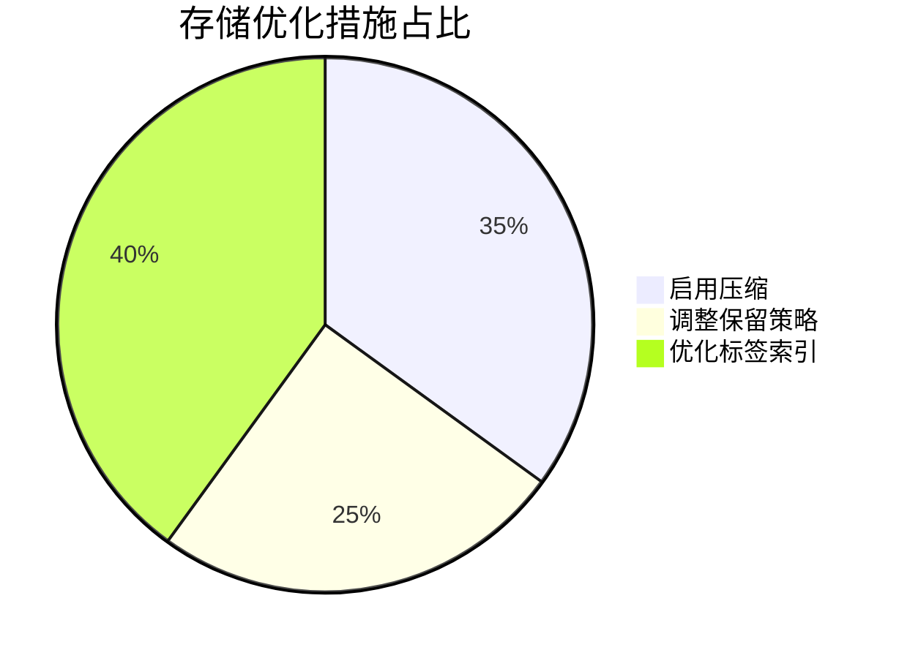
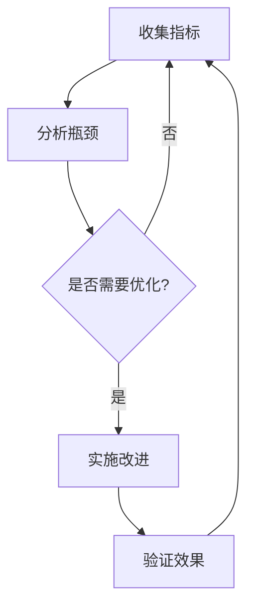

## 介绍

持续改进策略是确保 Loki 日志系统长期高效运行的核心方法。它通过周期性评估、指标分析和渐进式优化，帮助运维团队适应不断变化的业务需求。对于初学者而言，理解这一策略能避免常见的“部署即遗忘”陷阱，将 Loki 的价值最大化。

## 核心改进维度

### 1. 性能监控与基准测试

**关键步骤：**
- 使用 `logcli` 定期检查查询延迟：
  ```bash
  logcli query '{job="nginx"}' --limit=1000 --stats
  ```
  输出示例：
  ```
  Summary: 1000 lines, 2 streams, 1.5MB in 320ms
  ```

- 通过 Grafana 仪表盘监控 `loki_querystats_latency_seconds` 指标，识别慢查询模式。

:::tip
建议每周运行一次基准测试，对比历史数据生成趋势报告。
:::

### 2. 存储优化实战

**真实案例：**
某电商平台发现 Loki 存储占用每月增长 40%，通过以下策略降低 60% 成本：



具体配置示例：
```yaml
compactor:
  working_directory: /tmp/loki/compactor
  shared_store: s3
  retention_enabled: true
  retention_delete_delay: 2h
schema_config:
  configs:
    - from: 2023-01-01
      store: boltdb-shipper
      object_store: s3
      schema: v11
      index:
        prefix: index_
        period: 24h
```

### 3. 查询效率提升

**典型优化场景：**

```sql
-- 低效查询（全量扫描）
{namespace="production"} |= "error"

-- 优化后（利用标签缩小范围）
{namespace="production", pod=~"frontend-.+"} |= "timeout"
```

:::caution
避免在生产环境使用 `|= "error"` 这类宽泛匹配，可能触发全量日志扫描。
:::

## 改进周期模型



## 总结与进阶

**关键收获：**
- 建立定期（建议每月）的 Loki 健康检查机制
- 将优化指标纳入团队 KPI（如 P99 查询延迟 `<500ms`）
- 关注 Loki 社区发布的 [性能优化指南](https://grafana.com/docs/loki/latest/best-practices/)

**练习建议：**
1. 使用 `logcli` 对比有无标签限制的查询耗时差异
2. 在测试环境调整 `chunk_target_size` 观察压缩率变化
3. 模拟高负载场景（如使用 `flog` 生成日志）测试自动缩放策略