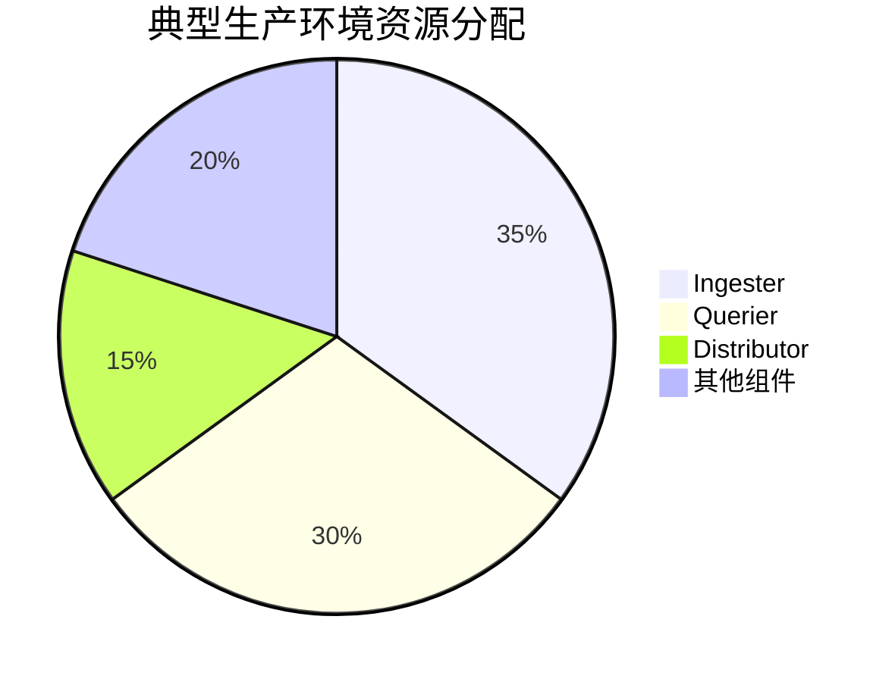

# Loki 资源配置指南

## 引言

在部署Grafana Loki时，合理的资源配置是保证日志系统稳定运行的关键。本指南将帮助初学者理解Loki各组件的资源需求特性，并提供从开发环境到生产环境的配置建议。

:::note 核心概念
Loki采用微服务架构，主要组件包括：
- **Ingester**：处理日志写入
- **Querier**：处理查询请求
- **Distributor**：分发写入请求
- **Store**：长期存储后端
:::

## 基础资源配置原则

### 1. CPU与内存分配



关键配置参数示例（`loki-config.yaml`）：
```yaml
limits_config:
  ingestion_rate_mb: 10
  ingestion_burst_size_mb: 15
  max_concurrent_tail_requests: 100
```

### 2. 存储资源配置

Loki的存储需求取决于：
- 日志保留周期
- 压缩率（通常3-5倍）
- 副本因子（默认3）

计算公式：
```
总存储需求 = 原始日志量 × 保留天数 × 压缩因子 × 副本数
```

## 环境分级配置

### 开发环境示例

```yaml
# 最小化配置示例
ingester:
  lifecycler:
    ring:
      replication_factor: 1
  chunk_idle_period: 30m
  max_transfer_retries: 0
```

:::warning 开发环境注意
单节点部署时应关闭副本功能，避免资源浪费
:::

### 生产环境建议

| 组件        | Pod数量 | CPU请求 | 内存请求 | 存储       |
|------------|--------|--------|---------|-----------|
| Ingester   | 3      | 2核    | 8Gi     | 本地SSD   |
| Querier    | 3      | 1核    | 4Gi     | 无        |
| Distributor| 2      | 0.5核  | 2Gi     | 无        |

## 性能调优实战

### 案例：高吞吐场景配置

当处理每秒10万行日志时：

1. **横向扩展**：
```bash
helm upgrade --set ingester.replicas=5 loki grafana/loki
```

2. **内存优化**：
```yaml
ingester:
  chunk_target_size: 1572864  # 1.5MB
  max_chunk_age: 2h
```

3. **查询优化**：
```yaml
querier:
  max_concurrent: 20
  timeout: 30s
```

:::tip 性能监测
使用以下PromQL监控资源使用：
```promql
sum(rate(loki_ingester_memory_chunks[1m])) by (container)
```
:::

## 常见问题解决方案

**问题1**：Ingester频繁OOM
- **解决方案**：降低 `chunk_block_size` 或增加 `-ingester.max-chunk-age`

**问题2**：查询超时
- **解决方案**：增加Querier副本数或调整 `query_timeout`

## 总结与进阶

### 关键要点
- 根据日志吞吐量动态调整Ingester资源
- 查询密集型场景优先扩展Querier
- 使用对象存储可显著降低长期存储成本

### 推荐练习
1. 使用`k6`工具模拟不同负载下的性能表现
2. 比较不同`chunk_target_size`对内存使用的影响
3. 测试查询并发参数对响应时间的影响

### 扩展阅读
- Loki官方文档《Scaling Guide》
- 《云原生日志系统资源规划白皮书》
- Prometheus资源监控最佳实践