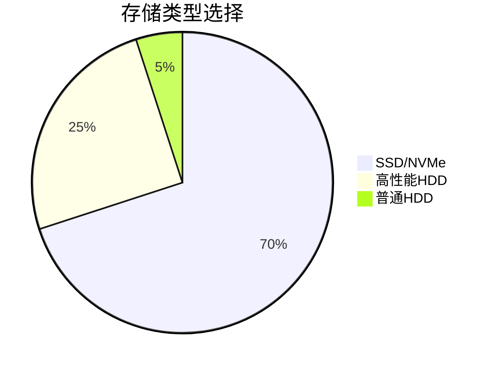
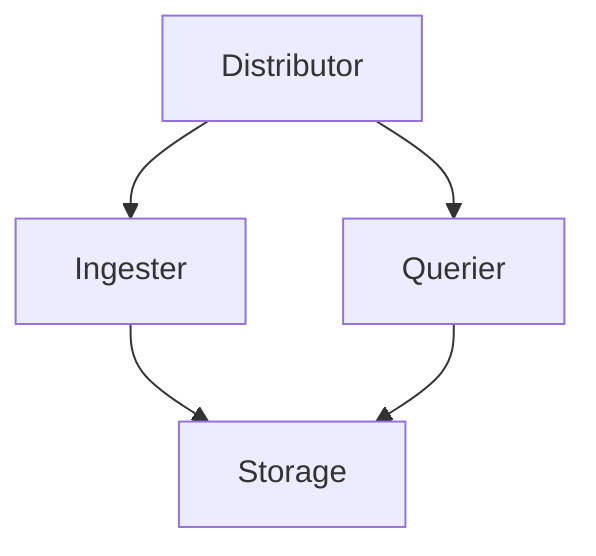

# 生产环境部署清单

## 介绍

在生产环境中部署Grafana Loki时，需要综合考虑性能、可靠性和安全性。本清单将指导您完成关键配置步骤，帮助您避免常见陷阱。无论您是单节点部署还是分布式集群，这些实践都能确保日志系统的稳定性。

:::note 适用版本
本文基于Loki 2.8+版本，部分建议可能不适用于旧版本。
:::

---

## 1. 硬件资源配置

### 计算资源
- **最低配置**（测试环境）：
  ```plaintext
  2 CPU核心 / 4GB内存 / 50GB存储
  ```
- **生产推荐**：
  ```plaintext
  8+ CPU核心 / 32GB+内存 / 500GB+ SSD存储（每节点）
  ```

### 存储选择


:::warning 注意
避免使用网络附加存储(NAS)，本地SSD能显著提升索引性能
:::

---

## 2. 部署架构选择

### 单节点模式（适合中小规模）
```yaml
# docker-compose.yml 示例
services:
  loki:
    image: grafana/loki:2.8.0
    command: -config.file=/etc/loki/local-config.yaml
```

### 微服务模式（大规模部署）


关键组件配置建议：
- **Ingester**：启用WAL(Write-Ahead Log)
  ```yaml
  ingester:
    wal:
      enabled: true
      dir: /loki/wal
  ```

---

## 3. 安全配置

### 基础安全措施
1. 启用TLS加密：
   ```yaml
   server:
     http_listen_port: 3100
     grpc_listen_port: 9095
     http_tls_config:
       cert_file: /path/to/cert.pem
       key_file: /path/to/key.pem
   ```

2. 身份验证配置（推荐JWT）：
   ```yaml
   auth_enabled: true
   ```

:::caution 重要
永远不要在生产环境使用`disable_validation: true`
:::

---

## 4. 数据保留策略

### 分层保留配置示例
```yaml
compactor:
  working_directory: /loki/compactor
  retention_enabled: true
  retention_delete_delay: 2h
  retention_delete_worker_count: 10

storage_config:
  gcs:
    bucket_name: loki-storage
  retention_period: 720h # 30天
```

:::tip 最佳实践
- 热数据：保留7天（本地SSD）
- 温数据：保留30天（对象存储）
- 冷数据：归档处理
:::

---

## 5. 监控与告警

### 必须监控的指标
1. **日志摄入速率**：`rate(loki_distributor_bytes_received_total[1m])`
2. **查询延迟**：`histogram_quantile(0.99, sum(rate(loki_query_frontend_duration_seconds_bucket[1m])) by (le))`

Prometheus告警规则示例：
```yaml
- alert: HighIngestionErrors
  expr: rate(loki_ingester_samples_failures_total[1m]) > 0
  for: 5m
```

---

## 6. 备份与灾难恢复

### 关键数据备份策略
1. **定期备份**：
   - `chunks` 目录（默认位于`/loki/chunks`）
   - 配置文件（尤其是`loki.yaml`）

2. **恢复流程**：
   ```bash
   # 停止Loki服务
   systemctl stop loki

   # 恢复数据
   rsync -avz /backup/loki/chunks /loki/data/

   # 重启服务
   systemctl start loki
   ```

---

## 实际案例：电商平台部署

**场景**：日均10TB日志量的电商平台

**解决方案**：
1. 采用3节点Loki集群
2. 使用GCS作为长期存储
3. 配置如下保留策略：
   ```yaml
   retention_period: 2160h  # 90天
   retention_stream:
     - selector: '{app="payment"}'
       priority: 1
       period: 8760h  # 1年
   ```

---

## 总结与练习

### 关键要点总结
1. 根据数据量选择合适架构
2. 始终启用安全功能
3. 监控核心指标并设置告警
4. 规划数据保留策略

### 练习建议
1. 在测试环境尝试WAL配置
2. 模拟节点故障测试恢复流程
3. 使用`logcli`工具验证查询性能

### 延伸阅读
- [官方生产部署指南](https://grafana.com/docs/loki/latest/installation/production/)
- 《可观测性工程》第5章（日志系统设计）