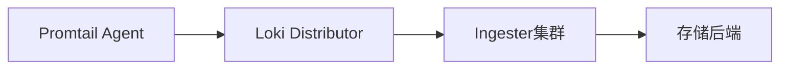

# 高吞吐量场景处理

## 介绍

在日志管理系统中，**高吞吐量场景**是指系统需要处理大量日志数据（如每秒数万条日志）的情况。Grafana Loki作为轻量级日志聚合系统，通过独特的索引设计和存储优化，能够高效处理此类场景。本章将介绍Loki在高吞吐量环境下的核心优化策略。

## 核心优化策略

### 1. 分布式部署模式

:::tip 关键原则
Loki的微服务架构允许水平扩展，这是处理高吞吐量的基础。
:::



#### 配置示例
```yaml
# 分布式部署关键组件
target: all
common:
  ring:
    kvstore:
      store: memberlist
```

### 2. Ingester优化

Ingester是Loki处理写入压力的核心组件，最佳实践包括：

- **使用持久化存储**：避免内存压力
  ```yaml
  ingester:
    lifecycler:
      ring:
        replication_factor: 3
    chunk_idle_period: 30m
    chunk_target_size: 1572864  # 1.5MB
  ```

- **批量写入配置**：
  ```yaml
  limits_config:
    ingestion_rate_mb: 16
    ingestion_burst_size_mb: 32
  ```

### 3. 高效日志采集

使用Promtail时的优化配置：
```yaml
scrape_configs:
- job_name: high-throughput
  pipeline_stages:
    - regex:
        expression: '^(?P<timestamp>\d{4}-\d{2}-\d{2} \d{2}:\d{2}:\d{2})'
    - timestamp:
        source: timestamp
        format: "2006-01-02 15:04:05"
  client:
    batchwait: 1s
    batchsize: 102400  # 100KB
```

## 实际案例：电商大促场景

某电商平台在双11期间的处理配置：

1. **集群规模**：
   - 12个Ingester节点
   - 3个Distributor节点
   - 存储使用GCS

2. **性能指标**：
   - 峰值吞吐量：120,000条日志/秒
   - 平均延迟：< 2秒
   - 存储压缩率：10:1

## 监控与调优

关键监控指标：
- `loki_ingester_memory_chunks` (内存中的chunk数量)
- `loki_distributor_bytes_received_total` (接收数据量)
- `loki_ingester_chunk_utilization` (chunk利用率)

使用Grafana告警规则示例：
```yaml
- alert: HighIngesterMemory
  expr: sum by(instance) (loki_ingester_memory_chunks) > 500000
  for: 10m
```

## 总结

高吞吐量场景处理要点：
1. 采用分布式架构水平扩展
2. 合理配置Ingester的持久化和批处理参数
3. 优化客户端采集配置
4. 建立完善的监控体系

## 延伸学习

推荐练习：
1. 使用`k6`工具模拟高负载测试
   ```bash
   k6 run --vus 100 --duration 60s script.js
   ```
2. 调整不同的`chunk_target_size`值观察性能变化

官方资源：
- [Loki性能调优文档](https://grafana.com/docs/loki/latest/operations/optimization/)
- [生产环境部署指南](https://grafana.com/docs/loki/latest/installation/production/)