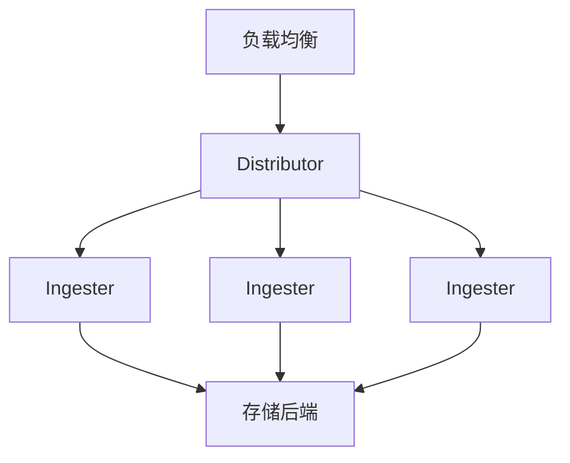

# 大规模部署考量

## 介绍

在大规模环境中部署Grafana Loki时，需要特别关注架构设计、资源分配和运维策略。与小型部署不同，大规模Loki集群需要更高的可用性、可扩展性和性能优化。本章将介绍如何规划和管理Loki的大规模部署，确保系统稳定运行并高效处理海量日志数据。

## 架构设计

### 微服务模式 vs 单体模式

Loki支持两种部署模式：
- **单体模式（Monolithic）**：所有组件（Distributor、Ingester、Querier等）运行在单个进程中，适合中小规模部署。
- **微服务模式（Microservices）**：各组件独立部署和扩展，适合大规模生产环境。

:::tip 选择建议
当每日日志量超过100GB或查询负载较高时，建议采用微服务模式以获得更好的扩展性。
:::

### 组件扩展策略



关键组件的扩展考虑：
- **Distributors**：根据写入吞吐量水平扩展
- **Ingesters**：根据内存使用和保留期需求扩展
- **Queriers**：根据查询并发量扩展
- **Query Frontend**：处理查询队列和缓存

## 存储配置

### 存储后端选择

大规模部署推荐使用对象存储作为主要后端：

| 存储类型 | 适用场景 | 注意事项 |
|---------|---------|---------|
| Amazon S3 | AWS环境 | 配置适当IAM策略 |
| GCS | GCP环境 | 考虑区域选择 |
| Azure Blob Storage | Azure环境 | 使用热存储层提高性能 |
| S3兼容存储 | 本地/混合云 | 确保兼容性 |

### 分片策略

配置`chunk_target_size`和`chunk_idle_period`优化存储效率：

```yaml
schema_config:
  configs:
    - from: 2020-10-24
      store: boltdb-shipper
      object_store: aws
      schema: v11
      index:
        prefix: index_
        period: 24h
```

## 性能优化

### 写入优化

1. 批量写入配置示例：
```yaml
limits_config:
  ingestion_rate_mb: 100
  ingestion_burst_size_mb: 200
  max_entries_limit_per_query: 5000
```

2. 客户端配置示例（Promtail）：
```yaml
clients:
  - url: http://loki:3100/loki/api/v1/push
    batchwait: 1s
    batchsize: 102400
    timeout: 10s
```

### 查询优化

1. 使用查询前端缓存：
```yaml
query_frontend:
  log_queries_longer_than: 5s
  parallelise_shardable_queries: true
```

2. 合理设置查询限制：
```yaml
limits_config:
  max_query_length: 721h
  max_query_parallelism: 128
```

## 运维实践

### 监控与告警

关键监控指标：
- `loki_ingester_memory_chunks`
- `loki_request_duration_seconds`
- `loki_distributor_bytes_received_total`

示例告警规则：
```yaml
groups:
- name: loki-alerts
  rules:
  - alert: HighIngesterMemoryUsage
    expr: sum(container_memory_usage_bytes{container="ingester"}) by (pod) / sum(container_spec_memory_limit_bytes{container="ingester"}) by (pod) > 0.8
    for: 15m
```

### 容量规划

计算资源估算公式：
```
所需Ingester数量 = (总日志量(GB/天) × 保留天数 × 1.5 / (单个Ingester内存(GB) × 0.8)
```

## 案例研究

### 电商平台日志系统

**挑战**：
- 每日产生500TB日志
- 需要7天快速查询和30天冷存储
- 高峰时段写入速率达200MB/s

**解决方案**：
1. 采用微服务架构，部署50个Ingester节点
2. 使用S3作为主存储，配置生命周期策略
3. 实现多租户隔离，限制每个业务线的资源使用
4. 部署查询前端集群处理高峰查询

## 总结

大规模Loki部署需要综合考虑：
- 选择合适的架构模式
- 合理规划存储后端
- 实施性能优化策略
- 建立完善的监控体系

## 扩展资源

1. [Loki生产部署指南](https://grafana.com/docs/loki/latest/installation/)
2. [性能调优白皮书](https://grafana.com/resources/whitepapers/)
3. [社区最佳实践讨论](https://community.grafana.com/c/loki/30)

## 练习

1. 使用Helm在测试环境部署微服务模式的Loki集群
2. 配置Promtail向集群发送日志，测试不同批量参数的影响
3. 模拟高负载场景，观察各组件资源使用情况
