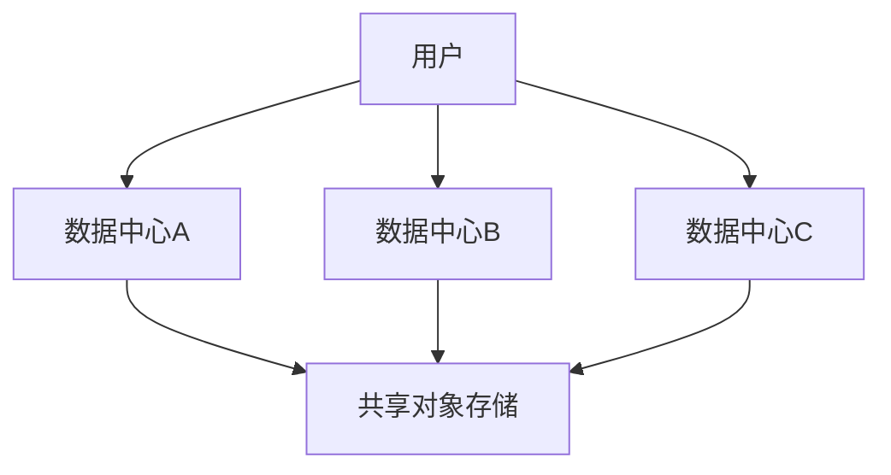

# 多数据中心部署

## 介绍

多数据中心部署是指在多个地理位置独立的数据中心中运行Grafana Loki实例，以提高系统的可用性、容错性和灾难恢复能力。这种架构特别适合需要高可用性和全球分布日志收集的企业级应用。

:::note 为什么需要多数据中心部署？
- **高可用性**：当一个数据中心发生故障时，其他中心可以继续提供服务
- **低延迟**：用户可以从最近的数据中心获取日志数据
- **灾难恢复**：防止单点故障导致数据完全丢失
- **合规要求**：某些法规要求数据必须在特定地理位置存储
:::

## 基本架构

多数据中心部署通常采用以下两种模式：

1. **主动-主动模式**：所有数据中心同时处理读写请求
2. **主动-被动模式**：一个中心处理请求，其他中心作为备份



## 部署步骤

### 1. 共享存储配置

多数据中心部署的关键是使用共享对象存储（如S3、GCS或Azure Blob Storage）：

```yaml
# loki-config.yaml
common:
  storage:
    s3:
      endpoint: s3.amazonaws.com
      region: us-east-1
      access_key_id: ${AWS_ACCESS_KEY_ID}
      secret_access_key: ${AWS_SECRET_ACCESS_KEY}
      bucketnames: my-loki-bucket
```

### 2. 配置复制

使用Loki的`memberlist`配置实现数据中心间的通信：

```yaml
memberlist:
  join_members:
    - "loki-dc1.example.com"
    - "loki-dc2.example.com"
  bind_port: 7946
```

### 3. 设置查询前端

跨数据中心查询需要配置查询前端：

```yaml
query_frontend:
  parallelise_shardable_queries: true
  max_outstanding_per_tenant: 256
  querier_forget_delay: 0s
```

## 实际案例

假设一个全球性电商平台在3个地区部署Loki：

1. **北美**（弗吉尼亚） - 主数据中心
2. **欧洲**（法兰克福） - 次要数据中心
3. **亚洲**（新加坡） - 次要数据中心

**配置示例**：

```yaml
# 北美节点配置
auth_enabled: true
server:
  http_listen_port: 3100
memberlist:
  join_members:
    - "loki-na.example.com:7946"
    - "loki-eu.example.com:7946"
    - "loki-as.example.com:7946"
```

## 性能优化

:::tip 多数据中心性能提示
1. **批处理写入**：增加`chunk_idle_period`减少小文件数量
2. **缓存配置**：使用Redis作为跨中心缓存
3. **查询优化**：设置合理的`query_timeout`
4. **网络优化**：数据中心间使用专用网络连接
:::

## 挑战与解决方案

| 挑战 | 解决方案 |
|------|----------|
| 网络延迟 | 使用本地读取和异步复制 |
| 数据一致性 | 配置适当的复制因子 |
| 成本控制 | 使用存储分层和生命周期策略 |

## 总结

多数据中心部署为Grafana Loki提供了企业级的高可用性和灾难恢复能力。关键点包括：

- 使用共享对象存储作为唯一真实数据源
- 合理配置`memberlist`实现集群通信
- 优化查询性能以适应跨中心操作
- 根据业务需求选择主动-主动或主动-被动模式

## 延伸学习

1. 尝试在不同区域的云服务器上部署Loki实例
2. 模拟数据中心故障，测试故障转移过程
3. 比较不同复制因子对性能的影响
4. 探索Loki与Grafana Mimir的集成可能性

:::caution 注意事项
- 跨数据中心部署会增加网络成本
- 确保符合数据驻留法规
- 监控跨中心网络延迟
:::