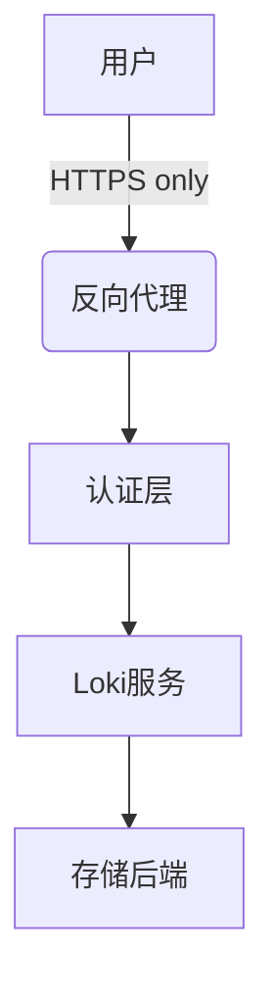

# 安全强化指南

## 介绍

在生产环境中运行Grafana Loki时，安全性是至关重要的考虑因素。本指南将带您了解保护Loki部署的关键步骤，从基础配置到高级安全措施，确保您的日志数据免受未经授权的访问和潜在威胁。

## 1. 身份验证与授权

### 基础认证配置

Loki默认不启用身份验证，这可能导致安全风险。推荐以下两种主要认证方式：

1. **通过Grafana集成认证**（推荐）：
   ```yaml
   # grafana配置示例
   auth.proxy:
     enabled: true
     header_name: X-WEBAUTH-USER
     header_property: username
     auto_sign_up: true
   ```

2. **直接使用Loki的认证**：
   ```yaml
   # loki配置示例
   auth_enabled: true
   ```

### 基于角色的访问控制(RBAC)

使用Grafana Enterprise或Loki的租户功能实现细粒度控制：

```yaml
# 多租户配置示例
multitenancy_enabled: true
```

:::tip 实践建议
- 为每个团队/项目创建独立租户
- 遵循最小权限原则分配访问权限
- 定期审查访问权限
:::

## 2. 网络安全性

### 传输层安全(TLS)

始终为所有通信启用TLS加密：

```yaml
# loki配置片段
server:
  http_tls_config:
    cert_file: /path/to/cert.pem
    key_file: /path/to/key.pem
```

### 网络隔离策略



关键隔离措施：
- 将Loki部署在私有网络
- 仅暴露必要的端口
- 使用网络策略限制入站/出站流量

## 3. 数据保护

### 日志数据加密

对于敏感日志，考虑字段级加密：

```go
// 示例日志处理管道
pipeline_stages:
  - match:
      selector: '{app="payment-service"}'
    stages:
      - encrypt:
          field: "credit_card"
          key: "${ENCRYPTION_KEY}"
```

### 保留策略

设置适当的日志保留期限：

```yaml
# 保留策略示例
compactor:
  retention_enabled: true
  retention_delete_delay: 2h
  retention_delete_worker_count: 150
```

## 4. 运行时安全

### 安全上下文配置

在Kubernetes中运行时的最佳实践：

```yaml
# pod安全上下文示例
securityContext:
  runAsNonRoot: true
  runAsUser: 1000
  fsGroup: 2000
  readOnlyRootFilesystem: true
```

### 资源限制

防止资源耗尽攻击：

```yaml
# 资源限制示例
limits_config:
  ingestion_rate_mb: 10
  ingestion_burst_size_mb: 15
  max_entries_limit_per_query: 5000
```

## 5. 审计与监控

### 启用审计日志

```yaml
# 审计配置
audit:
  enabled: true
  path: /var/log/loki/audit.log
```

### 关键监控指标

监控这些关键安全指标：
- 认证失败次数
- 异常查询模式
- 数据删除操作
- 配置变更

## 实际案例：电商平台安全部署

**场景**：某电商平台需要保护包含用户支付信息的日志

**解决方案**：
1. 为支付服务创建独立租户
2. 启用字段级加密处理敏感数据
3. 设置7天的短期保留策略
4. 限制支付服务日志的访问权限
5. 实施网络策略仅允许来自支付服务的日志摄入

```yaml
# 案例配置片段
limits_config:
  per_tenant_override:
    payment-service:
      ingestion_rate_mb: 5
      max_streams_per_user: 1000
```

## 总结

保护Grafana Loki部署需要多层次的安全措施：

1. 实施强身份验证和细粒度授权
2. 加密网络通信和敏感数据
3. 配置适当的资源限制和运行时保护
4. 建立全面的监控和审计机制

:::warning 重要提醒
安全配置需要定期审查和更新，以应对新的威胁和合规要求。
:::

## 延伸学习

**推荐练习**：
1. 为测试环境配置TLS加密
2. 创建一个多租户部署并测试隔离效果
3. 实现一个日志处理管道来加密敏感字段

**额外资源**：
- [Loki官方安全文档](https://grafana.com/docs/loki/latest/security/)
- [OWASP日志保护指南](https://owasp.org/www-project-cheat-sheets/)
- [Kubernetes安全最佳实践](https://kubernetes.io/docs/concepts/security/)