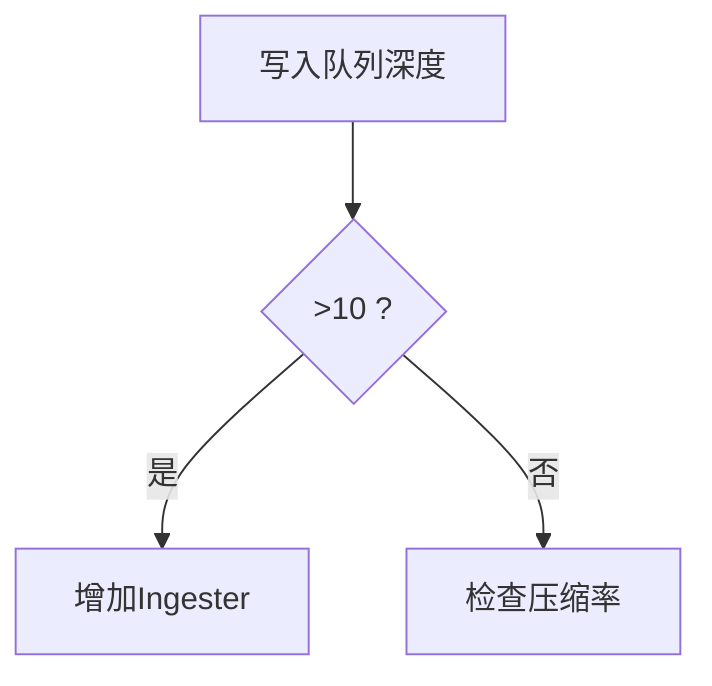

## 介绍

性能测试是评估Grafana Loki在真实负载下表现的关键步骤。通过模拟不同规模的日志流量，我们可以识别系统瓶颈、验证资源配置合理性，并为生产环境容量规划提供数据支持。本指南将介绍完整的Loki性能测试方法论。

:::note 为什么需要性能测试？
- 发现查询延迟异常
- 验证水平扩展能力
- 预防生产环境突发流量
- 优化硬件资源利用率
:::

## 核心测试类型

### 1. 负载测试 (Load Testing)
使用工具模拟持续增加的日志写入流量，观察系统响应变化：


### 2. 压力测试 (Stress Testing)
突破系统设计上限，测试失败恢复能力：

```bash
# 使用logcli进行极限写入测试
logcli produce --rate=100000 --size=2k --tenant=test
```

### 3. 基准测试 (Benchmarking)
使用标准化参数进行可重复的对比测试：

```go
// 示例测试场景配置
scenarios:
  - name: high-cardinality
    labels: 
      - "app=nginx"
      - "level={DEBUG,INFO,WARN,ERROR}"
      - "region={us,eu,asia}"
    write_rate: 10MB/s
    query_types: [range, instant]
```

## 测试工具链

| 工具 | 用途 | 示例命令 |
|------|------|----------|
| **Grafana k6** | 模拟负载 | `k6 run --vus=50 loki-write.js` |
| **logcli** | CLI测试工具 | `logcli query '{job="varlogs"}'` |
| **Prombene** | 协议基准工具 | `prombene -c config.yaml` |

## 关键性能指标

1. **写入吞吐量**：每秒处理的日志体积（MB/s）
2. **查询延迟**：P99查询响应时间
3. **资源利用率**：
   - Ingester CPU/Memory
   - Store Chunk压缩率
4. **错误率**：写入拒绝/查询超时比例

## 实战案例：电商日志测试

**场景需求**：
- 处理黑五期间10倍日常流量
- 保证关键业务查询`<2秒`响应

**测试步骤**：

1. 使用k6生成混合日志流：
```javascript
// k6脚本示例
import { check } from 'k6';
import http from 'k6/http';

export default function () {
  const res = http.post('http://loki:3100/api/prom/push', 
    generateLogLine(),
    { headers: { 'Content-Type': 'application/json' } }
  );
  check(res, { 'status was 200': (r) => r.status == 200 });
}
```

2. 监控关键仪表板：


3. 结果分析：
- 发现索引查询在200万series时延迟突增
- 解决方案：调整`chunk_target_size=1MB`

## 最佳实践建议

:::tip 测试设计原则
- **渐进式**：从20%生产负载开始逐步增加
- **隔离性**：单独测试写入/查询场景
- **可重复**：记录所有环境参数
:::

常见优化方向：
1. 调整`-ingester.max-chunk-age`
2. 优化标签基数（避免`user_id`作为标签）
3. 查询使用`|=`过滤器先于`|~`正则

## 总结与进阶

通过系统化的性能测试，我们可以：
- 建立性能基线
- 验证扩展假设
- 预防生产事故

**延伸学习**：
- [Loki官方基准测试报告](https://grafana.com/docs/loki/latest/benchmarks/)
- 使用`/metrics`端点构建自定义监控
- 比较GCS/S3不同存储后端表现

**练习任务**：
1. 使用Docker Compose部署测试集群
2. 对`/api/prom/push`端点进行1小时压力测试
3. 分析`loki_ingester_memory_chunks`指标变化
