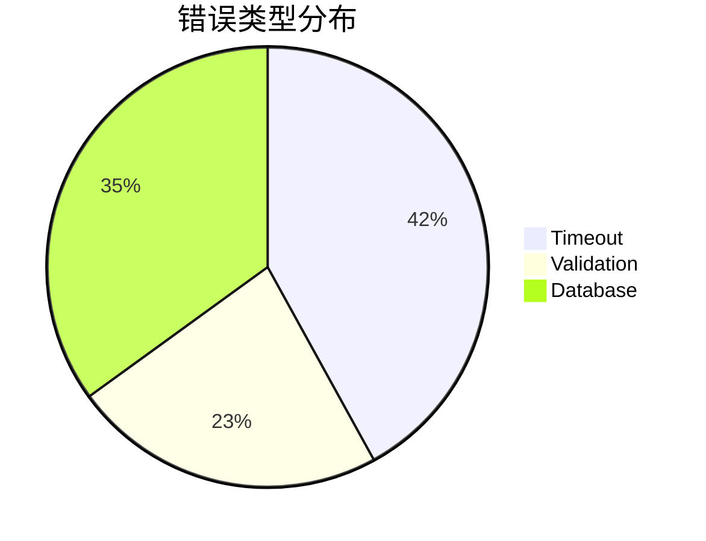

# 高级LogQL技巧

LogQL是Grafana Loki的查询语言，它结合了日志筛选和PromQL风格的指标计算能力。本文将介绍LogQL的高级用法，帮助你从海量日志中精准提取信息。

## 介绍

LogQL的基础用法（如 `{app="frontend"}`）能完成简单的日志过滤，但在复杂场景中需要更强大的功能：

- **模式匹配**：用正则和字符串操作提取特定日志
- **标签操作**：动态修改或创建标签
- **指标转换**：将日志流转换为可计算的指标
- **上下文查询**：关联相关日志条目

## 1. 高级模式匹配

### 正则表达式提取器

使用 `|~` 进行正则匹配，配合命名捕获组提取字段：

```logql
{app="nginx"} |~ `(?P<ip>\d+\.\d+\.\d+\.\d+) - (?P<user>\S+)`
```

输出示例：
```
192.168.1.1 - admin [GET /api/users]
```

:::tip
命名捕获组 `(?P<name>pattern)` 会创建对应的标签，后续可用 `| label_format` 处理
:::

### JSON日志处理

对结构化日志使用 `json` 解析器：

```logql
{app="order-service"} | json | latency_ms > 500
```

假设输入日志：
```json
{"level":"error","latency_ms":620,"request_id":"abc123"}
```

## 2. 标签动态操作

### 标签格式化

`label_format` 可以重命名或创建新标签：

```logql
{app="frontend"} 
  | json 
  | label_format 
    new_status="status",
    endpoint=`/api/${api_version}/${path}`
```

### 值转换

结合 `line_format` 修改日志内容：

```logql
{app="auth"} 
  |~ `login attempt by (?P<user>\S+)` 
  | line_format `{{.user}} tried to access at {{.timestamp}}`
```

## 3. 指标提取

### 日志转指标

将日志计数转为Prometheus指标：

```logql
rate(
  {app="payment-gateway"} 
    | json 
    | status_code =~ "5.." 
    | __error__="" 
  [1m]
)
```

### 直方图统计

计算延迟分布：

```logql
histogram_over_time(
  {app="delivery-service"} 
    | json 
    | __error__="" 
    | unwrap latency_ms [1m]
)
```

## 4. 实际案例

### 案例：API错误分析

```logql
# 1. 筛选错误日志
{app="api-server", env="production"} 
  | json 
  | level="error" 
  
# 2. 按错误类型统计
  | rate([5m]) by (error_type)
  
# 3. 关联用户ID
  | label_format user_id=`{{.metadata.user}}`
```



### 案例：安全审计

```logql
{namespace="security"} 
  |~ `failed login for (?P<account>\S+) from (?P<ip>\S+)` 
  | line_format `{{.account}}@{{.ip}}` 
  | rate() by (account, ip) > 5
```

## 总结

高级LogQL技巧能显著提升日志分析效率：

1. 使用正则和JSON解析器精确提取字段
2. 动态操作标签实现数据标准化
3. 将日志流转换为可计算指标
4. 通过上下文关联建立事件链条

## 延伸练习

1. 编写查询统计Nginx日志中不同HTTP方法的请求比例
2. 创建一个检测连续登录失败的告警规则
3. 尝试用 `pattern` 解析器处理非JSON格式的日志

:::note 更多资源
- [官方LogQL文档](https://grafana.com/docs/loki/latest/logql/)
- [Loki查询优化指南](https://grafana.com/blog/2022/02/07/how-to-optimize-your-loki-queries/)
:::