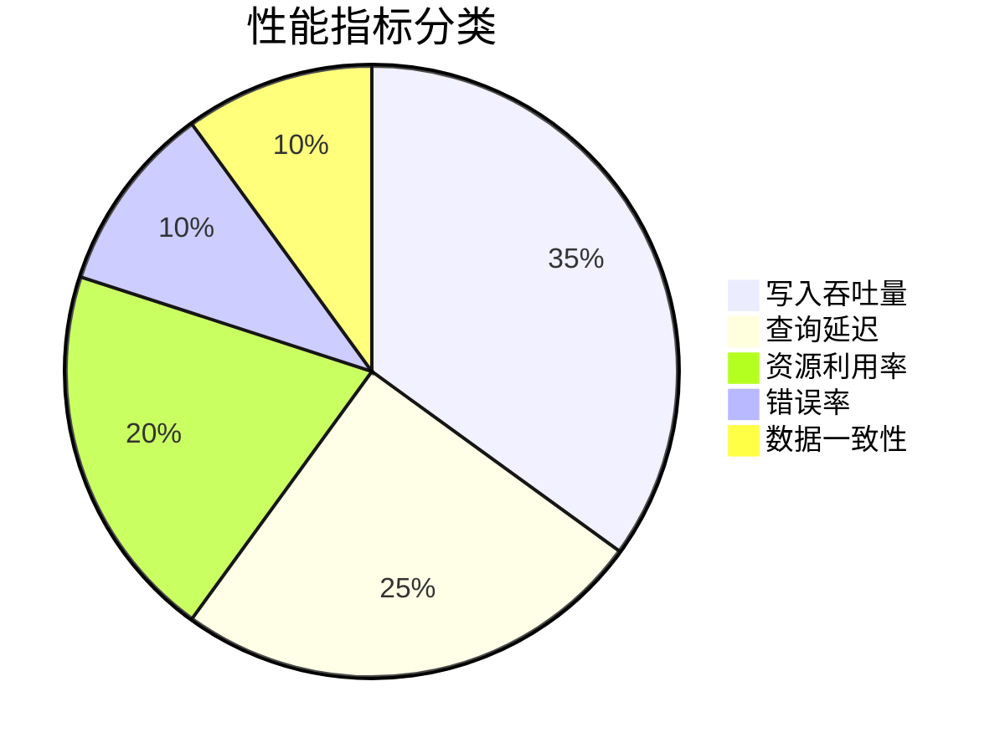

# Loki 性能基准测试

## 介绍

性能基准测试是评估Loki日志系统在特定工作负载下的表现的关键手段。通过模拟真实场景的读写操作，我们可以量化系统的吞吐量、延迟和资源消耗等核心指标，为容量规划和性能优化提供数据支撑。

:::tip 为什么需要基准测试？
- 验证Loki集群的配置是否满足业务需求
- 识别系统瓶颈（如查询性能、存储吞吐量）
- 为生产环境容量规划提供依据
- 比较不同版本/配置的性能差异
:::

## 常用测试工具

### 1. LogCLI

Loki自带的命令行工具可执行基础性能测试：

```bash
# 写入性能测试
logcli bench write --url=http://localhost:3100 --file=./sample-logs.jsonl

# 查询性能测试
logcli bench query --url=http://localhost:3100 \
  --query='{job="varlogs"}' \
  --since=1h
```

### 2. Grafana Loki Benchmark

官方提供的专用测试工具，可生成更复杂的负载：

```bash
docker run -it --rm grafana/loki:latest \
  benchmark --benchmarks=write,query \
  --client=10 --duration=5m \
  --loki-url=http://host.docker.internal:3100
```

## 关键测试指标



| 指标类型       | 具体指标                  | 理想值               |
|----------------|---------------------------|----------------------|
| 写入性能       | 日志行/秒                 | 根据集群规模变化     |
| 查询性能       | P99延迟                   | < 2秒（简单查询）    |
| 资源消耗       | CPU/内存使用率            | < 70% 峰值           |
| 可靠性         | 错误率                    | < 0.1%               |

## 测试场景设计

### 1. 写入压力测试

模拟不同规模的日志产生速率：

```bash
# 使用logcli模拟高吞吐写入
for i in {1..5}; do
  logcli bench write --url=http://loki:3100 \
    --rate=100000 --size=1KB --workers=10 &
done
```

### 2. 查询负载测试

组合测试不同类型的查询：

```bash
# 范围查询
logcli bench query --query='{job="nginx"} |= "GET"'

# 正则表达式查询  
logcli bench query --query='{job="mysql"} |~ "ERROR.*timeout"'

# 统计分析查询
logcli bench query --query='sum by(level) (count_over_time({job="app"}[1h]))'
```

## 实际案例

### 电商大促场景测试

**测试目标**：验证Loki集群能否处理黑色星期五期间10倍日常流量的日志

**测试配置**：
- 3节点Loki集群（16核/64GB内存）
- 使用Grafana Loki Benchmark工具
- 模拟300,000条日志/秒的写入速率
- 并发50个持续查询

**结果分析**：

```mermaid
barChart
    title 写入性能测试结果
    x-axis 测试轮次
    y-axis 日志行/秒 (x1000)
    bar 第一轮: 250
    bar 第二轮: 280
    bar 第三轮: 275
```

:::note 优化发现
通过测试发现：
1. 索引写入成为瓶颈，增加`ingester.ring.replication-factor`后提升30%吞吐
2. 高基数标签导致查询变慢，通过`--max-query-parallelism`调整优化
:::

## 结果分析方法

1. **Grafana监控面板**：使用预制的Loki性能仪表板
2. **Prometheus指标**：重点关注：
   - `loki_ingester_memory_chunks`
   - `loki_distributor_bytes_received_total`
   - `loki_query_frontend_retries_total`
3. **日志分析**：检查`loki`和`promtail`的WARN/ERROR日志

## 总结与最佳实践

**性能测试关键步骤**：
1. 定义明确的测试目标和成功标准
2. 选择与生产环境相似的测试环境
3. 逐步增加负载，观察系统行为变化
4. 记录所有相关指标和配置变更
5. 多次运行测试确保结果一致性

:::warning 注意事项
- 避免在生成环境直接运行压力测试
- 测试数据应尽量模拟真实日志特征
- 注意监控测试客户端的资源使用情况
:::

## 扩展资源

**推荐练习**：
1. 使用`logcli`测试不同日志大小对写入性能的影响
2. 比较`boltdb-shipper`和`tsdb`索引的性能差异
3. 设计一个模拟微服务架构的日志查询测试场景

**深入学习**：
- [Loki官方基准测试指南](https://grafana.com/docs/loki/latest/benchmarks/)
- [使用Grafana分析Loki性能](https://grafana.com/tutorials/analyze-loki-performance/)
- 《分布式系统性能测试方法论》（O'Reilly）