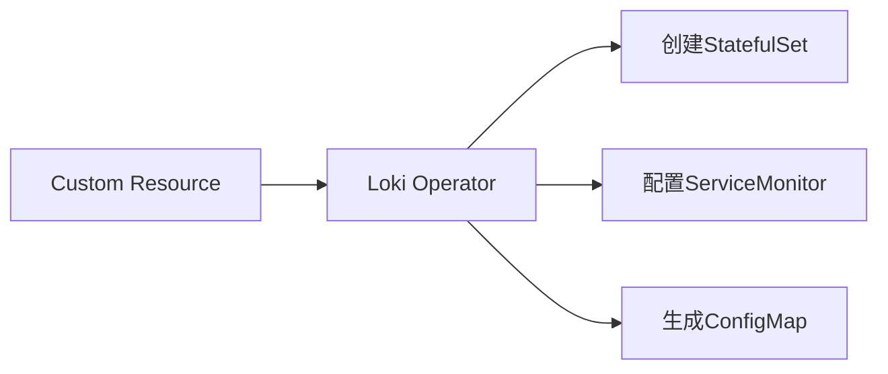

# 自动化运维工具

## 介绍

在Grafana Loki的运维中，**自动化工具**能够显著减少人工操作错误、提高部署效率，并实现日志管道的持续监控。本章将介绍如何通过主流工具（如Ansible、Terraform、Prometheus Operator等）实现Loki的自动化配置、扩缩容和告警管理。

:::note 适用场景
- 批量部署Loki组件
- 动态调整日志收集规则
- 与Kubernetes生态集成
:::

---

## 核心工具与技术

### 1. 基础设施即代码（IaC）

使用 **Terraform** 定义Loki的云资源：

```hcl
# 示例：在AWS部署Loki的S3存储后端
resource "aws_s3_bucket" "loki_storage" {
  bucket = "my-loki-storage"
  acl    = "private"
}

resource "aws_iam_policy" "loki_s3_access" {
  policy = jsonencode({
    Version = "2012-10-17",
    Statement = [{
      Effect = "Allow",
      Action = ["s3:*"],
      Resource = [aws_s3_bucket.loki_storage.arn]
    }]
  })
}
```

**输出验证**：
```bash
$ terraform apply
aws_s3_bucket.loki_storage: Created
aws_iam_policy.loki_s3_access: Created
```

---

### 2. 配置管理工具（Ansible）

通过Ansible Playbook自动化Loki安装：

```yaml
# loki_install.yml
- hosts: log_servers
  tasks:
    - name: Download Loki binary
      ansible.builtin.get_url:
        url: "https://github.com/grafana/loki/releases/download/v2.7.0/loki-linux-amd64.zip"
        dest: "/tmp/loki.zip"
    
    - name: Unzip Loki
      ansible.builtin.unarchive:
        src: "/tmp/loki.zip"
        dest: "/usr/local/bin"
        remote_src: yes
        mode: '0755'
```

:::tip 最佳实践
使用`ansible-vault`加密敏感配置（如Loki的S3凭证）。
:::

---

### 3. Kubernetes Operator模式

通过 **Loki Operator** 实现声明式管理：



**操作示例**：
```bash
# 安装Loki Operator（假设已配置kubectl）
kubectl apply -f https://github.com/grafana/loki-operator/releases/latest/download/namespace.yaml
kubectl apply -f https://github.com/grafana/loki-operator/releases/latest/download/all.yaml
```

---

## 实际案例：自动化日志规则更新

### 场景描述
当新服务部署时，自动为Loki添加对应的日志收集标签规则。

**解决方案**：
1. 使用 **GitHub Actions** 监听K8s部署事件
2. 通过API更新Loki的`scrape_configs`

```yaml
# .github/workflows/update_loki_config.yml
name: Update Loki Config
on:
  deployment:
jobs:
  update-config:
    runs-on: ubuntu-latest
    steps:
      - uses: actions/checkout@v3
      - run: |
          curl -X POST http://loki-service:3100/config \
          -H "Content-Type: application/json" \
          -d '{"scrape_configs": [{"job_name": "new-service", "static_configs": [{"targets": ["new-service:9080"]}]}]}'
```

---

## 总结与练习

### 关键收获
- IaC工具可标准化Loki环境部署
- Ansible适合批量配置管理
- Operator模式简化K8s环境运维

**练习建议**：
1. 使用Terraform为Loki创建GCS存储桶
2. 编写Ansible Playbook部署Promtail
3. 通过kubectl调试Loki Operator的CRD状态

:::warning 注意事项
自动化前务必在测试环境验证脚本，避免生产环境配置污染。
:::

```bash
# 课后练习：检查Loki Operator状态
kubectl get pods -n loki-operator
```

---

## 扩展阅读
- [官方Loki Operator文档](https://grafana.com/docs/loki/latest/operator/)
- 《Ansible for DevOps》第8章
- Terraform AWS Provider文档