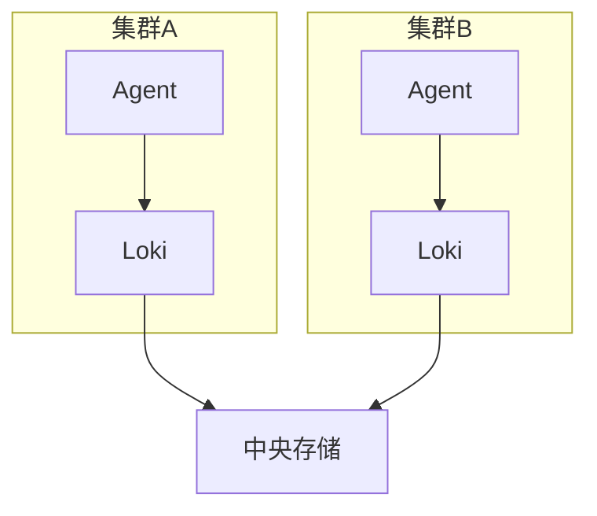

# 多集群Loki部署

## 介绍

多集群Loki部署允许您在多个Kubernetes集群中运行Loki组件，并将日志数据集中存储和分析。这种架构特别适合以下场景：
- 需要在不同区域或环境中（如开发/生产）统一管理日志
- 实现高可用性和灾难恢复
- 满足合规性要求，将日志存储在特定区域

## 架构概述

多集群Loki部署通常采用以下两种模式之一：

1. **集中式存储**：所有集群将日志发送到中央Loki实例
2. **联邦式查询**：每个集群运行独立的Loki实例，但可以通过单个入口查询所有集群



## 部署方案

### 方案1：集中式存储

#### 配置步骤

1. 在主集群部署Loki和存储后端（如S3、GCS）
2. 在其他集群配置日志代理指向主集群

```yaml title="主集群Loki配置示例 (loki-config.yaml)"
auth_enabled: false
server:
  http_listen_port: 3100
common:
  storage:
    s3:
      endpoint: minio.example.com
      bucketnames: loki-data
      access_key_id: ${ACCESS_KEY}
      secret_access_key: ${SECRET_KEY}
```

```yaml title="从集群Promtail配置示例 (promtail-config.yaml)"
clients:
  - url: http://loki-central.example.com:3100/loki/api/v1/push
```

### 方案2：联邦查询

#### 配置步骤

1. 在每个集群部署独立的Loki实例
2. 配置查询前端以聚合结果

```yaml title="联邦查询配置示例 (query-frontend.yaml)"
frontend:
  downstream_url: http://loki-cluster-a:3100
  parallelise_shardable_queries: true
```

## 实际案例

### 电商平台日志系统

一个跨国电商平台在3个区域部署了Kubernetes集群：

1. 使用集中式存储收集所有交易日志
2. 每个区域保留本地Loki实例处理调试日志
3. 通过标签区分日志来源

```yaml title="Promtail区域标签配置"
scrape_configs:
  - job_name: kubernetes-pods
    kubernetes_sd_configs: [...]
    relabel_configs:
      - source_labels: [__meta_kubernetes_namespace]
        target_label: namespace
      - source_labels: [__meta_kubernetes_pod_name]
        target_label: pod
      - target_label: region
        replacement: us-west-1
```

## 注意事项

:::caution 网络延迟
跨区域部署时，考虑网络延迟对日志传输的影响。可以配置批处理和压缩来优化性能。
:::

:::tip 安全建议
- 使用mTLS加密集群间通信
- 为每个集群设置独立的认证令牌
- 限制中央存储的写入权限
:::

## 总结

多集群Loki部署提供了灵活的日志管理方案，您可以根据需求选择集中式或联邦式架构。关键考虑因素包括：

- 网络条件和延迟要求
- 数据主权和合规性需求
- 运维复杂性和成本

## 扩展学习

1. 尝试在Minikube上模拟双集群部署
2. 比较不同存储后端的性能表现
3. 探索使用Grafana Tempo实现跨集群追踪

## 故障排查

常见问题及解决方法：

1. **连接失败**：检查网络策略和防火墙规则
   ```bash
   kubectl run -it --rm debug --image=busybox --restart=Never -- wget http://loki-central:3100/ready
   ```

2. **认证错误**：验证令牌和RBAC配置
   ```bash
   kubectl get secret loki-token -o jsonpath='{.data.token}' | base64 -d
   ```

3. **存储问题**：检查存储后端可用性和权限
   ```bash
   aws s3 ls s3://loki-data --recursive --summarize
   ```

Happy logging!