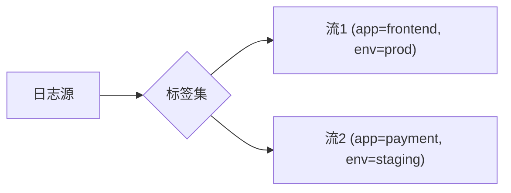

## 引言

在云原生和微服务架构中，日志管理面临海量数据、实时性要求和成本控制三大挑战。本节将介绍以Grafana Loki为代表的下一代日志技术如何通过**索引优化**、**流处理**和**混合存储**等创新方案解决这些问题。

:::tip 关键特征
- **无索引日志**：仅对元数据建立索引，降低存储开销
- **横向扩展**：原生支持分布式架构
- **实时流处理**：Promtail等代理的管道式传输
:::

## 核心技术解析

### 1. 日志流（Log Stream）模型

Loki将日志组织为**流（Stream）**的集合，每个流由一组标签唯一标识：



查询示例（LogQL）：
```plaintext
{app="frontend"} |= "error"
```
输出结果：
```json
{
  "streams": [
    {
      "labels": "{app=\"frontend\", pod=\"frontend-abc123\"}",
      "entries": [
        {"ts": "2023-01-01T12:00:00Z", "line": "error: connection timeout"}
      ]
    }
  ]
}
```

### 2. 混合存储架构

Loki采用分层存储策略：
- **热数据**：本地SSD或内存
- **温数据**：对象存储（如S3/GCS）
- **冷数据**：压缩归档

:::note 成本对比
| 方案          | 存储成本 | 查询延迟 |
|---------------|---------|---------|
| 全索引        | $$$$    | `<100ms`  |
| Loki          | $$      | `200-500ms`|
| 纯对象存储    | $       | `>1s`     |
:::

### 3. 实时管道处理

使用Promtail的流水线配置：
```yaml
pipeline_stages:
  - docker: {}
  - regex:
      expression: 'level=(?P<level>\w+)'
  - labels:
      level:
```
处理效果：
```
原始日志：time="2023-01-01T12:00:00Z" level=error msg="failed"
处理后元数据：{level="error"}
```

## 实际应用案例

### 电商平台日志分析
1. **场景**：黑色星期五流量激增时快速定位支付失败
2. **解决方案**：
   - 使用 `{service="payment", status_code="5xx"}` 过滤错误
   - 通过 `rate({job="payment"}[5m])` 监控异常频率
3. **效果**：从10TB日志中定位问题的时间从小时级降至分钟级

## 总结与进阶

### 关键收获
- 标签驱动的日志组织大幅降低存储需求
- 流式处理实现亚秒级日志可见性
- 云原生存储集成优化长期保存成本

### 推荐练习
1. 在本地Loki实例中配置多级存储策略
2. 使用LogQL的 `pattern` 解析器提取日志模式
3. 比较索引查询与非索引查询的性能差异

### 扩展阅读
- 《云原生日志设计模式》（O'Reilly）
- OpenTelemetry日志规范
- Loki官方性能调优指南