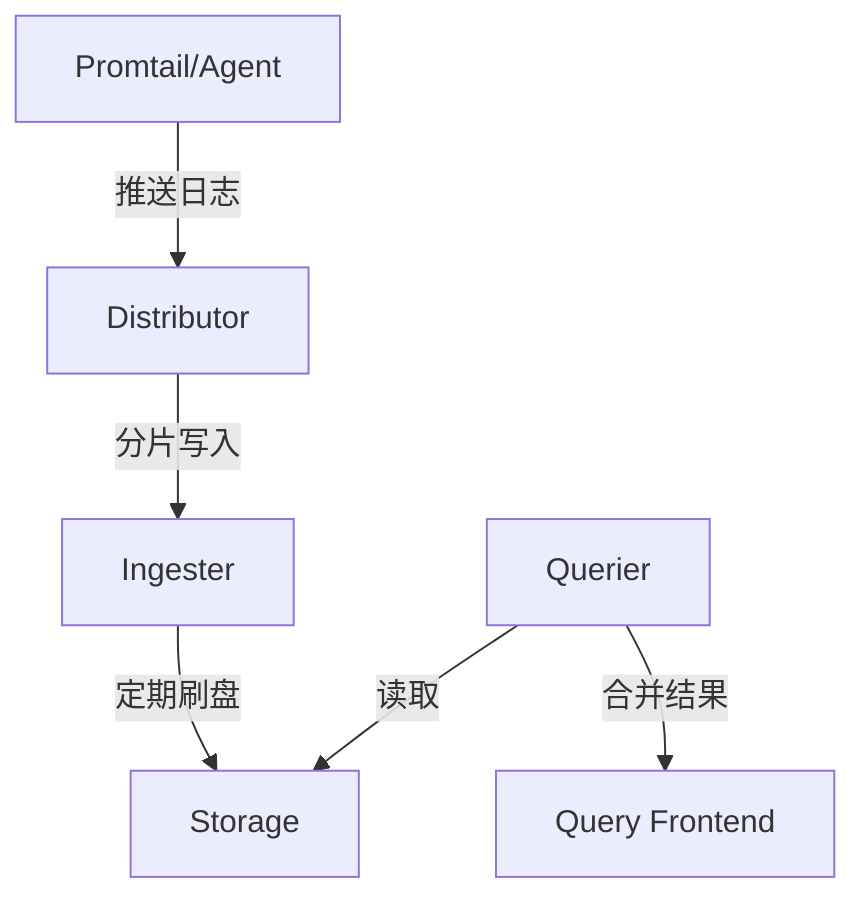
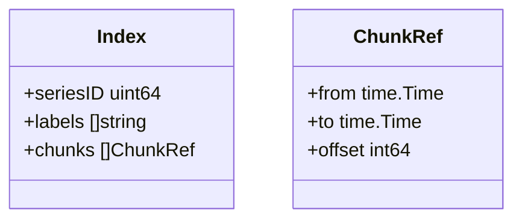

## 介绍

Grafana Loki是一个高效的日志聚合系统，专为云原生环境设计。理解其源码结构能帮助你更好地定制和优化日志处理流程。本节将解析Loki的核心模块，包括日志摄取、存储和查询的实现机制。

:::note 目标读者
- 已掌握Loki基础使用的开发者
- 对Go语言有基本了解的初学者
- 希望贡献Loki开源项目的爱好者
:::

## 核心架构概览

Loki采用微服务架构，主要组件包括：


## 关键模块解析

### 1. 日志摄取流程（Distributor）

**源码路径**：`pkg/distributor`
```go
// 示例：日志批处理的核心逻辑（简化版）
func (d *Distributor) Push(ctx context.Context, req *logproto.PushRequest) {
    for _, stream := range req.Streams {
        // 1. 验证日志标签格式
        validateLabels(stream.Labels) 
        // 2. 一致性哈希确定目标Ingester
        ingester := d.ring.Get(stream.Labels) 
        // 3. 并行写入多个副本
        go ingester.Push(ctx, stream) 
    }
}
```

**实际案例**：
当Promtail发送日志时，Distributor会：
1. 检查标签合法性（如不允许特殊字符）
2. 通过哈希环选择3个Ingester节点（默认副本数）
3. 采用gRPC流式传输提升吞吐量

### 2. 内存存储引擎（Ingester）

**核心机制**：
- 日志先写入内存中的`Chunk`
- 达到`chunk_idle_period`（默认30m）后刷盘
- 使用`WAL`（Write-Ahead Log）保证崩溃恢复

:::tip 性能优化点
通过调整以下参数优化内存使用：
```yaml
ingester:
  chunk_block_size: 262144  # 单个块大小
  max_chunk_age: 2h         # 内存最大保留时间
```
:::

### 3. 存储层解析

**索引存储**：


**典型操作示例**：
```go
// 查询时间段内的日志流
func (s *store) SelectLogs(ctx context.Context, req *logproto.QueryRequest) {
    // 1. 通过倒排索引找到SeriesID
    ids := s.index.Lookup(req.Matchers) 
    // 2. 加载关联的Chunk数据
    chunks := s.chunks.Fetch(ids, req.From, req.To) 
    // 3. 使用gRPC流式返回结果
    streamResults(chunks) 
}
```

## 实战：自定义处理插件

案例：添加日志敏感信息过滤
```go
// 在Distributor中插入处理中间件
func NewLogFilterMiddleware(next distributor.Interface) distributor.Interface {
    return &filterMiddleware{
        next: next,
        patterns: []regexp.Regexp{ /* 敏感词正则 */ }
    }
}

func (m *filterMiddleware) Push(ctx context.Context, req *logproto.PushRequest) {
    for _, stream := range req.Streams {
        stream.Line = filterSensitiveData(stream.Line) // 过滤处理
    }
    m.next.Push(ctx, req)
}
```

## 总结与进阶

**关键收获**：
- Loki通过分片写入和内存缓冲实现高吞吐
- 索引与存储分离的设计降低成本
- 扩展点主要在Distributor和Ingester模块

**推荐练习**：
1. 在本地编译Loki并添加调试日志
2. 尝试修改WAL的刷盘策略
3. 实现一个简单的标签重写中间件

**延伸阅读**：
- [Loki设计文档](https://grafana.com/docs/loki/latest/design/)
- [Go语言高性能编程实践](https://github.com/dgryski/go-perfbook)