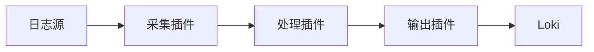

# 自定义Promtail插件

## 介绍

Promtail是Grafana Loki生态系统中负责收集、处理和转发日志的代理组件。虽然它内置了许多功能，但有时您需要特定的日志处理逻辑。这时可以通过**自定义Promtail插件**来扩展其功能。

自定义插件允许您：
- 添加特殊的日志解析逻辑
- 实现自定义的日志过滤
- 集成第三方服务
- 转换日志格式以满足特定需求

:::note
Promtail插件使用Go语言编写，需要基本的Go编程知识。本文假设您已安装Go 1.17+和Promtail开发环境。
:::

## 插件架构概述

Promtail插件系统基于Go的插件机制，通过实现特定接口来扩展功能。主要插件类型包括：

1. **日志采集插件** - 从非标准源获取日志
2. **处理插件** - 修改日志内容和元数据
3. **输出插件** - 将日志发送到非Loki目的地



## 开发您的第一个插件

### 1. 设置开发环境

首先创建一个Go模块：

```bash
mkdir my-promtail-plugin
cd my-promtail-plugin
go mod init github.com/yourname/my-promtail-plugin
```

### 2. 基本插件结构

创建一个简单的处理插件，为日志添加固定前缀：

```go
package main

import (
    "github.com/grafana/loki/clients/pkg/logentry/stages"
    "github.com/grafana/loki/clients/pkg/logentry/logql"
)

type AddPrefixConfig struct {
    Prefix string `river:"prefix,attr"`
}

func init() {
    stages.RegisterPlugin("add_prefix", func() stages.Stage {
        return &AddPrefixStage{}
    })
}

type AddPrefixStage struct {
    cfg *AddPrefixConfig
}

func (s *AddPrefixStage) Run(entry []logql.Stream) ([]logql.Stream, error) {
    for i := range entry {
        entry[i].Line = s.cfg.Prefix + entry[i].Line
    }
    return entry, nil
}

func (s *AddPrefixStage) Name() string {
    return "add_prefix"
}
```

### 3. 构建和安装插件

编译为共享库：

```bash
go build -buildmode=plugin -o add_prefix.so add_prefix.go
```

### 4. 在Promtail配置中使用

在Promtail的配置文件中引用您的插件：

```yaml
pipeline_stages:
  - add_prefix:
      prefix: "[IMPORTANT] "
```

## 实际应用案例

### 案例：敏感信息过滤插件

开发一个插件，自动检测并屏蔽日志中的信用卡号：

```go
package main

import (
    "regexp"
    "github.com/grafana/loki/clients/pkg/logentry/stages"
    "github.com/grafana/loki/clients/pkg/logentry/logql"
)

var creditCardRegex = regexp.MustCompile(`\b(?:\d[ -]*?){13,16}\b`)

type CreditCardFilter struct{}

func (f *CreditCardFilter) Run(entry []logql.Stream) ([]logql.Stream, error) {
    for i := range entry {
        entry[i].Line = creditCardRegex.ReplaceAllString(entry[i].Line, "[CREDIT_CARD]")
    }
    return entry, nil
}

func (f *CreditCardFilter) Name() string { return "credit_card_filter" }

func init() {
    stages.RegisterPlugin("credit_card_filter", func() stages.Stage {
        return &CreditCardFilter{}
    })
}
```

配置示例：

```yaml
pipeline_stages:
  - credit_card_filter: {}
```

## 调试和测试插件

### 单元测试

为您的插件编写测试：

```go
package main

import (
    "testing"
    "github.com/grafana/loki/clients/pkg/logentry/logql"
)

func TestAddPrefix(t *testing.T) {
    stage := &AddPrefixStage{cfg: &AddPrefixConfig{Prefix: "[TEST] "}}
    input := []logql.Stream{{Line: "original message"}}
    
    output, err := stage.Run(input)
    if err != nil {
        t.Fatal(err)
    }
    
    if output[0].Line != "[TEST] original message" {
        t.Errorf("Expected prefixed message, got %q", output[0].Line)
    }
}
```

### 集成测试

1. 启动测试Loki实例
2. 配置Promtail使用您的插件
3. 发送测试日志并验证输出

## 最佳实践

1. **保持插件单一职责** - 每个插件只做一件事
2. **处理错误优雅** - 不要因为插件错误中断整个流水线
3. **性能考虑** - 避免在插件中进行昂贵的操作
4. **文档完善** - 为您的插件编写清晰的文档
5. **版本兼容** - 注意Promtail版本变化

:::caution
自定义插件会增加Promtail的复杂性。只有在内置功能无法满足需求时才考虑开发插件。
:::

## 总结

通过自定义Promtail插件，您可以灵活扩展日志处理能力，满足特定业务需求。本文介绍了：

- Promtail插件的基本架构
- 如何开发、构建和安装插件
- 实际应用案例
- 调试和测试方法
- 最佳实践

## 进一步学习

1. [Promtail官方文档](https://grafana.com/docs/loki/latest/clients/promtail/)
2. [Go插件系统文档](https://pkg.go.dev/plugin)
3. [Loki社区插件仓库](https://github.com/grafana/loki/community/plugins)

**练习建议**：
1. 创建一个插件，为日志添加时间戳前缀
2. 开发一个插件，将特定关键词高亮显示
3. 尝试将插件发布到社区