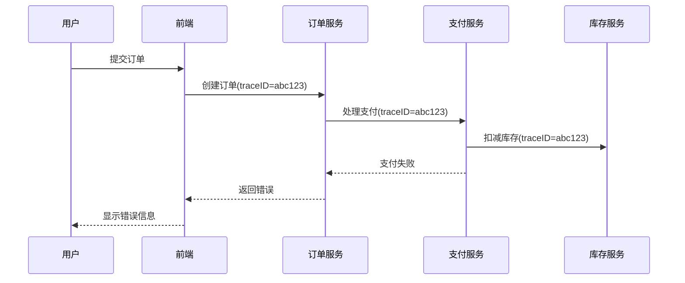

# 分布式追踪集成

## 介绍

在现代微服务架构中，分布式追踪（Distributed Tracing）是诊断跨服务请求问题的关键工具。当与Grafana Loki的日志系统集成时，您可以通过追踪ID（Trace ID）直接关联日志条目和追踪数据，形成完整的可观测性解决方案。

分布式追踪集成允许您：
- 通过追踪ID在Loki中快速定位相关日志
- 在Grafana中同时查看追踪数据和关联日志
- 分析请求在不同服务间的流转路径和耗时

## 核心概念

### 1. 追踪ID传播

分布式追踪系统（如Jaeger、Tempo）会为每个请求分配唯一的`traceID`。要使Loki能够关联这些数据，您的应用程序需要：

1. 将`traceID`注入日志上下文
2. 确保日志格式包含`traceID`字段

```go
// Go示例：在日志中添加traceID
import (
    "go.opentelemetry.io/otel/trace"
    "logur.dev/logur"
)

func logWithTrace(logger logur.Logger, ctx context.Context, message string) {
    span := trace.SpanFromContext(ctx)
    logger.Info(message, map[string]interface{}{
        "traceID": span.SpanContext().TraceID().String(),
    })
}
```

### 2. Loki配置

在Loki的配置文件中，需要确保能够正确解析包含追踪ID的日志：

```yaml
# loki-config.yaml片段
pipeline_stages:
  - regex:
      expression: '.*traceID=(?P<traceID>\w+).*'
  - labels:
      traceID:
```

## 集成步骤

### 步骤1：配置应用程序日志

确保您的应用程序日志包含追踪ID。以下是不同语言的示例：

**Python (使用OpenTelemetry):**
```python
from opentelemetry import trace
import logging

tracer = trace.get_tracer(__name__)
logger = logging.getLogger(__name__)

def example_function():
    with tracer.start_as_current_span("example-span"):
        current_span = trace.get_current_span()
        logger.info("Important event", extra={
            "traceID": current_span.get_span_context().trace_id
        })
```

### 步骤2：配置Loki管道

在Loki中设置管道来提取追踪ID：

```yaml
# 提取JSON格式日志中的traceID
pipeline_stages:
  - json:
      expressions:
        traceID:
  - labels:
      traceID:
```

### 步骤3：Grafana配置

1. 在Grafana中配置Loki和追踪数据源（如Tempo/Jaeger）
2. 确保两个数据源使用相同的`traceID`字段名称

## 实际案例

假设您有一个电子商务系统，用户下单时请求会经过以下服务：

```
前端 → 订单服务 → 支付服务 → 库存服务
```

通过分布式追踪集成，当支付服务出现错误时：

1. 在Grafana Tempo中查看有问题的追踪
2. 复制`traceID`并在Loki中搜索：
   ```logql
   {app="payment-service"} | json | traceID="abc123"
   ```
3. 查看该追踪相关的所有服务日志



## 总结

分布式追踪集成将Loki的日志分析能力与分布式追踪系统的请求跟踪能力相结合，为您提供：

- 端到端的请求生命周期视图
- 快速定位跨服务问题的能力
- 日志和追踪数据的无缝关联

:::tip 最佳实践
1. 在所有服务中使用相同的日志格式
2. 标准化`traceID`字段名称
3. 在开发环境中测试集成配置
:::

## 延伸学习

1. 尝试将Loki与您现有的追踪系统集成
2. 在Grafana中创建包含日志和追踪面板的仪表盘
3. 使用LogQL查询特定`traceID`的所有相关日志

## 附加资源

- [OpenTelemetry日志集成文档](https://opentelemetry.io/docs/)
- [Grafana Loki管道阶段文档](https://grafana.com/docs/loki/latest/configuration/pipeline_stages/)
- [Grafana Tempo文档](https://grafana.com/docs/tempo/latest/)