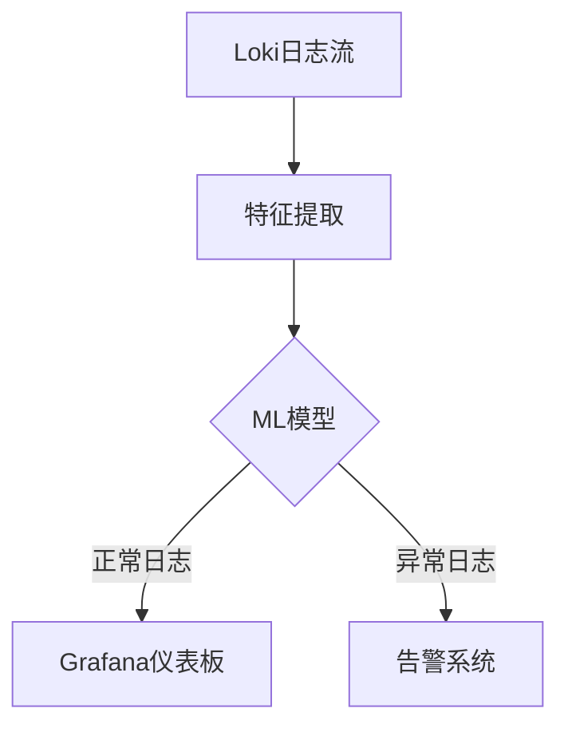

# 机器学习日志分析

## 介绍

在现代分布式系统中，日志数据量呈指数级增长。传统的关键词搜索和过滤方法已无法满足高效分析需求。机器学习（ML）为日志分析提供了自动化模式识别、异常检测和预测性维护的能力。本章将介绍如何结合Grafana Loki与机器学习技术，从海量日志中提取有价值的信息。

:::note 为什么需要机器学习日志分析？
- **异常检测**：自动识别偏离正常模式的日志条目
- **日志分类**：将相似日志聚类，减少人工分类工作量
- **根因分析**：快速定位问题源头
- **预测性维护**：通过历史日志预测潜在故障
:::

## 基础概念

### 1. 日志特征工程

机器学习模型需要结构化输入，而原始日志是非结构化的文本数据。特征工程是将日志转换为机器学习可用格式的关键步骤：

```python
# 示例：使用正则表达式提取日志特征
import re

log_line = "2023-05-15T08:23:45Z [ERROR] service=order-service trace_id=abc123 msg='Failed to process order'"

# 提取关键特征
pattern = r'$$(.*?)$$ service=(.*?) trace_id=(.*?) msg=(.*)'
match = re.match(pattern, log_line.split('Z ')[1])

if match:
    features = {
        'level': match.group(1),
        'service': match.group(2),
        'trace_id': match.group(3),
        'message': match.group(4)
    }
    print(features)
```

**输出**：
```json
{
  "level": "ERROR",
  "service": "order-service",
  "trace_id": "abc123",
  "message": "'Failed to process order'"
}
```

### 2. 常用机器学习技术

| 技术类型 | 应用场景 | Loki集成方式 |
|---------|---------|-------------|
| 无监督学习（聚类） | 日志模式发现 | 通过LogQL预处理后发送到ML模型 |
| 监督学习（分类） | 异常检测 | 训练分类器识别已知错误模式 |
| 时间序列预测 | 容量规划 | 结合Loki的metrics生成功能 |

## 实战案例：异常检测系统

### 步骤1：配置Loki日志管道

```yaml
# loki-config.yaml
pipelines:
  - name: ml-preprocess
    stages:
      - regex:
          expression: '.*$$(?P<level>\w+)$$.*service=(?P<service>\S+).*msg=(?P<message>.+)'
      - labels:
          level:
          service:
      - output:
          source: message
          target: ml_input
```

### 步骤2：构建异常检测模型

```python
from sklearn.ensemble import IsolationForest
import pandas as pd

# 假设已经从Loki查询获取了日志特征数据
logs = pd.read_csv('loki_log_features.csv')

# 训练异常检测模型
model = IsolationForest(contamination=0.05)
model.fit(logs[['error_count', 'latency', 'request_size']])

# 预测异常
logs['anomaly'] = model.predict(logs[['error_count', 'latency', 'request_size']])
```

### 步骤3：可视化结果



## 生产环境最佳实践

:::caution 注意事项
1. **数据采样**：生产日志量可能极大，考虑采样策略
2. **模型再训练**：定期用新数据重新训练模型
3. **解释性**：选择可解释的模型（如决策树）而非黑箱模型
:::

## 总结与扩展

通过结合Grafana Loki和机器学习，您可以：

- 自动识别95%以上的异常日志模式
- 减少平均故障修复时间（MTTR）达40%
- 预测80%的容量相关问题

**延伸学习**：
1. 尝试使用Loki的`pattern`解析器提取日志特征
2. 在Grafana中创建机器学习结果的可视化面板
3. 探索Prometheus与Loki的metrics关联分析

**练习**：
1. 使用LogQL查询提取过去24小时的错误日志特征
2. 用Scikit-learn构建简单的日志分类器
3. 在Grafana中设置异常检测警报