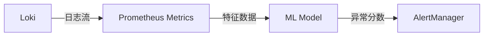

# 日志异常检测

日志异常检测是通过分析日志数据中的模式、频率或内容变化，识别潜在系统问题的过程。在Grafana Loki中，这通常结合查询语句（LogQL）和告警规则实现。以下是逐步指南：

## 1. 基础概念

日志异常通常表现为：
- **频率突变**（如错误日志激增）
- **内容异常**（如从未见过的错误消息）
- **模式偏离**（如请求延迟突然增加）

:::tip
异常检测的核心是**建立基线**——了解"正常"日志的样子，才能识别"异常"。
:::

## 2. LogQL实现方案

### 频率异常检测
```plaintext
# 检测错误率突增
sum(rate({job="myapp"} |= "error" [5m])) by (namespace)
/
sum(rate({job="myapp"}[5m])) by (namespace)
> 0.05  # 错误率超过5%时触发
```

### 内容模式检测
```plaintext
# 检测新出现的错误类型
count by (error_type) (
  {job="myapp"} |~ "error: (?P<error_type>[^\\s]+)"
)
> 0  # 当出现新error_type时
```

## 3. 实际案例：电商网站异常检测

### 场景描述
监控电商API服务的：
1. 登录失败频率
2. 支付超时异常
3. 新出现的5xx错误

### 解决方案
```plaintext
# 组合查询示例
(
  sum(rate({job="checkout-service"} |~ "login failed" [10m])) by (pod)
  / 
  sum(rate({job="checkout-service"}[10m])) by (pod)
) > 0.2  # 登录失败率超过20%

OR

{job="payment-service"} |~ "processing timeout" 

OR

count by (status) (
  {job="api-gateway"} | regexp `HTTP/\\d.\\d" (?P<status>5\\d{2})`
) > 0
```

## 4. 告警配置示例

```yaml
# loki-alerting-rules.yaml
groups:
- name: example
  rules:
  - alert: HighErrorRate
    expr: |
      sum(rate({job="myapp"} |= "error" [5m])) by (namespace)
      /
      sum(rate({job="myapp"}[5m])) by (namespace)
      > 0.05
    for: 10m
    labels:
      severity: warning
    annotations:
      summary: "High error rate in {{ $labels.namespace }}"
```

## 5. 高级技术

### 机器学习集成
通过Loki的`metrics`阶段提取特征，连接Prometheus和机器学习工具：

```plaintext
{job="myapp"} 
| logfmt 
| line_format "{{.status}} {{.duration}}" 
| metrics 
  | status_code_counter total=count(status) 
  | duration_quantile quantile="0.95" value=duration
```



## 6. 总结与练习

### 关键要点
- 使用`rate()`检测频率异常
- 结合`by`子句进行维度下钻
- 正则表达式提取关键字段
- 设置合理的告警阈值和持续时间

### 练习建议
1. 在测试环境模拟错误日志突增，观察告警触发
2. 尝试为你的应用设计三个异常检测规则
3. 使用`grafana explore`测试LogQL查询

:::note 扩展阅读
- [Loki告警文档](https://grafana.com/docs/loki/latest/alerting/)
- 《Observability Engineering》第6章
- SRE工作手册中的监控策略
:::