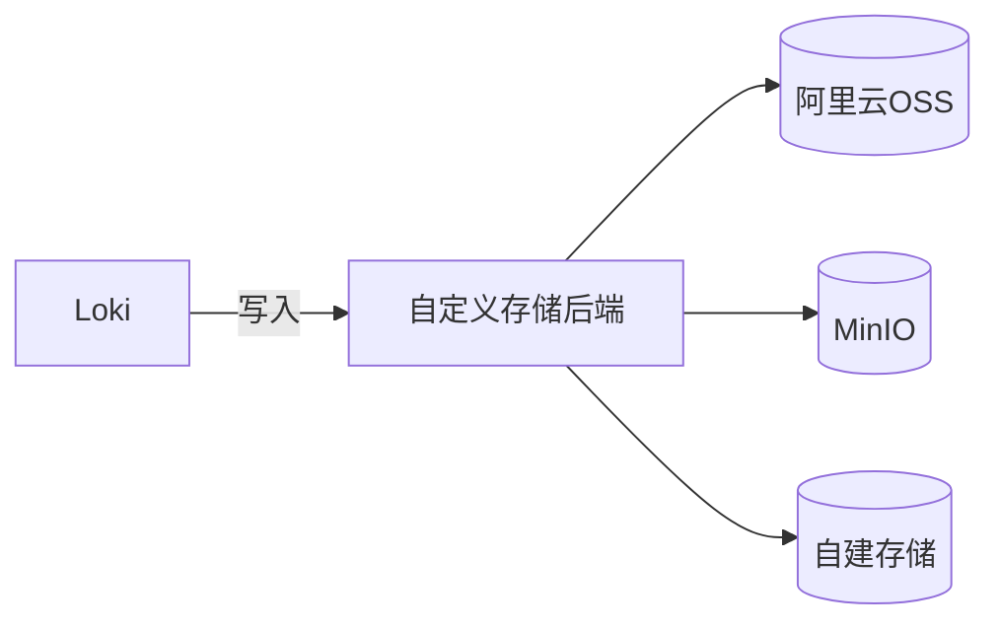

# 自定义存储后端

## 介绍

Grafana Loki的存储后端是日志数据持久化的核心组件。默认情况下，Loki支持本地文件系统、Amazon S3、Google Cloud Storage等存储方案。但在实际生产环境中，可能需要集成其他存储系统（如MinIO、Azure Blob Storage或自建对象存储）。**自定义存储后端**允许开发者通过配置或开发适配器扩展Loki的存储能力。

:::note 关键概念
- **存储后端**：Loki用于存储日志索引和块数据的底层系统。
- **兼容性**：自定义后端需实现Loki的存储接口（如`ObjectClient`）。
:::

---

## 配置自定义存储

### 1. 支持的存储类型
Loki原生支持以下存储类型（通过`storage_config`配置）：
- `aws` (S3)
- `gcs` (Google Cloud Storage)
- `azure` (Azure Blob Storage)
- `filesystem` (本地文件系统)

### 2. 自定义适配器示例
若要集成MinIO（S3兼容存储），配置如下：

```yaml
storage_config:
  aws:
    s3: http://minio:9000
    access_key_id: minioadmin
    secret_access_key: minioadmin
    bucketnames: loki-logs
    s3forcepathstyle: true
```

:::caution 注意
确保MinIO服务地址、认证信息与Loki部署环境网络互通。
:::

---

## 开发自定义存储插件

### 步骤1：实现`ObjectClient`接口
Loki通过`ObjectClient`接口与存储交互。以下是一个骨架代码（Go语言）：

```go
type MyCustomClient struct {
    // 自定义客户端字段
}

func (c *MyCustomClient) PutObject(ctx context.Context, objectKey string, r io.Reader) error {
    // 实现上传逻辑
}

func (c *MyCustomClient) GetObject(ctx context.Context, objectKey string) (io.ReadCloser, error) {
    // 实现下载逻辑
}
```

### 步骤2：注册插件
在Loki的`main.go`中注册自定义客户端：

```go
import (
    "github.com/grafana/loki/pkg/storage"
)

func init() {
    storage.RegisterObjectClient("myplugin", func(cfg config.Config) (storage.ObjectClient, error) {
        return &MyCustomClient{}, nil
    })
}
```

---

## 实际案例：集成阿里云OSS

### 配置示例
```yaml
storage_config:
  aliyunoss:
    endpoint: oss-cn-hangzhou.aliyuncs.com
    access_key_id: YOUR_KEY
    access_key_secret: YOUR_SECRET
    bucket_name: loki-data
```

### 验证存储
启动Loki后，检查日志是否出现存储初始化成功的消息：
```
level=info msg="Aliyun OSS storage initialized"
```

---

## 总结

- **核心价值**：自定义存储后端使Loki能适应多样化的基础设施环境。
- **关键步骤**：配置现有适配器或开发新插件实现`ObjectClient`接口。
- **生产建议**：优先测试存储性能与稳定性，尤其是大规模日志场景。

---

## 延伸学习

1. **官方文档**：[Loki Storage Configuration](https://grafana.com/docs/loki/latest/configuration/storage/)
2. **练习**：在本地MinIO上部署Loki并验证日志写入。
3. **进阶**：阅读Loki的`pkg/storage`源码，理解存储抽象层设计。

