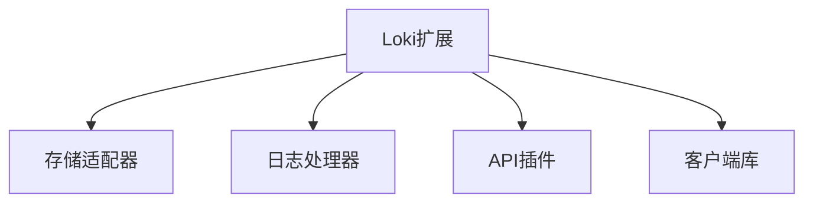

# Loki 扩展开发

## 介绍

Loki扩展开发允许您通过自定义组件增强日志系统的功能。无论是添加新的存储后端、实现特殊日志过滤器，还是集成第三方服务，扩展机制为Loki提供了无限可能性。

:::tip 为什么需要扩展？
- 支持专有存储系统
- 添加业务特定的日志处理逻辑
- 集成企业内部认证系统
- 实现自定义日志分析算法
:::

## 扩展类型概览



## 开发环境准备

1. 安装Go 1.20+（Loki使用Go开发）
2. 获取Loki源码：
   ```bash
   git clone https://github.com/grafana/loki.git
   cd loki
   ```
3. 了解基本接口：
   ```go
   type StorageClient interface {
     Put(ctx context.Context, chunks []chunk.Chunk) error
     Get(ctx context.Context, from, through model.Time, matchers ...*labels.Matcher) ([]chunk.Chunk, error)
   }
   ```

## 存储适配器开发示例

### 1. 实现接口

```go
package mystorage

import (
  "context"
  "github.com/grafana/loki/pkg/storage/chunk"
  "github.com/prometheus/common/model"
)

type MyStorage struct {
  // 您的存储配置字段
}

func (s *MyStorage) Put(ctx context.Context, chunks []chunk.Chunk) error {
  // 实现存储逻辑
  return nil
}

func (s *MyStorage) Get(ctx context.Context, from, through model.Time, matchers ...*labels.Matcher) ([]chunk.Chunk, error) {
  // 实现查询逻辑
  return []chunk.Chunk{}, nil
}
```

### 2. 注册适配器

在`pkg/storage/storage.go`中添加：

```go
import "github.com/grafana/loki/pkg/storage/mystorage"

func NewMyStorage(cfg mystorage.Config) (chunk.StorageClient, error) {
  return &mystorage.MyStorage{}, nil
}
```

## 日志处理器开发

创建自定义日志过滤器：

```go
package myfilter

import (
  "github.com/grafana/loki/pkg/logql"
  "github.com/prometheus/prometheus/model/labels"
)

type MyFilter struct {
  next logql.SampleEvaluator
}

func (f *MyFilter) Evaluate(ctx context.Context) (logql.Vector, error) {
  vector, err := f.next.Evaluate(ctx)
  // 自定义过滤逻辑
  return filterVector(vector), err
}

func NewMyFilter(next logql.SampleEvaluator) *MyFilter {
  return &MyFilter{next: next}
}
```

## 实际案例：敏感信息过滤器

**场景**：自动屏蔽日志中的信用卡号

```go
var creditCardRegex = regexp.MustCompile(`\b(?:\d[ -]*?){13,16}\b`)

func filterSensitiveData(entry string) string {
  return creditCardRegex.ReplaceAllString(entry, "[CREDIT_CARD]")
}

// 在日志接收管道中使用
pipeline.AddStage(filterSensitiveData)
```

## 测试您的扩展

创建单元测试：

```go
func TestMyStorage_Put(t *testing.T) {
  storage := &MyStorage{}
  err := storage.Put(context.Background(), []chunk.Chunk{testChunk})
  require.NoError(t, err)
}
```

使用Loki测试框架：

```bash
go test ./pkg/storage/mystorage -v
```

## 部署扩展

1. 编译自定义Loki：
   ```bash
   make loki-custom
   ```
2. 配置`loki.yaml`：
   ```yaml
   storage_config:
     my_storage:
       enabled: true
       endpoint: "my-storage-service:8080"
   ```

## 总结

通过Loki扩展开发，您可以：

✓ 集成自定义存储系统<br />
✓ 添加业务特定的日志处理<br />
✓ 扩展查询功能<br />
✓ 适应各种企业需求

## 延伸学习

- [Loki插件架构设计文档](https://github.com/grafana/loki/blob/main/docs/design.md)
- [Go接口编程实践](https://golang.org/doc/effective_go.html#interfaces)
- [Loki存储接口深度解析](https://grafana.com/docs/loki/latest/storage/)

**练习建议**：
1. 尝试实现一个简单的内存存储适配器
2. 创建日志美化处理器（如JSON格式化）
3. 为特定日志添加自动标记功能