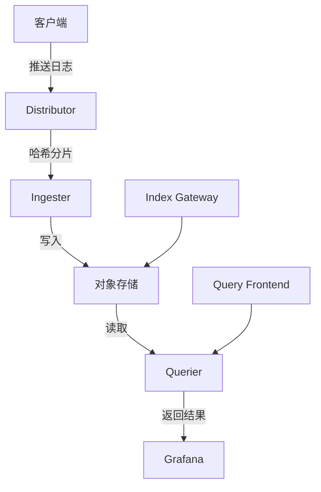
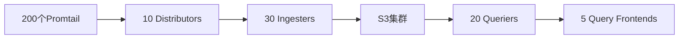

# 大规模Loki架构

## 介绍

当你的日志数据量从GB级增长到TB甚至PB级时，Loki的基础部署模式可能无法满足需求。大规模Loki架构通过分布式组件和优化策略，使系统能够处理海量日志数据，同时保持查询性能和成本效益。

:::note 核心优势
- **水平扩展**：所有组件均可独立扩展
- **成本优化**：仍保持Loki"不索引日志内容"的核心理念
- **高可用性**：消除单点故障
:::

## 关键组件架构

大规模Loki部署通常包含以下核心组件：



### 组件详解

1. **Distributor**
   - 负责接收客户端日志
   - 使用一致性哈希分配日志到Ingester节点
   - 示例配置片段：
     ```yaml
     distributor:
       ring:
         kvstore:
           store: memberlist
       max_line_size: 256KB
     ```

2. **Ingester**
   - 处理日志流并构建块数据
   - 内存中保留"热数据"（默认为12小时）
   - 重要参数：
     ```yaml
     ingester:
       lifecycler:
         ring:
           replication_factor: 3
       chunk_idle_period: 30m
     ```

3. **对象存储**
   - 长期存储的核心（如S3、GCS、MinIO）
   - 示例S3配置：
     ```yaml
     storage_config:
       aws:
         s3: s3://ACCESS_KEY:SECRET_KEY@region/bucket
         s3forcepathstyle: true
     ```

## 扩展策略

### 水平扩展模式

1. **读写分离扩展**
   - 独立扩展Ingester(写)和Querier(读)节点
   - 典型比例：写密集型场景3:1，读密集型场景1:3

2. **微服务模式部署**
   ```bash
   # 独立启动各组件示例
   loki -target=distributor
   loki -target=ingester
   loki -target=querier
   ```

### 分区策略

1. **租户隔离**
   ```go
   // 客户端设置租户ID示例
   client, err := logproto.NewPusherClient("http://loki:3100/api/prom/push")
   req := &logproto.PushRequest{
       Streams: []*logproto.Stream{{
           Labels: `{job="webapp", tenant="team-a"}`,
           Entries: entries,
       }},
   }
   ```

2. **时间分片**
   - 按时间范围分区查询（特别适合历史日志查询）

## 实际案例：电商平台日志系统

**场景需求**：
- 日均日志量：50TB
- 峰值QPS：200,000条日志/秒
- 查询延迟要求：`<5秒`（最近1小时数据）

**解决方案**：


**关键配置**：
```yaml
limits_config:
  ingestion_rate_mb: 50
  ingestion_burst_size_mb: 100
  max_entries_limit_per_query: 50000
```

## 性能优化技巧

1. **查询加速**
   - 使用 `Query Frontend` 进行查询拆分和缓存
   ```sql
   -- 使用分区查询语法
   {cluster="us-east"} |= "error" | logfmt | rate(5m)
   ```

2. **存储优化**
   - 调整块设置：
     ```yaml
     chunk_store_config:
       max_look_back_period: 168h
     ```

3. **资源隔离**
   ```yaml
   query_scheduler:
     max_outstanding_requests_per_tenant: 100
   ```

## 总结

大规模Loki架构通过分布式设计解决了三个核心问题：
1. 数据摄入的高吞吐量需求
2. 长期存储的经济性需求
3. 快速查询的响应需求

:::tip 扩展学习
1. 尝试在测试环境部署5节点Loki集群
2. 使用 `k6` 工具模拟高负载日志写入
3. 练习配置多租户隔离策略
:::

## 附加资源

- [Loki官方扩展指南](https://grafana.com/docs/loki/latest/operations/scaling/)
- 《云原生日志系统设计》第三章
- Loki性能基准测试工具包 `logcli` 的使用方法