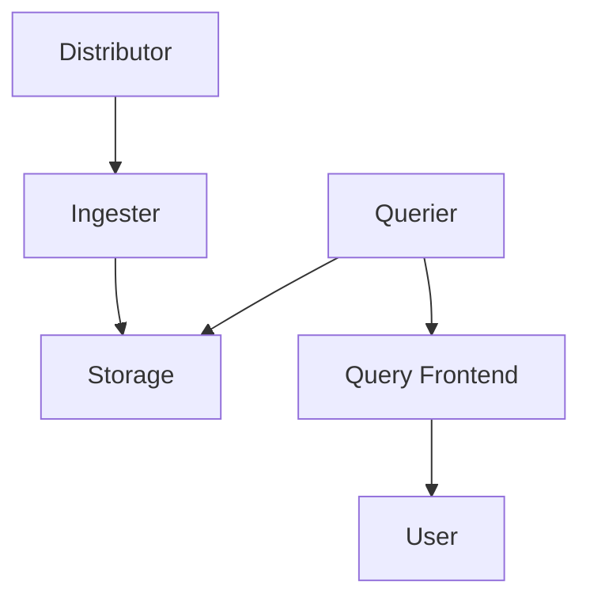
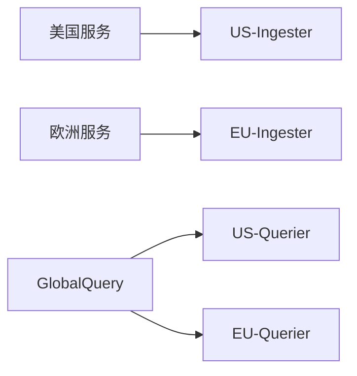

# Loki 分布式架构

## 介绍

Grafana Loki是一个水平可扩展、高可用的日志聚合系统，专为云原生环境设计。与传统的日志系统不同，Loki采用独特的分布式架构，通过分离索引和日志存储来降低成本，同时保持高效的查询性能。本章将深入解析Loki的分布式设计原理及其核心组件间的协作方式。

## 架构概览

Loki的分布式架构主要由以下组件构成：



1. **Distributor** - 日志入口网关
2. **Ingester** - 日志处理与临时存储
3. **Storage** - 长期存储（通常为对象存储）
4. **Querier** - 查询处理器
5. **Query Frontend** - 查询优化与缓存层

## 核心组件详解

### 1. Distributor

作为日志数据的第一站，Distributor负责：
- 验证日志流的正确性
- 对日志进行预处理（如标签验证）
- 将数据分发给多个Ingester实例

:::tip 数据分片
Distributor使用一致性哈希算法确保相同日志流始终路由到相同的Ingester节点，保证数据局部性。
:::

### 2. Ingester

内存中的日志"蓄水池"，主要功能：
- 批量处理日志并压缩存储
- 定期将数据刷新到长期存储
- 提供近期数据的快速查询

```go
// 示例：查看Ingester状态（Loki API）
curl -G http://localhost:3100/ring
```

### 3. 存储层

Loki采用分离存储架构：
- **索引存储**：通常使用Cassandra或BoltDB
- **日志存储**：兼容对象存储（如S3、GCS）

:::caution 注意
存储配置直接影响查询性能，生产环境建议：
- 索引存储：SSD优化数据库
- 日志存储：高吞吐量对象存储
:::

## 数据流示例

让我们跟踪一条日志的完整生命周期：

1. 客户端发送日志到Distributor
```bash
echo 'level=error msg="DB connection failed"' | \
curl --data-binary @- http://loki:3100/api/prom/push
```

2. Distributor验证标签并转发到Ingester集群
3. Ingester将日志存入内存缓冲区（默认15分钟后刷盘）
4. 查询时，Querier合并Ingester内存数据和存储数据

## 实际应用场景

**电商平台日志分析**：
- 使用Loki分布式架构处理来自1000+微服务的日志
- Ingester集群按地域分布，减少网络延迟
- 查询前端实现跨区域聚合结果



## 总结

Loki的分布式架构通过以下方式实现高效日志管理：
- 读写路径分离
- 内存与持久化存储分层
- 无状态查询组件水平扩展

## 扩展学习

1. 实践练习：部署3节点Loki集群，观察组件间通信
2. 性能测试：比较单节点与分布式架构的查询延迟
3. 官方资源：
   - [Loki架构文档](https://grafana.com/docs/loki/latest/fundamentals/architecture/)
   - [生产环境部署指南](https://grafana.com/docs/loki/latest/installation/)