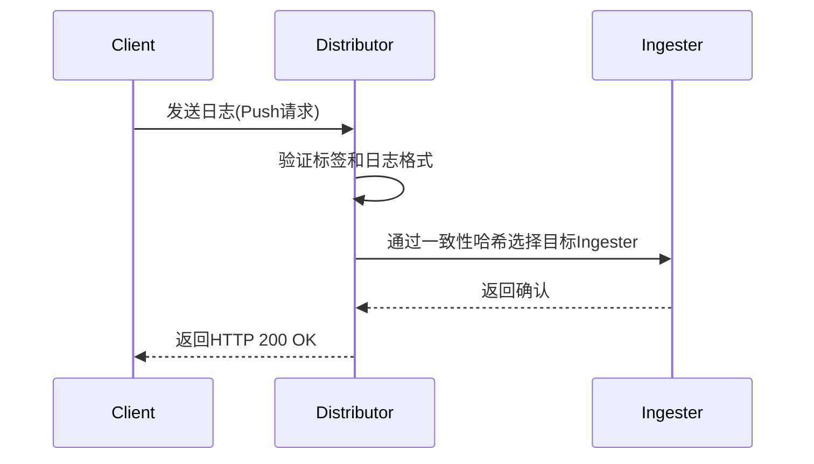

# Loki Distributor组件

## 概述

Loki的**Distributor**组件是日志管道的第一站，负责接收客户端发送的日志数据，并将其分发到后续处理环节。它的核心职责包括：
- 接收日志写入请求（HTTP/gRPC）
- 验证日志数据的格式和标签
- 将日志分批发送给Ingester组件

:::note 类比理解
将Distributor想象成邮局的分拣中心——它接收来自各方的信件（日志），检查地址（标签）是否有效，然后分发给对应的派送员（Ingester）。
:::

## 工作原理

### 1. 日志接收流程
Distributor通过以下步骤处理日志：



### 2. 关键机制

#### 标签验证
Distributor会检查日志流的标签是否符合规则：
- 标签名必须匹配正则 `[a-zA-Z_][a-zA-Z0-9_]*`
- 标签值不能为空
- 每个日志流必须有至少一个标签

:::caution 常见错误
以下标签会导致验证失败：
```bash
# 错误的标签名
{ "1st-label": "value" }  # 不能以数字开头

# 空标签值
{ "env": "" }
```
:::

#### 哈希环（Hash Ring）
Distributor使用一致性哈希算法确定日志应该发送到哪个Ingester：

```go
// 伪代码展示哈希计算逻辑
func hashLabels(labels map[string]string) uint32 {
    // 对标签键值对进行排序
    sortedLabels := sortLabels(labels)  
    // 计算哈希值
    return murmur3Hash(sortedLabels) % ringSize
}
```

## 配置示例

典型的Distributor配置（YAML格式）：

```yaml
distributor:
  ring:
    kvstore:
      store: memberlist  # 使用memberlist进行集群通信
  max_recv_msg_size: 100MB  # 最大接收消息大小
  rate_limits:
    ingestion_rate_mb: 100  # 每秒最大摄入量(MB)
    ingestion_burst_size_mb: 150  # 突发流量允许值
```

## 实际应用场景

### 场景1：高可用部署
当部署多个Distributor实例时，它们会自动形成集群：
1. 客户端可通过负载均衡访问任意Distributor
2. 所有Distributor共享相同的哈希环信息
3. 即使某个Distributor故障，其他实例仍能正常处理请求

### 场景2：限流保护
通过配置速率限制防止系统过载：
```yaml
limits_config:
  ingestion_rate_strategy: "global"  # 集群级限流
  ingestion_rate_limit: 50          # 50MB/s
```

## 性能调优技巧

:::tip 最佳实践
1. **批处理大小**：调整 `-distributor.max-recv-msg-size` 优化网络传输效率
2. **标签设计**：避免高频变化的标签（如时间戳），会导致大量小日志流
3. **压缩启用**：客户端启用gzip压缩减少带宽消耗
```bash
curl -v -H "Content-Encoding: gzip" --data-binary @logs.gz http://loki:3100/api/prom/push
```
:::

## 总结

Distributor作为Loki的"流量入口"，主要特点包括：
- 负责日志的初步验证和路由
- 通过哈希环实现负载均衡
- 提供限流等保护机制
- 支持水平扩展应对高流量

## 延伸学习

1. **动手练习**：
   - 使用Docker部署多Distributor实例
   - 通过 `http://localhost:3100/ring` 查看哈希环状态
   
2. **故障排查**：
   ```bash
   # 查看Distributor日志中的错误信息
   kubectl logs -l component=distributor --tail=50 | grep "error"
   ```

3. **深度阅读**：
   - [Loki官方文档 - Distributor](https://grafana.com/docs/loki/latest/architecture/components/distributor/)
   - 《云原生日志系统设计》第4章