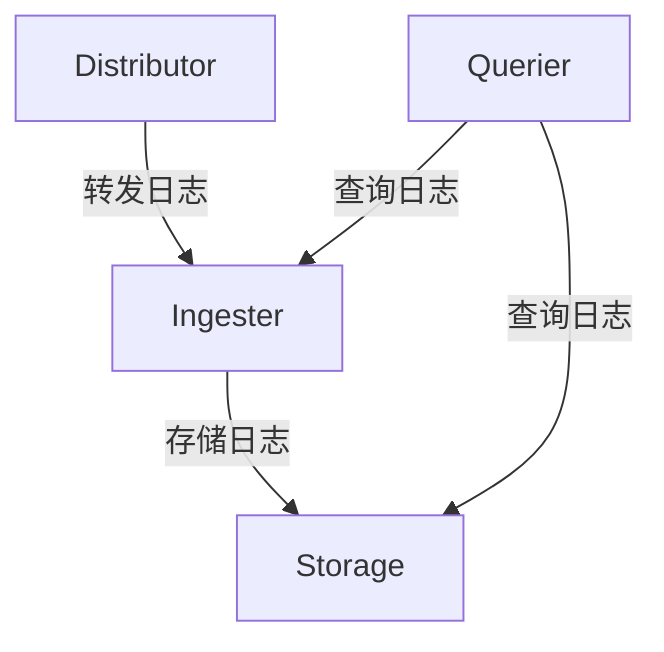

# Loki 组件监控

## 简介

Grafana Loki是一个高效的日志聚合系统，由多个组件协同工作。监控这些组件的健康状态和性能指标对于维护稳定的日志系统至关重要。本章将介绍如何监控Loki的核心组件，包括Distributor、Ingester、Querier等，以及如何利用Prometheus和Grafana实现可视化监控。

---

## 核心组件及其监控指标

Loki的主要组件及其关键监控指标如下：

### 1. Distributor
- **作用**：接收日志数据并分发给Ingester
- **关键指标**：
  - `loki_distributor_bytes_received_total`：接收的日志字节数
  - `loki_distributor_requests_total`：处理的总请求数
  - `loki_distributor_errors_total`：错误计数

### 2. Ingester
- **作用**：存储和查询内存中的日志数据
- **关键指标**：
  - `loki_ingester_memory_chunks`：内存中的chunk数量
  - `loki_ingester_chunk_utilization`：chunk利用率
  - `loki_ingester_chunk_entries`：每个chunk的日志条目数

### 3. Querier
- **作用**：执行日志查询
- **关键指标**：
  - `loki_querier_queries_total`：查询总数
  - `loki_querier_query_duration_seconds`：查询延迟



---

## 配置Prometheus监控Loki

Loki原生暴露Prometheus格式的指标。以下是配置示例：

1. **修改Loki配置**（`loki-config.yaml`）：
```yaml
server:
  http_listen_port: 3100
  grpc_listen_port: 9095

metrics:
  enable_http_middleware: true
  enable_grpc_middleware: true
```

2. **Prometheus抓取配置**（`prometheus.yml`）：
```yaml
scrape_configs:
  - job_name: 'loki'
    static_configs:
      - targets: ['loki:3100']
```

:::tip
使用`/metrics`端点验证指标是否正常暴露：
```bash
curl http://localhost:3100/metrics
```
:::

---

## 实际案例：监控Ingester内存使用

当Ingester内存使用过高时，可能导致OOM（Out Of Memory）错误。以下Grafana告警规则示例：

```yaml
groups:
- name: loki-ingester
  rules:
  - alert: HighIngesterMemoryUsage
    expr: sum(container_memory_usage_bytes{container="ingester"}) / sum(container_spec_memory_limit_bytes{container="ingester"}) > 0.8
    for: 10m
    labels:
      severity: critical
    annotations:
      summary: "High memory usage on Loki Ingester (instance {{ $labels.instance }})"
      description: "Ingester memory usage is at {{ $value }}% of limit"
```

---

## 常见问题排查

1. **Distributor高错误率**：
   - 检查后端存储是否可访问
   - 验证租户配置是否正确

2. **Ingester频繁刷新数据**：
   - 调整`chunk_idle_period`和`max_chunk_age`参数
   - 检查`loki_ingester_chunk_utilization`是否过低

3. **Querier响应缓慢**：
   - 增加Querier副本数量
   - 检查`loki_querier_query_duration_seconds`百分位值

---

## 总结与练习

### 总结
- Loki组件监控是维护日志系统稳定的关键
- Prometheus是监控Loki指标的最佳工具
- 核心组件（Distributor/Ingester/Querier）有不同的监控重点

### 练习
1. 部署Loki并配置Prometheus监控
2. 创建一个Grafana仪表盘，展示以下指标：
   - 日志摄入速率
   - 查询延迟P99
   - 内存使用百分比
3. 设置当Ingester内存使用超过80%时触发告警

### 扩展阅读
- [Loki官方监控文档](https://grafana.com/docs/loki/latest/operations/monitoring/)
- [Prometheus查询指南](https://prometheus.io/docs/prometheus/latest/querying/basics/)